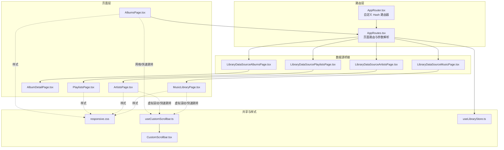
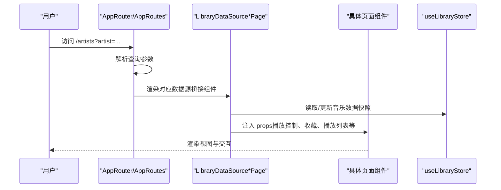
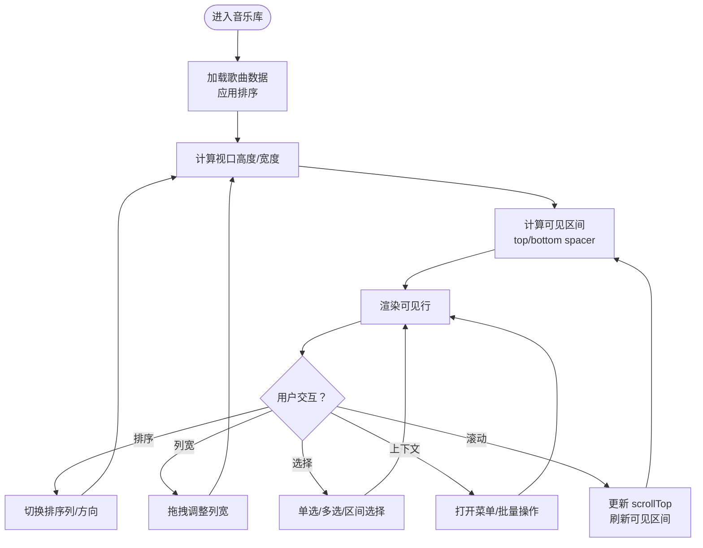
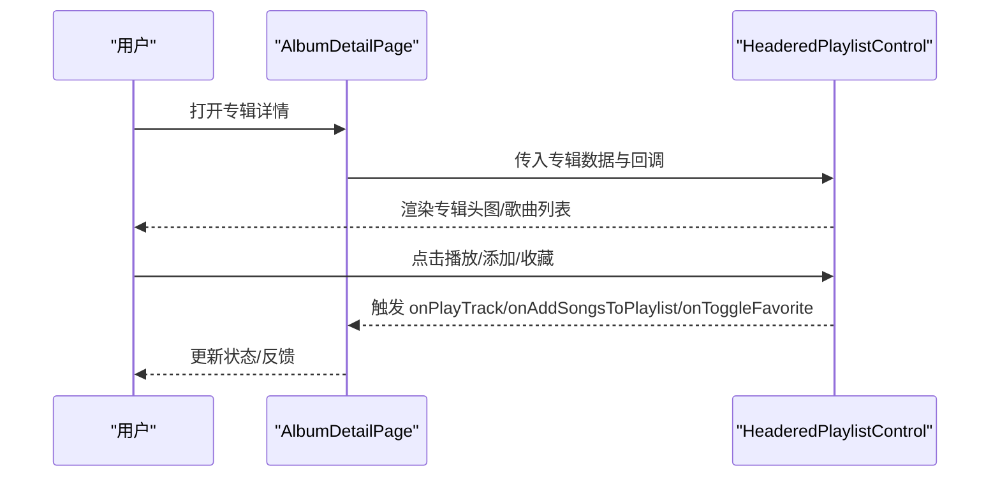
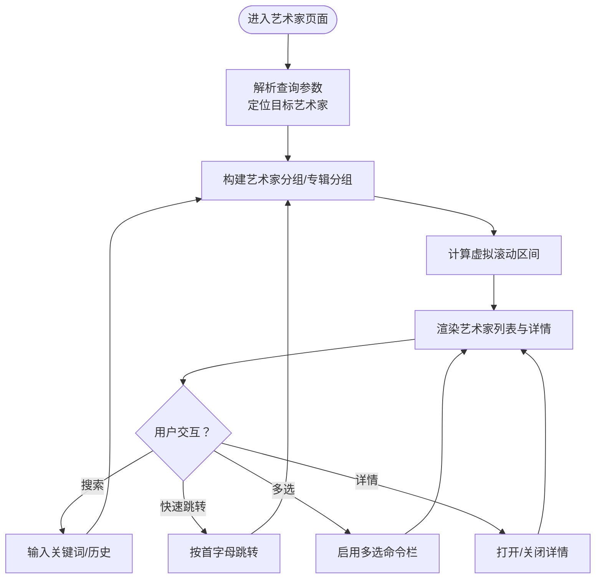
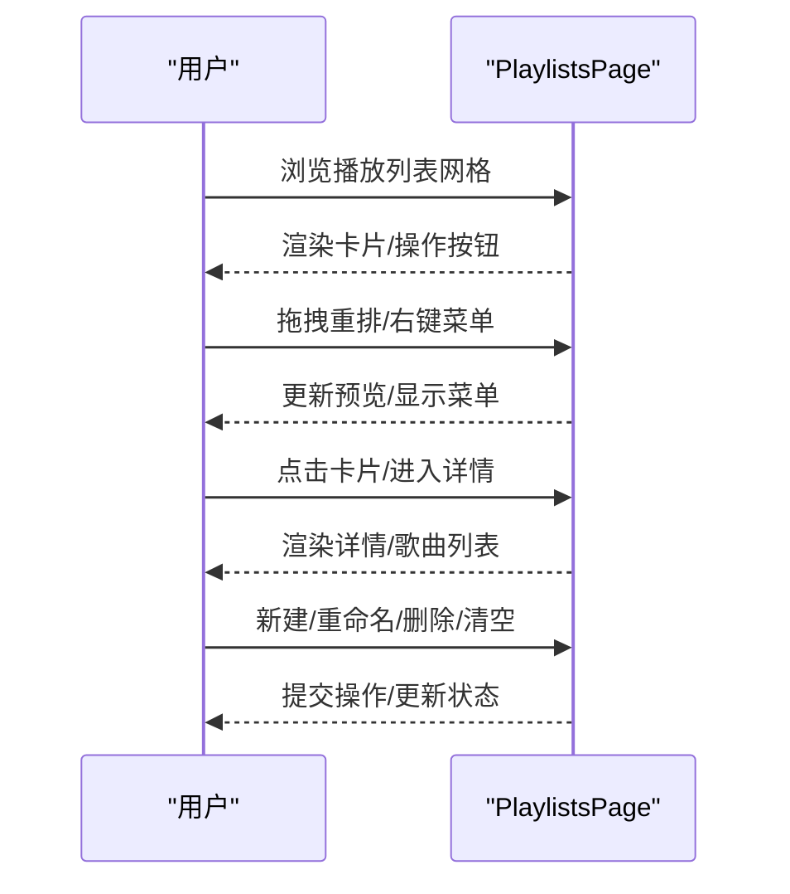
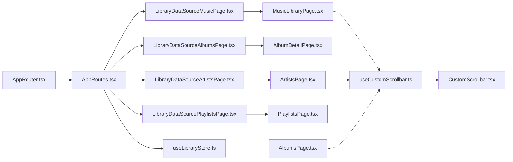

# 页面设计

<cite>
**本文引用的文件**
- [MusicLibraryPage.tsx](file://src/pages/MusicLibraryPage.tsx)
- [AlbumDetailPage.tsx](file://src/pages/AlbumDetailPage.tsx)
- [ArtistsPage.tsx](file://src/pages/ArtistsPage.tsx)
- [PlaylistsPage.tsx](file://src/pages/PlaylistsPage.tsx)
- [AlbumsPage.tsx](file://src/pages/AlbumsPage.tsx)
- [LibraryDataSourceMusicPage.tsx](file://src/pages/LibraryDataSourceMusicPage.tsx)
- [LibraryDataSourceAlbumsPage.tsx](file://src/pages/LibraryDataSourceAlbumsPage.tsx)
- [LibraryDataSourceArtistsPage.tsx](file://src/pages/LibraryDataSourceArtistsPage.tsx)
- [LibraryDataSourcePlaylistsPage.tsx](file://src/pages/LibraryDataSourcePlaylistsPage.tsx)
- [AppRouter.tsx](file://src/AppRouter.tsx)
- [AppRoutes.tsx](file://src/AppRoutes.tsx)
- [responsive.css](file://src/styles/responsive.css)
- [artistsPageModel.ts](file://src/pages/artistsPageModel.ts)
- [useCustomScrollbar.ts](file://src/hooks/useCustomScrollbar.ts)
- [CustomScrollbar.tsx](file://src/components/CustomScrollbar.tsx)
- [useLibraryStore.ts](file://src/state/useLibraryStore.ts)
</cite>

## 目录
1. [简介](#简介)
2. [项目结构](#项目结构)
3. [核心组件](#核心组件)
4. [架构总览](#架构总览)
5. [详细组件分析](#详细组件分析)
6. [依赖关系分析](#依赖关系分析)
7. [性能考虑](#性能考虑)
8. [故障排查指南](#故障排查指南)
9. [结论](#结论)
10. [附录](#附录)

## 简介
本文件系统化梳理 SMPlayer 的页面设计体系，围绕音乐库、专辑详情、艺术家、播放列表等核心页面，阐述其布局设计、数据展示、交互模式与导航逻辑；同时覆盖响应式设计、状态管理、性能优化与用户体验细节。目标是帮助开发者与产品人员快速理解页面实现与扩展路径。

## 项目结构
SMPlayer 的页面层位于 src/pages，采用“按页面拆分”的组织方式，每个页面组件负责自身视图与交互，并通过 AppRoutes 进行统一路由编排。样式集中在 src/styles，响应式规则以断点驱动不同布局形态。状态管理使用 Zustand（useLibraryStore），页面通过上下文或数据源桥接状态与 UI。

图表来源
- [AppRouter.tsx:1-82](file://src/AppRouter.tsx#L1-L82)
- [AppRoutes.tsx:176-800](file://src/AppRoutes.tsx#L176-L800)
- [MusicLibraryPage.tsx:82-690](file://src/pages/MusicLibraryPage.tsx#L82-L690)
- [AlbumDetailPage.tsx:32-110](file://src/pages/AlbumDetailPage.tsx#L32-L110)
- [ArtistsPage.tsx:82-560](file://src/pages/ArtistsPage.tsx#L82-L560)
- [PlaylistsPage.tsx:71-566](file://src/pages/PlaylistsPage.tsx#L71-L566)
- [AlbumsPage.tsx:64-739](file://src/pages/AlbumsPage.tsx#L64-L739)
- [LibraryDataSourceMusicPage.tsx:39-143](file://src/pages/LibraryDataSourceMusicPage.tsx#L39-L143)
- [LibraryDataSourceAlbumsPage.tsx:31-173](file://src/pages/LibraryDataSourceAlbumsPage.tsx#L31-L173)
- [LibraryDataSourceArtistsPage.tsx:31-131](file://src/pages/LibraryDataSourceArtistsPage.tsx#L31-L131)
- [LibraryDataSourcePlaylistsPage.tsx:36-132](file://src/pages/LibraryDataSourcePlaylistsPage.tsx#L36-L132)
- [responsive.css:1-560](file://src/styles/responsive.css#L1-L560)
- [useCustomScrollbar.ts:11-96](file://src/hooks/useCustomScrollbar.ts#L11-L96)
- [CustomScrollbar.tsx:9-16](file://src/components/CustomScrollbar.tsx#L9-L16)
- [useLibraryStore.ts:111-200](file://src/state/useLibraryStore.ts#L111-L200)

章节来源
- [AppRoutes.tsx:176-800](file://src/AppRoutes.tsx#L176-L800)
- [responsive.css:1-560](file://src/styles/responsive.css#L1-L560)

## 核心组件
- 音乐库页面（MusicLibraryPage）：表格型音乐库，支持列排序、列宽调整、虚拟滚动、快速跳转、多选与上下文菜单。
- 专辑详情页（AlbumDetailPage）：沉浸式专辑详情，支持封面编辑、偏好设置、艺人/专辑点击回调。
- 艺术家页面（ArtistsPage）：双栏艺术家列表与详情联动，支持搜索建议、快速跳转、多选命令栏、拖拽排序等。
- 播放列表页面（PlaylistsPage）：网格卡片式播放列表，支持拖拽重排、右键菜单、新建/重命名/删除、歌曲操作。
- 专辑页面（AlbumsPage）：网格布局专辑浏览，支持搜索、排序、快速跳转、批量选择与上下文菜单。
- 数据源桥接页面：各页面通过 LibraryDataSourceXxxPage 将外部数据源（本地/远程）注入到具体页面组件。

章节来源
- [MusicLibraryPage.tsx:82-690](file://src/pages/MusicLibraryPage.tsx#L82-L690)
- [AlbumDetailPage.tsx:32-110](file://src/pages/AlbumDetailPage.tsx#L32-L110)
- [ArtistsPage.tsx:82-560](file://src/pages/ArtistsPage.tsx#L82-L560)
- [PlaylistsPage.tsx:71-566](file://src/pages/PlaylistsPage.tsx#L71-L566)
- [AlbumsPage.tsx:64-739](file://src/pages/AlbumsPage.tsx#L64-L739)
- [LibraryDataSourceMusicPage.tsx:39-143](file://src/pages/LibraryDataSourceMusicPage.tsx#L39-L143)
- [LibraryDataSourceAlbumsPage.tsx:31-173](file://src/pages/LibraryDataSourceAlbumsPage.tsx#L31-L173)
- [LibraryDataSourceArtistsPage.tsx:31-131](file://src/pages/LibraryDataSourceArtistsPage.tsx#L31-L131)
- [LibraryDataSourcePlaylistsPage.tsx:36-132](file://src/pages/LibraryDataSourcePlaylistsPage.tsx#L36-L132)

## 架构总览
SMPlayer 使用自定义的 Hash 路由器 AppRouter，结合 AppRoutes 统一声明页面路由与参数解析。页面通过数据源桥接组件（LibraryDataSourceXxxPage）接入状态与数据，实现“页面组件 + 数据源桥接 + 路由”的清晰分层。

图表来源
- [AppRouter.tsx:25-82](file://src/AppRouter.tsx#L25-L82)
- [AppRoutes.tsx:390-457](file://src/AppRoutes.tsx#L390-L457)
- [LibraryDataSourceArtistsPage.tsx:31-131](file://src/pages/LibraryDataSourceArtistsPage.tsx#L31-L131)
- [useLibraryStore.ts:111-200](file://src/state/useLibraryStore.ts#L111-L200)

章节来源
- [AppRouter.tsx:25-82](file://src/AppRouter.tsx#L25-L82)
- [AppRoutes.tsx:326-800](file://src/AppRoutes.tsx#L326-L800)

## 详细组件分析

### 音乐库页面（MusicLibraryPage）
- 布局与交互
  - 表格布局，支持列排序（标题、艺人、专辑、时长、播放次数、添加时间）与列宽调整。
  - 虚拟滚动：根据视口高度与行高计算可见区间，仅渲染可视区域，提升大数据集性能。
  - 快速跳转：基于当前排序列首字母分组，支持在紧凑布局下弹出快捷面板。
  - 多选与上下文菜单：支持 Ctrl/Cmd+点击、Shift 区间选择；右键弹出菜单或批量操作。
  - 自定义滚动条：基于 useCustomScrollbar 实现可拖动滚动条。
- 数据展示
  - 展示歌曲元数据（标题、艺人、专辑、时长、播放次数、添加时间）。
  - 当前播放歌曲高亮与播放中波纹动画。
- 交互模式
  - 单击选择、双击播放下一首、右键打开菜单。
  - 收藏/取消收藏、添加至播放列表、立即播放、移动到音乐或播放等。
- 参数与路由
  - 支持 routeBase 前缀，用于嵌套路由场景；链接跳转至艺人/专辑详情。
- 性能与优化
  - 虚拟滚动与列宽缓存，减少重排。
  - 仅在窗口尺寸变化或排序变更时更新布局度量。
- 错误与空态
  - 加载中、扫描中、无匹配结果、无内容提示等。

图表来源
- [MusicLibraryPage.tsx:114-142](file://src/pages/MusicLibraryPage.tsx#L114-L142)
- [MusicLibraryPage.tsx:315-321](file://src/pages/MusicLibraryPage.tsx#L315-L321)
- [MusicLibraryPage.tsx:464-611](file://src/pages/MusicLibraryPage.tsx#L464-L611)

章节来源
- [MusicLibraryPage.tsx:82-690](file://src/pages/MusicLibraryPage.tsx#L82-L690)
- [useCustomScrollbar.ts:11-96](file://src/hooks/useCustomScrollbar.ts#L11-L96)

### 专辑详情页（AlbumDetailPage）
- 布局与交互
  - 沉浸式头部 + 列表主体，支持专辑封面编辑、偏好设置、艺人/专辑点击回调。
  - 内置 HeaderedPlaylistControl，复用播放列表控制能力。
- 数据展示
  - 专辑名称、歌曲列表、封面图、播放统计等。
- 交互模式
  - 播放整张专辑、添加到播放列表、收藏、记录播放历史、编辑封面等。
- 参数与路由
  - 通过 props 接收 albumName 与歌曲集合，支持外部导航回调。

图表来源
- [AlbumDetailPage.tsx:32-110](file://src/pages/AlbumDetailPage.tsx#L32-L110)

章节来源
- [AlbumDetailPage.tsx:32-110](file://src/pages/AlbumDetailPage.tsx#L32-L110)

### 艺术家页面（ArtistsPage）
- 布局与交互
  - 双栏布局：左侧艺术家列表，右侧详情区；紧凑模式下详情独立页面。
  - 支持搜索建议、搜索历史、快速跳转、多选命令栏、拖拽排序等。
  - 虚拟滚动：按行高与可视窗口计算渲染区间，提升大列表性能。
- 数据展示
  - 艺术家名、专辑数、歌曲数、首张封面等。
- 交互模式
  - 选择艺术家、随机播放、右键菜单、批量操作、返回列表等。
- 参数与路由
  - 支持从查询参数读取目标艺术家，自动定位并打开详情。
- 性能与优化
  - 虚拟滚动、快速跳转索引、多选后自动隐藏命令栏等。

图表来源
- [ArtistsPage.tsx:141-199](file://src/pages/ArtistsPage.tsx#L141-L199)
- [ArtistsPage.tsx:283-320](file://src/pages/ArtistsPage.tsx#L283-L320)
- [artistsPageModel.ts:96-132](file://src/pages/artistsPageModel.ts#L96-L132)

章节来源
- [ArtistsPage.tsx:82-560](file://src/pages/ArtistsPage.tsx#L82-L560)
- [artistsPageModel.ts:1-200](file://src/pages/artistsPageModel.ts#L1-L200)

### 播放列表页面（PlaylistsPage）
- 布局与交互
  - 网格卡片式布局，支持拖拽重排、右键菜单、新建/重命名/删除播放列表。
  - 选中播放列表后进入详情模式，展示歌曲列表与操作。
- 数据展示
  - 播放列表名称、歌曲数、首张封面等。
- 交互模式
  - 新建、重命名、删除、清空、设置偏好、拖拽排序、歌曲排序等。
- 参数与路由
  - 支持通过 URL 参数选择特定播放列表，进入详情模式。
- 性能与优化
  - 拖拽预览与拖拽覆盖层，避免频繁重绘；仅在激活时更新拖拽状态。

图表来源
- [PlaylistsPage.tsx:71-566](file://src/pages/PlaylistsPage.tsx#L71-L566)

章节来源
- [PlaylistsPage.tsx:71-566](file://src/pages/PlaylistsPage.tsx#L71-L566)

### 专辑页面（AlbumsPage）
- 布局与交互
  - 网格布局，支持搜索、排序（默认/名称/艺人/逆序）、快速跳转、多选与批量操作。
  - 支持查看专辑封面大图、设置偏好、随机播放等。
- 数据展示
  - 专辑名称、艺人、歌曲数、时长、封面等。
- 交互模式
  - 打开专辑详情、播放专辑、添加到播放列表、收藏、查看封面等。
- 性能与优化
  - 网格虚拟化（按行列计算渲染窗口），紧凑模式下自动隐藏多选命令栏。

章节来源
- [AlbumsPage.tsx:64-739](file://src/pages/AlbumsPage.tsx#L64-L739)

## 依赖关系分析
- 路由与页面
  - AppRouter 提供 Hash 路由能力；AppRoutes 统一声明路由与参数解析，将查询参数映射到页面 props。
- 页面与数据源
  - 各 LibraryDataSourceXxxPage 将外部数据源（本地/远程）注入到具体页面组件，实现数据与 UI 的解耦。
- 共享工具
  - useCustomScrollbar 与 CustomScrollbar 提供统一的自定义滚动条实现，被多个页面复用。
  - artistsPageModel 提供艺术家/专辑分组、快速跳转等算法。
- 状态管理
  - useLibraryStore 管理音乐库快照、加载状态、扫描进度、最近播放/搜索等，页面通过桥接组件与之交互。

图表来源
- [AppRouter.tsx:25-82](file://src/AppRouter.tsx#L25-L82)
- [AppRoutes.tsx:326-800](file://src/AppRoutes.tsx#L326-L800)
- [LibraryDataSourceMusicPage.tsx:39-143](file://src/pages/LibraryDataSourceMusicPage.tsx#L39-L143)
- [LibraryDataSourceAlbumsPage.tsx:31-173](file://src/pages/LibraryDataSourceAlbumsPage.tsx#L31-L173)
- [LibraryDataSourceArtistsPage.tsx:31-131](file://src/pages/LibraryDataSourceArtistsPage.tsx#L31-L131)
- [LibraryDataSourcePlaylistsPage.tsx:36-132](file://src/pages/LibraryDataSourcePlaylistsPage.tsx#L36-L132)
- [useCustomScrollbar.ts:11-96](file://src/hooks/useCustomScrollbar.ts#L11-L96)
- [CustomScrollbar.tsx:9-16](file://src/components/CustomScrollbar.tsx#L9-L16)
- [useLibraryStore.ts:111-200](file://src/state/useLibraryStore.ts#L111-L200)

章节来源
- [AppRoutes.tsx:326-800](file://src/AppRoutes.tsx#L326-L800)
- [useLibraryStore.ts:111-200](file://src/state/useLibraryStore.ts#L111-L200)

## 性能考虑
- 虚拟滚动
  - 音乐库与艺术家页面均采用虚拟滚动，通过视口高度、行高与可视区间计算，仅渲染可见行，显著降低 DOM 节点数量。
- 自定义滚动条
  - useCustomScrollbar 基于 ResizeObserver/MutationObserver/scroll 事件监听，动态计算滚动条高度与位置，避免重排抖动。
- 懒加载与按需加载
  - 数据源桥接组件在首次渲染时拉取数据，避免一次性加载全部数据。
- 缓存与去抖
  - 列表渲染依赖 useMemo 与依赖数组，减少重复计算；滚动与尺寸更新使用 requestAnimationFrame 与 ResizeObserver 降低主线程压力。
- 移动端优化
  - 响应式样式在 720px 断点以下切换紧凑布局，隐藏非关键元素，提升移动端可读性与交互效率。

章节来源
- [MusicLibraryPage.tsx:114-142](file://src/pages/MusicLibraryPage.tsx#L114-L142)
- [ArtistsPage.tsx:173-184](file://src/pages/ArtistsPage.tsx#L173-L184)
- [useCustomScrollbar.ts:18-62](file://src/hooks/useCustomScrollbar.ts#L18-L62)
- [responsive.css:298-445](file://src/styles/responsive.css#L298-L445)

## 故障排查指南
- 路由问题
  - 若页面未正确渲染，请检查 AppRouter 是否正确初始化，以及 AppRoutes 中路由声明与参数解析是否一致。
- 数据加载失败
  - LibraryDataSourceXxxPage 在拉取数据失败时会设置错误状态，页面层可通过 error props 显示错误横幅。
- 滚动异常
  - 自定义滚动条依赖容器尺寸与滚动高度，若滚动条不显示或无法拖动，检查容器是否正确设置高度与 overflow。
- 性能卡顿
  - 检查虚拟滚动区间计算与依赖数组；确认未在渲染函数中进行昂贵计算；必要时增加虚拟 overscan 行数。

章节来源
- [AppRouter.tsx:25-82](file://src/AppRouter.tsx#L25-L82)
- [AppRoutes.tsx:326-800](file://src/AppRoutes.tsx#L326-L800)
- [LibraryDataSourceMusicPage.tsx:67-96](file://src/pages/LibraryDataSourceMusicPage.tsx#L67-L96)
- [useCustomScrollbar.ts:18-62](file://src/hooks/useCustomScrollbar.ts#L18-L62)

## 结论
SMPlayer 的页面设计以“路由 + 数据源桥接 + 页面组件”三层结构实现清晰职责分离；通过虚拟滚动、自定义滚动条与响应式断点，兼顾性能与体验；状态管理通过 useLibraryStore 统一入口，便于扩展与维护。建议在新增页面时遵循现有模式，优先考虑虚拟化与响应式适配，确保跨设备一致体验。

## 附录
- 响应式断点
  - 720px：移动端紧凑布局，隐藏非关键 UI，切换交互方式。
  - 860px：进一步简化布局，调整间距与控件尺寸。
  - 1200px：桌面端布局优化，调整网格与面板排列。
- 关键实现参考
  - 虚拟滚动与快速跳转：MusicLibraryPage、ArtistsPage、AlbumsPage
  - 自定义滚动条：useCustomScrollbar + CustomScrollbar
  - 数据源桥接：LibraryDataSourceXxxPage
  - 状态管理：useLibraryStore

章节来源
- [responsive.css:1-560](file://src/styles/responsive.css#L1-L560)
- [useCustomScrollbar.ts:11-96](file://src/hooks/useCustomScrollbar.ts#L11-L96)
- [CustomScrollbar.tsx:9-16](file://src/components/CustomScrollbar.tsx#L9-L16)
- [useLibraryStore.ts:111-200](file://src/state/useLibraryStore.ts#L111-L200)