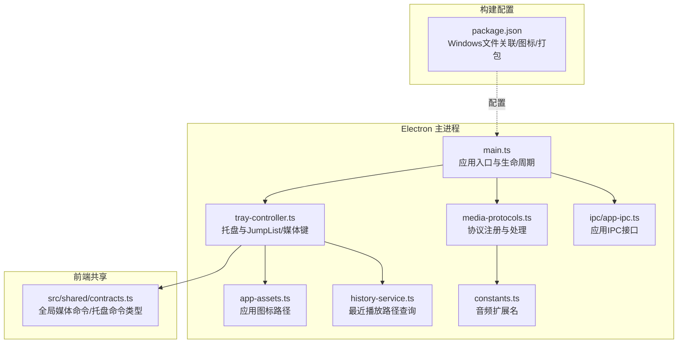
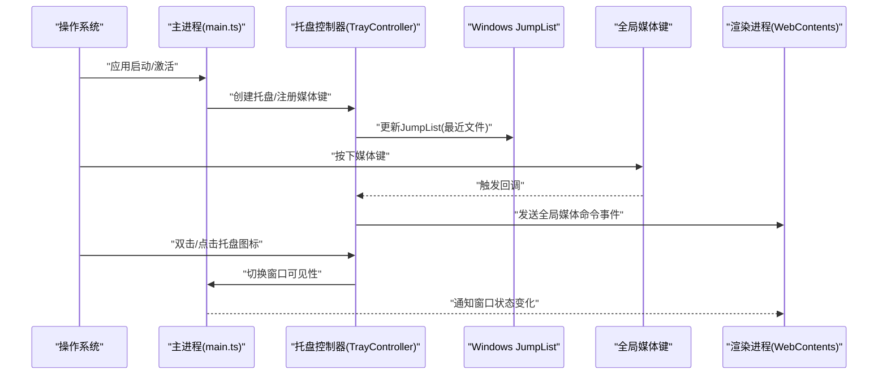
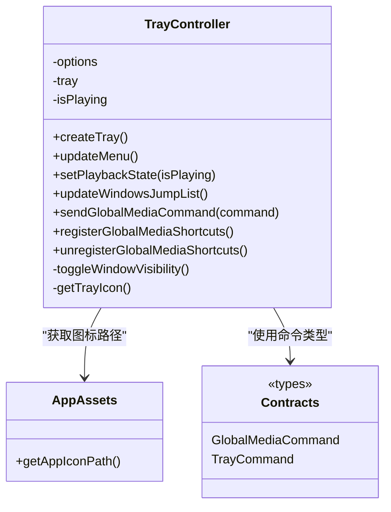
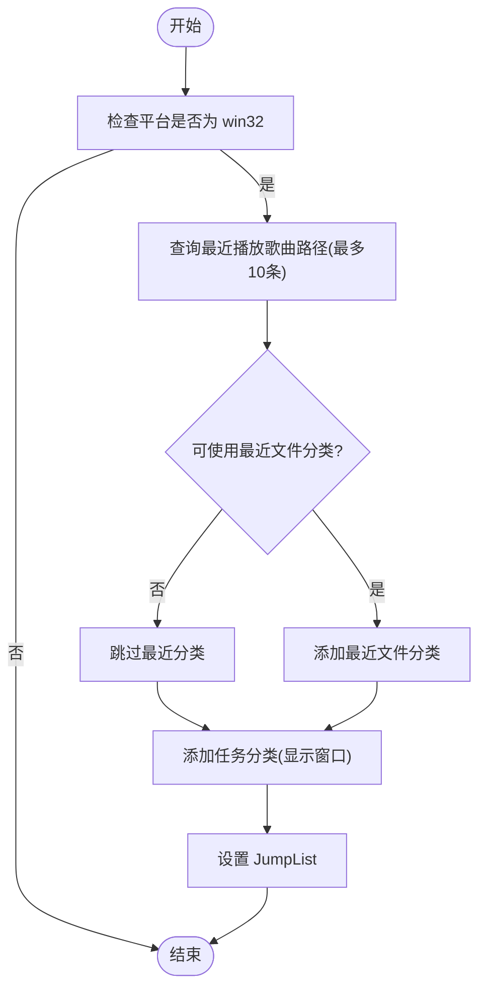
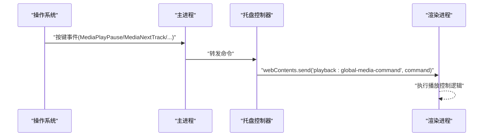
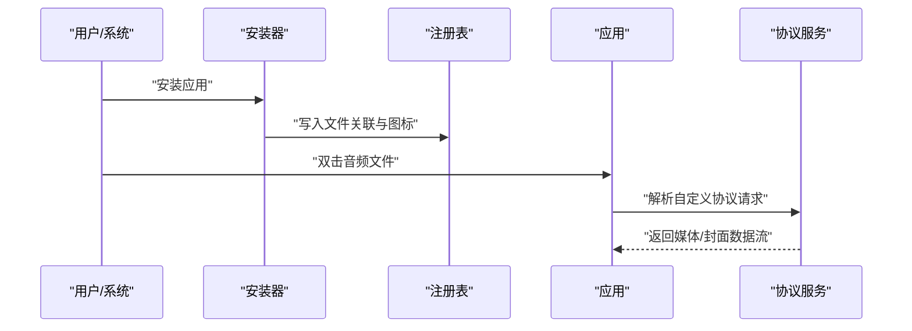
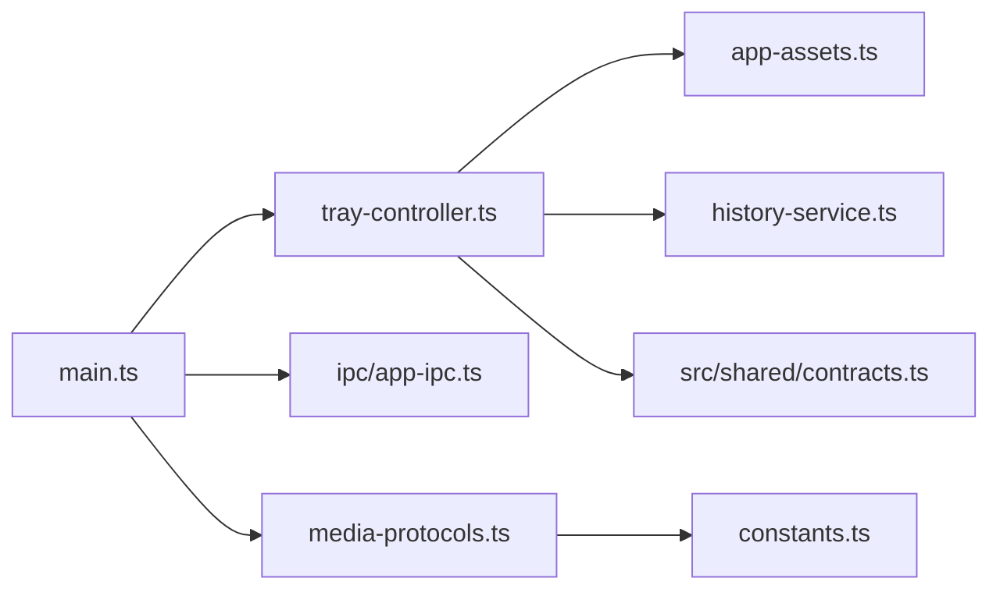

# Windows平台特性

<cite>
**本文引用的文件**
- [electron/tray-controller.ts](file://electron/tray-controller.ts)
- [electron/main.ts](file://electron/main.ts)
- [electron/services/media-protocols.ts](file://electron/services/media-protocols.ts)
- [electron/services/app-assets.ts](file://electron/services/app-assets.ts)
- [electron/services/history-service.ts](file://electron/services/history-service.ts)
- [electron/services/constants.ts](file://electron/services/constants.ts)
- [electron/ipc/app-ipc.ts](file://electron/ipc/app-ipc.ts)
- [src/shared/contracts.ts](file://src/shared/contracts.ts)
- [package.json](file://package.json)
</cite>

## 目录
1. [简介](#简介)
2. [项目结构](#项目结构)
3. [核心组件](#核心组件)
4. [架构总览](#架构总览)
5. [详细组件分析](#详细组件分析)
6. [依赖关系分析](#依赖关系分析)
7. [性能考量](#性能考量)
8. [故障排查指南](#故障排查指南)
9. [结论](#结论)
10. [附录](#附录)

## 简介
本章节面向Windows平台特性，围绕系统托盘集成、Windows JumpList（跳转列表）、全局媒体键绑定、文件关联与协议处理进行技术说明。文档基于仓库中的实际实现，结合Electron API与应用服务层，给出可操作的实现路径、数据流与错误处理策略，并提供平台兼容性建议。

## 项目结构
与Windows平台特性直接相关的代码主要分布在以下位置：
- Electron主进程：托盘控制器、主流程、服务注册、协议与资产加载
- 应用服务层：历史记录服务（用于JumpList最近项）、常量定义（扩展名）
- IPC接口：应用信息、托盘播放状态同步
- 共享契约：全局媒体命令类型、托盘命令类型等
- 构建配置：Windows文件关联、图标资源、打包目标

**图表来源**
- [electron/main.ts:1-243](file://electron/main.ts#L1-L243)
- [electron/tray-controller.ts:1-209](file://electron/tray-controller.ts#L1-L209)
- [electron/services/app-assets.ts:1-28](file://electron/services/app-assets.ts#L1-L28)
- [electron/services/media-protocols.ts:1-120](file://electron/services/media-protocols.ts#L1-L120)
- [electron/services/history-service.ts:1-484](file://electron/services/history-service.ts#L1-L484)
- [electron/services/constants.ts:1-28](file://electron/services/constants.ts#L1-L28)
- [electron/ipc/app-ipc.ts:1-26](file://electron/ipc/app-ipc.ts#L1-L26)
- [src/shared/contracts.ts:1-664](file://src/shared/contracts.ts#L1-L664)
- [package.json:1-175](file://package.json#L1-L175)

**章节来源**
- [electron/main.ts:1-243](file://electron/main.ts#L1-L243)
- [package.json:1-175](file://package.json#L1-L175)

## 核心组件
- 托盘控制器（TrayController）：负责托盘图标创建、右键菜单、双击/单击显示/隐藏窗口、Windows JumpList动态更新、全局媒体键注册与转发。
- 历史服务（HistoryService）：提供最近播放歌曲路径列表，供JumpList“最近”分类使用。
- 协议服务（Media Protocols）：注册并处理自定义协议，支持范围请求与封面图代理。
- 应用资产（App Assets）：根据平台选择合适的图标路径，确保托盘尺寸适配。
- IPC接口（App IPC）：提供应用信息查询与托盘播放状态设置接口。
- 共享契约（Contracts）：定义全局媒体命令与托盘命令类型，保证前后端一致。

**章节来源**
- [electron/tray-controller.ts:28-209](file://electron/tray-controller.ts#L28-L209)
- [electron/services/history-service.ts:222-230](file://electron/services/history-service.ts#L222-L230)
- [electron/services/media-protocols.ts:10-120](file://electron/services/media-protocols.ts#L10-L120)
- [electron/services/app-assets.ts:12-27](file://electron/services/app-assets.ts#L12-L27)
- [electron/ipc/app-ipc.ts:10-26](file://electron/ipc/app-ipc.ts#L10-L26)
- [src/shared/contracts.ts:8-11](file://src/shared/contracts.ts#L8-L11)

## 架构总览
下图展示Windows平台特性在主进程中的交互关系与数据流向：

**图表来源**
- [electron/main.ts:141-239](file://electron/main.ts#L141-L239)
- [electron/tray-controller.ts:37-188](file://electron/tray-controller.ts#L37-L188)

## 详细组件分析

### 系统托盘集成
- 托盘图标创建与尺寸适配
  - 使用应用图标路径生成托盘图标；Windows平台按16x16缩放，其他平台按18x18缩放，确保托盘显示清晰。
  - 图标路径由应用资产模块根据打包状态与平台选择。
- 右键菜单配置
  - 动态菜单项包含显示/隐藏窗口、播放/暂停、上一首/下一首、快速播放、设置入口、退出等。
  - 菜单项标签通过翻译器按首选语言与本地化设置生成。
- 双击/单击行为
  - 双击与单击均触发窗口显示/隐藏切换；窗口显示时移除任务栏跳过标记，隐藏时加入跳过标记。
- 播放状态联动
  - 主进程通过IPC接收播放状态变更，托盘菜单即时反映播放/暂停状态。

**图表来源**
- [electron/tray-controller.ts:28-209](file://electron/tray-controller.ts#L28-L209)
- [electron/services/app-assets.ts:12-27](file://electron/services/app-assets.ts#L12-L27)
- [src/shared/contracts.ts:8-11](file://src/shared/contracts.ts#L8-L11)

**章节来源**
- [electron/tray-controller.ts:37-120](file://electron/tray-controller.ts#L37-L120)
- [electron/tray-controller.ts:190-207](file://electron/tray-controller.ts#L190-L207)
- [electron/services/app-assets.ts:12-27](file://electron/services/app-assets.ts#L12-L27)
- [electron/main.ts:98-129](file://electron/main.ts#L98-L129)

### Windows JumpList（跳转列表）
- 最近播放歌曲列表
  - 仅在打包且非便携模式下启用“最近文件”分类，限制数量为10。
  - 通过历史服务查询最近播放歌曲路径，映射为JumpList文件项。
- 任务栏快捷方式
  - 添加“任务”分类，包含一个任务项，点击后以特定参数唤起应用窗口。
  - 使用应用图标作为任务项图标，参数传递给进程执行路径。
- 动态更新策略
  - 应用启动时与库数据变更时调用更新函数，确保JumpList与当前播放历史保持一致。

**图表来源**
- [electron/tray-controller.ts:122-160](file://electron/tray-controller.ts#L122-L160)
- [electron/services/history-service.ts:222-230](file://electron/services/history-service.ts#L222-L230)

**章节来源**
- [electron/tray-controller.ts:122-160](file://electron/tray-controller.ts#L122-L160)
- [electron/services/history-service.ts:222-230](file://electron/services/history-service.ts#L222-L230)

### 全局媒体键绑定
- 注册与处理
  - 在主进程启动时注册系统媒体键：播放/暂停、下一曲、上一曲、停止。
  - 回调中通过IPC向渲染进程发送“全局媒体命令”事件，交由前端逻辑处理。
- 生命周期管理
  - 应用退出前注销所有全局媒体键，避免残留占用。

**图表来源**
- [electron/tray-controller.ts:171-188](file://electron/tray-controller.ts#L171-L188)
- [electron/main.ts:207-236](file://electron/main.ts#L207-L236)

**章节来源**
- [electron/tray-controller.ts:171-188](file://electron/tray-controller.ts#L171-L188)
- [electron/main.ts:207-236](file://electron/main.ts#L207-L236)

### 文件关联与协议处理
- 文件关联（Windows）
  - 通过构建配置声明多种音频扩展名的默认打开程序角色，安装时写入注册表。
  - 安装器会将图标资源复制到输出目录，确保文件类型图标正确显示。
- 协议处理（Electron）
  - 注册自定义协议（如 smplayer-media、smplayer-artwork），赋予标准、安全、Fetch API、流式支持。
  - 处理媒体文件请求时支持HTTP Range请求，实现断点续传与进度播放。
  - 封面图代理返回远程URL内容，附加跨域与缓存头。

**图表来源**
- [package.json:79-99](file://package.json#L79-L99)
- [electron/services/media-protocols.ts:10-88](file://electron/services/media-protocols.ts#L10-L88)

**章节来源**
- [package.json:79-99](file://package.json#L79-L99)
- [electron/services/media-protocols.ts:10-88](file://electron/services/media-protocols.ts#L10-L88)

### Windows平台特有API使用示例
- 托盘图标与尺寸
  - 使用原生图像对象创建托盘图标，并按平台调整尺寸。
- 全局媒体键
  - 使用全局快捷键注册系统媒体键，回调中通过IPC转发命令。
- JumpList
  - 使用应用的JumpList接口设置任务与最近文件分类。
- 协议注册
  - 使用协议注册特权方案，处理自定义协议请求并返回流式响应。
- 应用标识
  - 设置Windows应用用户模型ID，影响任务栏分组与跳转列表归属。

**章节来源**
- [electron/tray-controller.ts:199-207](file://electron/tray-controller.ts#L199-L207)
- [electron/tray-controller.ts:171-188](file://electron/tray-controller.ts#L171-L188)
- [electron/tray-controller.ts:122-160](file://electron/tray-controller.ts#L122-L160)
- [electron/services/media-protocols.ts:10-88](file://electron/services/media-protocols.ts#L10-L88)
- [electron/main.ts:72-76](file://electron/main.ts#L72-L76)

## 依赖关系分析
- 组件耦合
  - 托盘控制器依赖应用资产（图标）、历史服务（最近播放路径）、共享契约（命令类型）。
  - 主进程在应用启动阶段完成托盘创建、媒体键注册、JumpList更新与协议注册。
- 外部依赖
  - Electron原生模块（Tray、Menu、globalShortcut、nativeImage、protocol、net）。
  - 构建工具链（electron-builder）与安装器（NSIS/便携版）。

**图表来源**
- [electron/main.ts:141-239](file://electron/main.ts#L141-L239)
- [electron/tray-controller.ts:28-209](file://electron/tray-controller.ts#L28-L209)
- [electron/ipc/app-ipc.ts:10-26](file://electron/ipc/app-ipc.ts#L10-L26)
- [electron/services/media-protocols.ts:10-120](file://electron/services/media-protocols.ts#L10-L120)
- [electron/services/app-assets.ts:12-27](file://electron/services/app-assets.ts#L12-L27)
- [electron/services/history-service.ts:222-230](file://electron/services/history-service.ts#L222-L230)
- [src/shared/contracts.ts:8-11](file://src/shared/contracts.ts#L8-L11)
- [electron/services/constants.ts:3-15](file://electron/services/constants.ts#L3-L15)

**章节来源**
- [electron/main.ts:141-239](file://electron/main.ts#L141-L239)
- [electron/tray-controller.ts:28-209](file://electron/tray-controller.ts#L28-L209)

## 性能考量
- JumpList更新频率
  - 频繁更新可能带来I/O开销，建议在播放历史发生显著变化或应用启动时集中更新。
- 托盘图标尺寸
  - Windows平台使用较小尺寸可减少内存占用，同时保证清晰度。
- 协议响应
  - 对大文件采用范围请求与流式传输，避免一次性加载导致内存峰值。
- 全局媒体键
  - 注册数量有限，仅注册必要键位；在应用退出时统一注销，防止资源泄漏。

[本节为通用指导，无需列出具体文件来源]

## 故障排查指南
- 托盘不显示或图标异常
  - 检查应用图标路径是否存在与可读；确认打包资源已包含图标文件。
  - 确认平台判断与尺寸缩放逻辑生效。
- JumpList“最近”分类为空
  - 确认应用处于打包状态且非便携模式；检查最近播放路径查询结果。
- 媒体键无响应
  - 确认全局媒体键已成功注册；检查IPC转发逻辑与渲染进程事件监听。
- 文件关联无效
  - 检查安装器是否正确写入注册表；确认扩展名与图标路径配置正确。
- 协议无法访问媒体/封面
  - 检查协议注册是否成功；确认文件存在且可读；验证Range请求与响应头。

**章节来源**
- [electron/services/app-assets.ts:12-27](file://electron/services/app-assets.ts#L12-L27)
- [electron/services/history-service.ts:222-230](file://electron/services/history-service.ts#L222-L230)
- [electron/tray-controller.ts:171-188](file://electron/tray-controller.ts#L171-L188)
- [package.json:79-99](file://package.json#L79-L99)
- [electron/services/media-protocols.ts:34-87](file://electron/services/media-protocols.ts#L34-L87)

## 结论
本项目在Windows平台上通过托盘控制器实现了完整的系统托盘交互、JumpList动态更新与全局媒体键绑定；配合协议服务与文件关联配置，提供了从系统层到应用层的一致体验。主进程在启动阶段完成初始化与注册，IPC接口保障了前后端协作顺畅。建议在生产环境中关注JumpList更新频率、协议流式传输与全局媒体键生命周期管理，以获得更佳的稳定性与性能。

[本节为总结性内容，无需列出具体文件来源]

## 附录
- 关键类型与命令
  - 全局媒体命令：播放/暂停、上一首、下一首、停止
  - 托盘命令：快速播放、显示窗口
- 平台差异
  - 托盘图标尺寸：Windows使用16x16，其他平台使用18x18
  - JumpList“最近文件”分类仅在打包且非便携模式可用
- 构建与安装
  - Windows安装器目标包含NSIS与便携版，文件关联与图标资源在构建配置中声明

**章节来源**
- [src/shared/contracts.ts:8-11](file://src/shared/contracts.ts#L8-L11)
- [electron/tray-controller.ts:199-207](file://electron/tray-controller.ts#L199-L207)
- [electron/tray-controller.ts:128-130](file://electron/tray-controller.ts#L128-L130)
- [package.json:108-125](file://package.json#L108-L125)