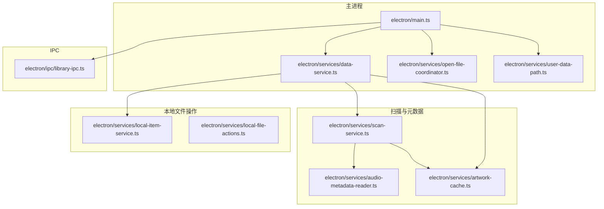
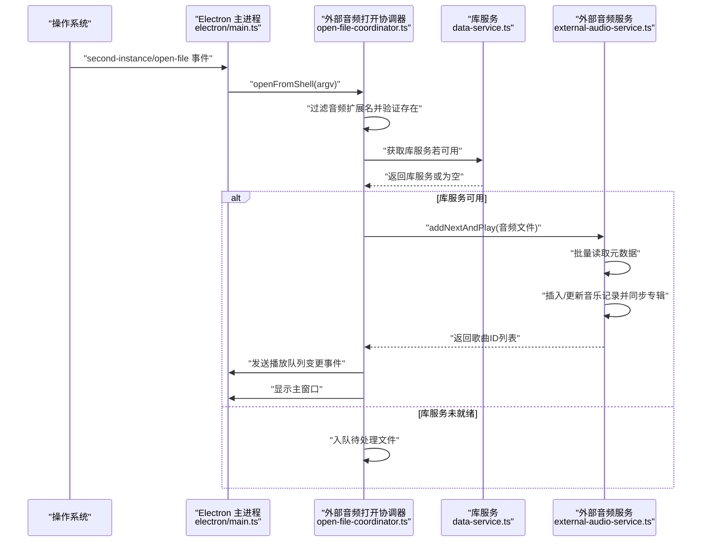
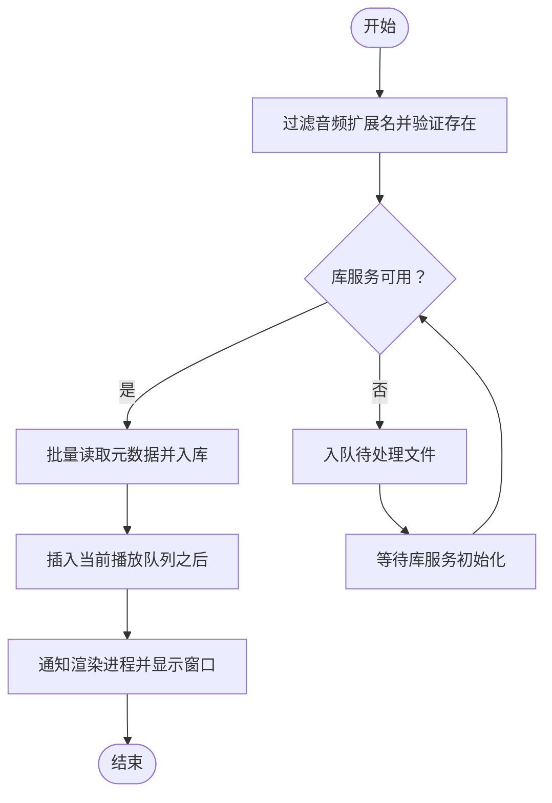
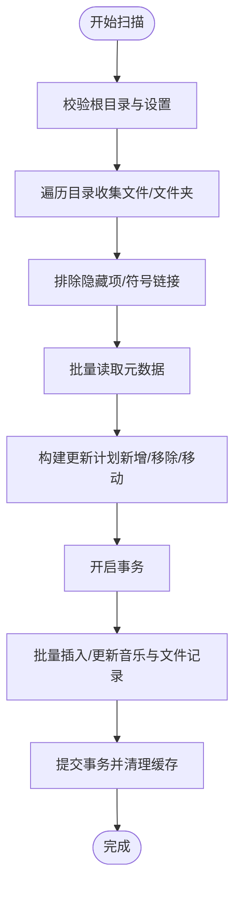
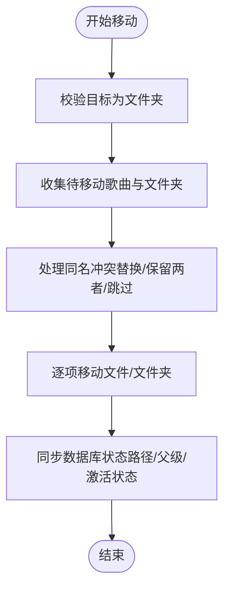
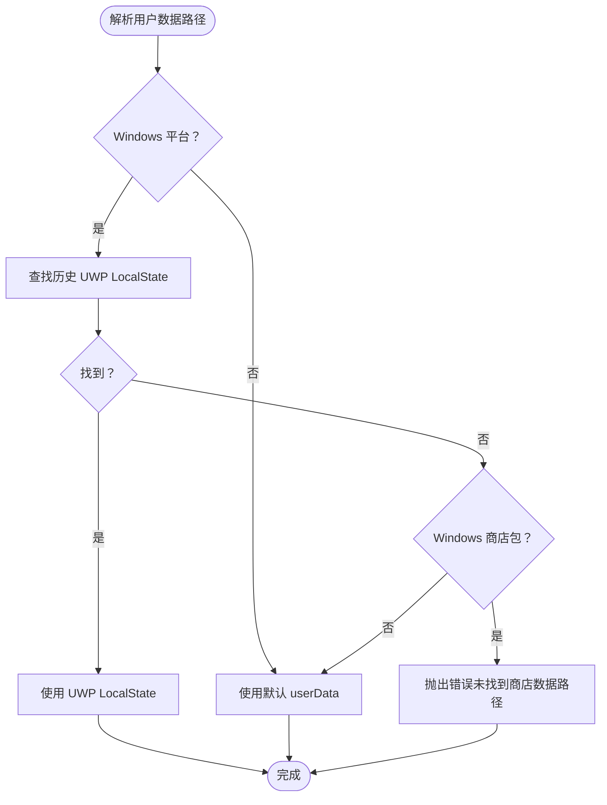
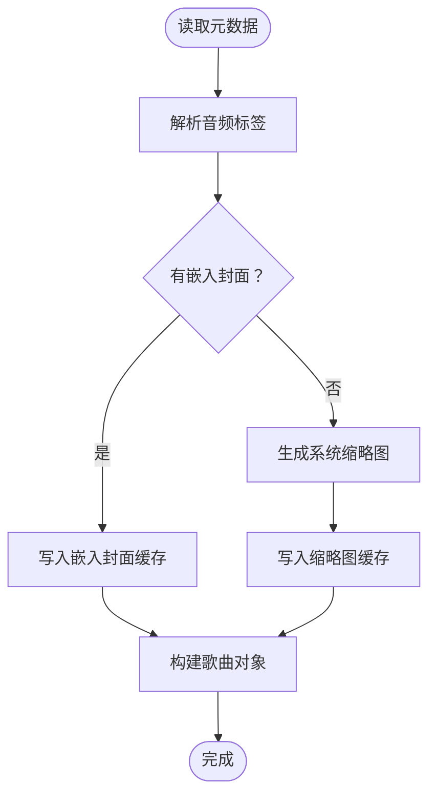
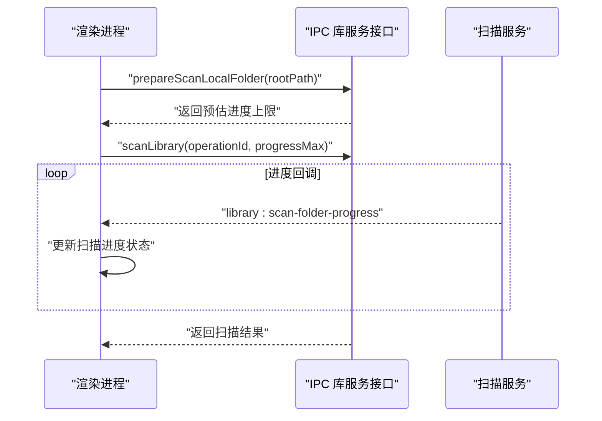
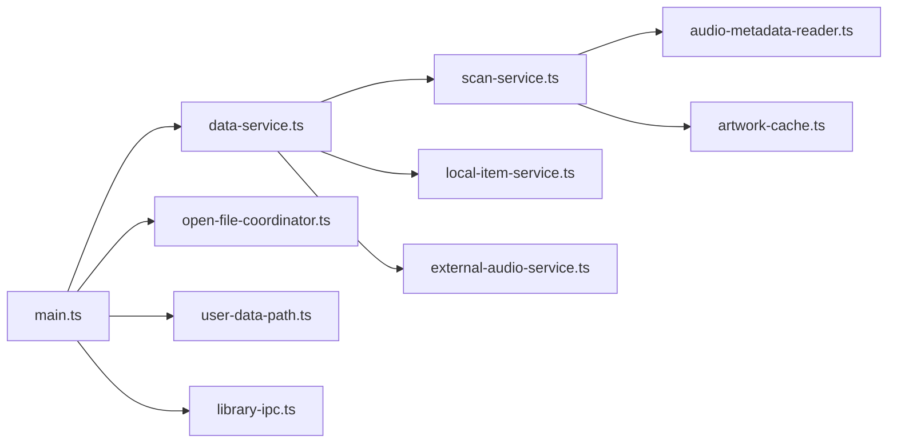

# 文件系统集成

<cite>
**本文引用的文件**
- [electron/main.ts](file://electron/main.ts)
- [electron/services/data-service.ts](file://electron/services/data-service.ts)
- [electron/services/constants.ts](file://electron/services/constants.ts)
- [electron/services/open-file-coordinator.ts](file://electron/services/open-file-coordinator.ts)
- [electron/services/external-audio-service.ts](file://electron/services/external-audio-service.ts)
- [electron/services/user-data-path.ts](file://electron/services/user-data-path.ts)
- [electron/services/scan-service.ts](file://electron/services/scan-service.ts)
- [electron/services/local-item-service.ts](file://electron/services/local-item-service.ts)
- [electron/services/local-file-actions.ts](file://electron/services/local-file-actions.ts)
- [electron/services/audio-metadata-reader.ts](file://electron/services/audio-metadata-reader.ts)
- [electron/services/artwork-cache.ts](file://electron/services/artwork-cache.ts)
- [electron/ipc/library-ipc.ts](file://electron/ipc/library-ipc.ts)
- [src/state/useLibraryStore.ts](file://src/state/useLibraryStore.ts)
</cite>

## 目录
1. [简介](#简介)
2. [项目结构](#项目结构)
3. [核心组件](#核心组件)
4. [架构总览](#架构总览)
5. [详细组件分析](#详细组件分析)
6. [依赖关系分析](#依赖关系分析)
7. [性能考量](#性能考量)
8. [故障排查指南](#故障排查指南)
9. [结论](#结论)
10. [附录](#附录)

## 简介
本文件系统集成文档聚焦于 SMPlayer 的本地文件系统能力，涵盖以下方面：
- 本地文件操作：读写权限管理、移动与复制、批量处理、回收站处理
- 外部音频文件打开协调器：接收外部音频、路径验证、播放队列管理
- 用户数据路径管理：配置与缓存目录解析、Windows UWP 数据迁移、便携模式支持
- 文件系统扫描与增量更新：目录遍历、元数据读取、数据库一致性、进度与取消
- 安全性：路径存在性校验、权限错误处理、冲突解决策略
- 跨平台差异：路径分隔符归一化、缩略图生成、Windows 特性适配
- 最佳实践与性能优化：并发控制、事务批处理、缓存清理

## 项目结构
围绕文件系统的关键模块分布如下：
- Electron 主进程入口负责应用生命周期、单实例锁、协议注册、窗口与托盘控制，并在启动时解析用户数据路径、初始化库服务与远程播放服务。
- 服务层提供扫描、本地项操作、外部音频打开、用户数据路径解析、元数据读取与封面缓存等能力。
- IPC 层暴露扫描、删除、移动等操作给渲染进程，同时传递扫描进度事件。

**图表来源**
- [electron/main.ts:141-200](file://electron/main.ts#L141-L200)
- [electron/services/data-service.ts:39-145](file://electron/services/data-service.ts#L39-L145)
- [electron/services/scan-service.ts:65-130](file://electron/services/scan-service.ts#L65-L130)
- [electron/services/audio-metadata-reader.ts:31-105](file://electron/services/audio-metadata-reader.ts#L31-L105)
- [electron/services/artwork-cache.ts:10-49](file://electron/services/artwork-cache.ts#L10-L49)
- [electron/services/local-item-service.ts:22-41](file://electron/services/local-item-service.ts#L22-L41)
- [electron/services/local-file-actions.ts:6-18](file://electron/services/local-file-actions.ts#L6-L18)
- [electron/ipc/library-ipc.ts:205-231](file://electron/ipc/library-ipc.ts#L205-L231)

**章节来源**
- [electron/main.ts:141-200](file://electron/main.ts#L141-L200)
- [electron/services/data-service.ts:39-145](file://electron/services/data-service.ts#L39-L145)

## 核心组件
- 外部音频打开协调器：负责接收外部传入的音频文件列表，过滤音频扩展名并确保文件存在，随后通过库服务添加到播放队列并显示窗口。
- 扫描服务：递归遍历音乐库根目录，识别隐藏项，读取音频元数据，构建数据库更新计划（新增/更新/移除/移动），并在事务中批量写入。
- 本地项服务：封装文件移动/复制/重命名/删除等操作，处理同名冲突（替换/保留两者/跳过），并同步数据库状态。
- 用户数据路径解析：优先使用历史 UWP LocalState 作为用户数据目录，否则回退到默认 userData；支持 Windows 商店包检测。
- 元数据读取与封面缓存：使用音乐标签解析库提取元数据，优先嵌入封面，否则回退到系统缩略图生成；缓存缩略图以提升后续访问性能。
- 回收站与冲突解决：提供安全删除（先检查再删除）与移动冲突解决对话框。

**章节来源**
- [electron/services/open-file-coordinator.ts:15-81](file://electron/services/open-file-coordinator.ts#L15-L81)
- [electron/services/scan-service.ts:131-306](file://electron/services/scan-service.ts#L131-L306)
- [electron/services/local-item-service.ts:79-159](file://electron/services/local-item-service.ts#L79-L159)
- [electron/services/user-data-path.ts:11-28](file://electron/services/user-data-path.ts#L11-L28)
- [electron/services/audio-metadata-reader.ts:31-74](file://electron/services/audio-metadata-reader.ts#L31-L74)
- [electron/services/artwork-cache.ts:10-49](file://electron/services/artwork-cache.ts#L10-L49)
- [electron/services/local-file-actions.ts:6-18](file://electron/services/local-file-actions.ts#L6-L18)

## 架构总览
外部音频文件进入流程（从操作系统到播放队列）：

**图表来源**
- [electron/main.ts:131-139](file://electron/main.ts#L131-L139)
- [electron/services/open-file-coordinator.ts:52-73](file://electron/services/open-file-coordinator.ts#L52-L73)
- [electron/services/external-audio-service.ts:56-97](file://electron/services/external-audio-service.ts#L56-L97)

## 详细组件分析

### 外部音频文件打开协调器
- 职责
  - 接收外部音频文件路径（命令行参数或 open-file 事件）
  - 过滤音频扩展名并验证文件存在
  - 若库服务尚未初始化，暂存待处理队列；初始化后批量导入并加入播放队列
  - 通知渲染进程播放队列变更并显示窗口
- 冲突与容错
  - 仅处理已知音频扩展名且存在的文件
  - 未初始化时延迟处理，避免丢失首次打开请求

**图表来源**
- [electron/services/open-file-coordinator.ts:52-73](file://electron/services/open-file-coordinator.ts#L52-L73)
- [electron/services/external-audio-service.ts:56-97](file://electron/services/external-audio-service.ts#L56-L97)

**章节来源**
- [electron/services/open-file-coordinator.ts:15-81](file://electron/services/open-file-coordinator.ts#L15-L81)
- [electron/services/external-audio-service.ts:14-121](file://electron/services/external-audio-service.ts#L14-L121)

### 扫描服务与增量更新
- 能力
  - 遍历根目录收集文件与文件夹，忽略隐藏项与符号链接
  - 读取音频元数据，计算新增/移除/移动文件
  - 使用数据库事务批量写入，保证一致性
  - 支持取消与进度回调，后台清理缩略图缓存
- 关键点
  - 路径归一化与大小写不敏感比较，避免重复或遗漏
  - 增量扫描针对指定文件夹，仅更新该范围内的记录
  - 权限错误明确抛出“无法访问”等信息，便于上层提示

**图表来源**
- [electron/services/scan-service.ts:131-306](file://electron/services/scan-service.ts#L131-L306)
- [electron/services/scan-service.ts:366-579](file://electron/services/scan-service.ts#L366-L579)

**章节来源**
- [electron/services/scan-service.ts:65-130](file://electron/services/scan-service.ts#L65-L130)
- [electron/services/scan-service.ts:131-306](file://electron/services/scan-service.ts#L131-L306)
- [electron/services/scan-service.ts:366-579](file://electron/services/scan-service.ts#L366-L579)

### 本地文件操作（移动/复制/删除/重命名）
- 移动/复制
  - 检查目标是否为文件夹
  - 处理同名冲突（替换/保留两者/跳过），必要时生成可用的兄弟路径
  - 对文件夹合并：递归处理子项，保持层级关系
- 删除
  - 提供安全删除函数：先检查存在性，再执行删除
  - 支持回收站（平台原生）
- 重命名/删除文件夹
  - 更新数据库中的路径引用与父级关系
- 状态同步
  - 通过状态服务在文件系统变更后同步数据库状态（激活/非激活）

**图表来源**
- [electron/services/local-item-service.ts:79-159](file://electron/services/local-item-service.ts#L79-L159)
- [electron/services/local-item-service.ts:187-346](file://electron/services/local-item-service.ts#L187-L346)
- [electron/services/local-file-actions.ts:6-18](file://electron/services/local-file-actions.ts#L6-L18)

**章节来源**
- [electron/services/local-item-service.ts:22-41](file://electron/services/local-item-service.ts#L22-L41)
- [electron/services/local-item-service.ts:79-159](file://electron/services/local-item-service.ts#L79-L159)
- [electron/services/local-item-service.ts:187-346](file://electron/services/local-item-service.ts#L187-L346)
- [electron/services/local-file-actions.ts:6-18](file://electron/services/local-file-actions.ts#L6-L18)

### 用户数据路径管理
- 优先策略
  - 在 Windows 上优先查找历史 UWP 包 LocalState 路径作为用户数据目录
  - 若未找到但检测到商店包，则抛出错误提示
  - 否则使用默认 userData 目录
- 便携模式
  - 通过 Electron app 路径设置实现便携行为（由上层逻辑决定）

**图表来源**
- [electron/services/user-data-path.ts:11-28](file://electron/services/user-data-path.ts#L11-L28)
- [electron/services/user-data-path.ts:34-76](file://electron/services/user-data-path.ts#L34-L76)

**章节来源**
- [electron/services/user-data-path.ts:11-28](file://electron/services/user-data-path.ts#L11-L28)
- [electron/services/user-data-path.ts:34-76](file://electron/services/user-data-path.ts#L34-L76)

### 元数据读取与封面缓存
- 元数据读取
  - 解析音频文件标签，提取标题、艺术家、专辑、时长等
  - 当无法解析时回退到文件名与空值
- 封面缓存
  - 优先写入嵌入封面到缓存
  - 若无嵌入封面，则调用系统缩略图生成并写入 PNG 缓存
- 并发与取消
  - 批量读取支持并发与取消信号，按完成进度回调

**图表来源**
- [electron/services/audio-metadata-reader.ts:31-74](file://electron/services/audio-metadata-reader.ts#L31-L74)
- [electron/services/artwork-cache.ts:10-49](file://electron/services/artwork-cache.ts#L10-L49)

**章节来源**
- [electron/services/audio-metadata-reader.ts:31-105](file://electron/services/audio-metadata-reader.ts#L31-L105)
- [electron/services/artwork-cache.ts:10-49](file://electron/services/artwork-cache.ts#L10-L49)

### IPC 与前端交互
- 扫描进度
  - 渲染进程通过 IPC 订阅扫描进度事件，UI 层展示阶段、计数与可取消状态
- 扫描入口
  - 提供全库扫描与文件夹扫描接口，支持取消操作 ID

**图表来源**
- [electron/ipc/library-ipc.ts:205-231](file://electron/ipc/library-ipc.ts#L205-L231)
- [src/state/useLibraryStore.ts:374-411](file://src/state/useLibraryStore.ts#L374-L411)

**章节来源**
- [electron/ipc/library-ipc.ts:205-231](file://electron/ipc/library-ipc.ts#L205-L231)
- [src/state/useLibraryStore.ts:374-411](file://src/state/useLibraryStore.ts#L374-L411)

## 依赖关系分析
- 组件耦合
  - 主进程依赖用户数据路径解析与库服务初始化
  - 库服务聚合扫描、本地项、外部音频、歌词、封面等服务
  - 扫描服务依赖元数据读取与封面缓存
  - 本地项服务依赖状态服务进行数据库一致性维护
- 外部依赖
  - 音频元数据解析库用于读取标签
  - Electron 原生图像与对话框用于缩略图与冲突解决

**图表来源**
- [electron/main.ts:141-200](file://electron/main.ts#L141-L200)
- [electron/services/data-service.ts:39-145](file://electron/services/data-service.ts#L39-L145)
- [electron/services/scan-service.ts:65-130](file://electron/services/scan-service.ts#L65-L130)
- [electron/services/audio-metadata-reader.ts:31-74](file://electron/services/audio-metadata-reader.ts#L31-L74)
- [electron/services/artwork-cache.ts:10-49](file://electron/services/artwork-cache.ts#L10-L49)
- [electron/services/open-file-coordinator.ts:15-81](file://electron/services/open-file-coordinator.ts#L15-L81)
- [electron/services/user-data-path.ts:11-28](file://electron/services/user-data-path.ts#L11-L28)
- [electron/ipc/library-ipc.ts:205-231](file://electron/ipc/library-ipc.ts#L205-L231)

**章节来源**
- [electron/services/data-service.ts:39-145](file://electron/services/data-service.ts#L39-L145)

## 性能考量
- 并发与批处理
  - 扫描与元数据读取采用固定并发度（批量读取并发常量），避免过多线程争用
  - 数据库写入使用事务批量提交，减少磁盘 I/O 开销
- 缓存与清理
  - 缩略图缓存异步清理，避免阻塞 IPC 返回
  - 封面优先使用嵌入式图片，减少系统缩略图生成成本
- 取消与进度
  - 扫描过程支持取消与进度回调，UI 及时反馈，避免长时间无响应
- 路径与比较
  - 归一化路径与大小写不敏感比较，降低重复扫描与误判概率

[本节为通用指导，无需具体文件分析]

## 故障排查指南
- “无法访问文件/目录”
  - 扫描服务对权限错误进行明确抛出，提示“无法访问”；请检查权限与路径有效性
- “未选择音乐库根目录”
  - 扫描前需设置根目录；若未设置会抛出相应错误
- “外部音频未播放”
  - 若库服务尚未初始化，外部音频会被暂存；等待初始化后自动处理
- “移动/复制冲突”
  - 使用冲突解决对话框选择替换/保留两者/跳过；必要时手动调整目标名称
- “删除无效”
  - 确认文件是否存在；不存在则直接忽略，避免错误

**章节来源**
- [electron/services/scan-service.ts:135-142](file://electron/services/scan-service.ts#L135-L142)
- [electron/services/scan-service.ts:1271-1284](file://electron/services/scan-service.ts#L1271-L1284)
- [electron/services/open-file-coordinator.ts:63-73](file://electron/services/open-file-coordinator.ts#L63-L73)
- [electron/services/local-file-actions.ts:6-18](file://electron/services/local-file-actions.ts#L6-L18)

## 结论
SMPlayer 的文件系统集成功能以服务化架构组织，围绕“扫描—元数据—入库—播放队列”的闭环实现。通过严格的路径校验、事务批处理与并发控制，兼顾了可靠性与性能。外部音频打开协调器与用户数据路径解析进一步增强了用户体验与跨平台兼容性。建议在实际部署中结合平台特性完善权限与路径策略，并持续优化扫描与缓存策略以获得更佳性能。

[本节为总结，无需具体文件分析]

## 附录
- 常用路径与配置
  - 用户数据目录：优先历史 UWP LocalState，否则默认 userData
  - 缩略图缓存目录：位于用户数据目录下的封面缓存文件夹
  - 数据库文件：位于用户数据目录下特定名称
- 扩展名集合
  - 已支持的音频扩展名集合用于外部音频过滤与扫描筛选

**章节来源**
- [electron/services/user-data-path.ts:11-28](file://electron/services/user-data-path.ts#L11-L28)
- [electron/services/data-service.ts:78-84](file://electron/services/data-service.ts#L78-L84)
- [electron/services/constants.ts:3-15](file://electron/services/constants.ts#L3-L15)