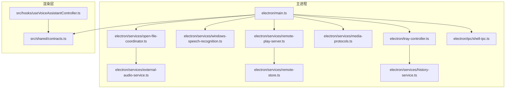
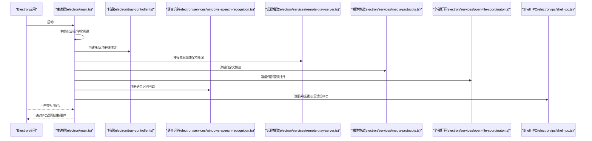
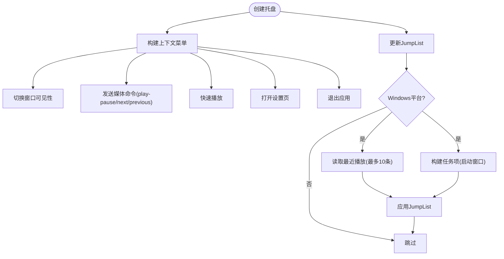
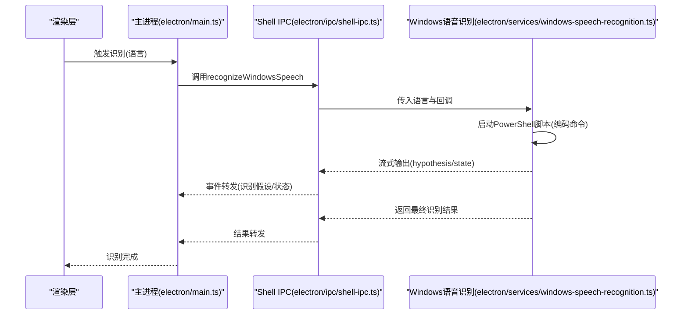
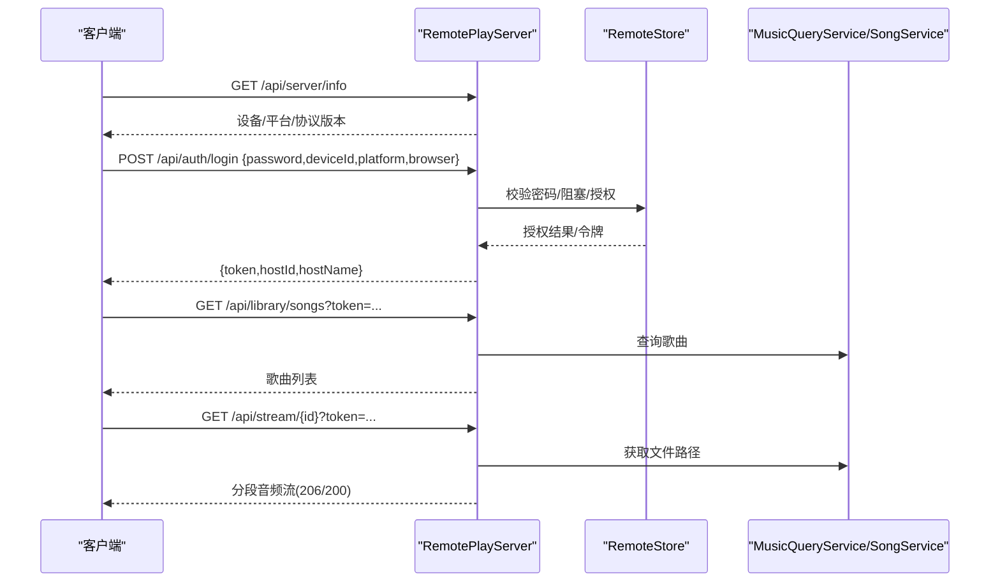
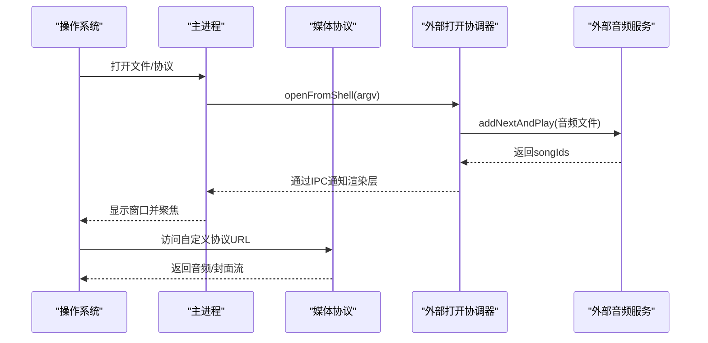
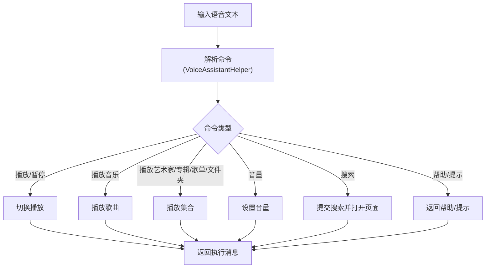
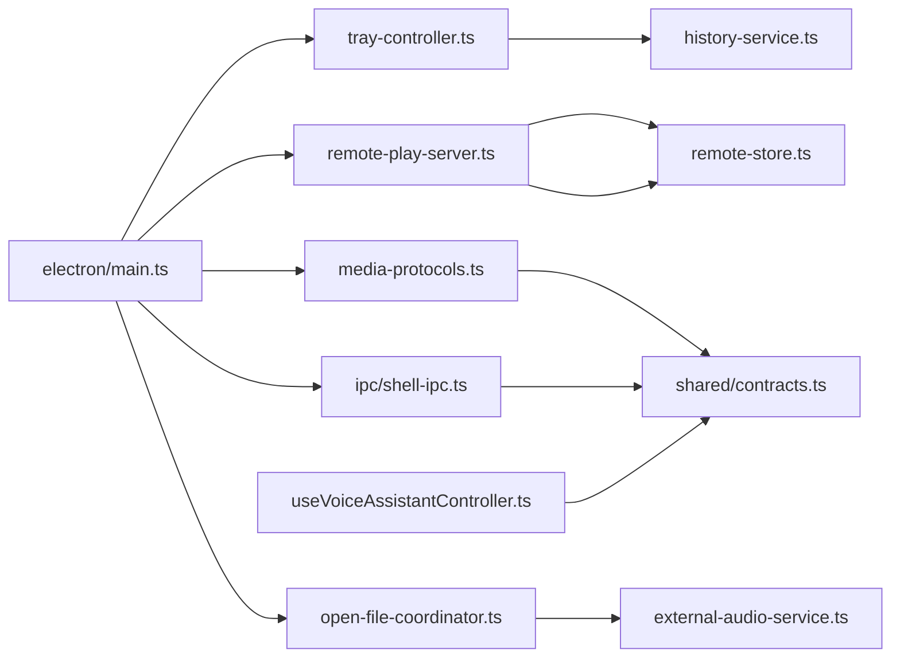

# 系统集成

<cite>
**本文引用的文件**
- [electron/main.ts](file://electron/main.ts)
- [electron/tray-controller.ts](file://electron/tray-controller.ts)
- [electron/services/windows-speech-recognition.ts](file://electron/services/windows-speech-recognition.ts)
- [electron/services/remote-play-server.ts](file://electron/services/remote-play-server.ts)
- [electron/services/media-protocols.ts](file://electron/services/media-protocols.ts)
- [electron/services/external-audio-service.ts](file://electron/services/external-audio-service.ts)
- [electron/services/open-file-coordinator.ts](file://electron/services/open-file-coordinator.ts)
- [electron/services/remote-store.ts](file://electron/services/remote-store.ts)
- [electron/services/history-service.ts](file://electron/services/history-service.ts)
- [electron/services/constants.ts](file://electron/services/constants.ts)
- [electron/ipc/shell-ipc.ts](file://electron/ipc/shell-ipc.ts)
- [src/shared/contracts.ts](file://src/shared/contracts.ts)
- [src/hooks/useVoiceAssistantController.ts](file://src/hooks/useVoiceAssistantController.ts)
</cite>

## 目录
1. [简介](#简介)
2. [项目结构](#项目结构)
3. [核心组件](#核心组件)
4. [架构总览](#架构总览)
5. [详细组件分析](#详细组件分析)
6. [依赖关系分析](#依赖关系分析)
7. [性能考量](#性能考量)
8. [故障排查指南](#故障排查指南)
9. [结论](#结论)
10. [附录](#附录)

## 简介
本文件面向SMPlayer在Windows平台的系统集成功能，围绕以下主题进行技术说明：
- Windows平台特性：系统托盘、JumpList、全局媒体键、文件关联与协议处理
- 语音助手集成：Windows语音识别API调用、命令解析与反馈
- 远程播放：本地HTTP服务器、播放列表与数据共享、鉴权与状态同步
- 与其他应用集成：文件协议、外部音频文件打开、系统通知
- 权限与安全：文件系统访问、网络权限、隐私保护
- 跨平台兼容性与Windows特性限制

## 项目结构
SMPlayer采用Electron主进程负责系统级集成（托盘、协议、语音、远程播放），渲染层通过IPC与主进程交互；服务层封装数据库、历史记录、远程存储等能力。

图表来源
- [electron/main.ts:1-243](file://electron/main.ts#L1-L243)
- [electron/tray-controller.ts:1-209](file://electron/tray-controller.ts#L1-L209)
- [electron/services/windows-speech-recognition.ts:1-240](file://electron/services/windows-speech-recognition.ts#L1-L240)
- [electron/services/remote-play-server.ts:1-295](file://electron/services/remote-play-server.ts#L1-L295)
- [electron/services/media-protocols.ts:1-120](file://electron/services/media-protocols.ts#L1-L120)
- [electron/services/open-file-coordinator.ts:1-81](file://electron/services/open-file-coordinator.ts#L1-L81)
- [electron/services/external-audio-service.ts:1-121](file://electron/services/external-audio-service.ts#L1-L121)
- [electron/services/remote-store.ts:1-525](file://electron/services/remote-store.ts#L1-L525)
- [electron/services/history-service.ts:1-484](file://electron/services/history-service.ts#L1-L484)
- [electron/ipc/shell-ipc.ts:1-100](file://electron/ipc/shell-ipc.ts#L1-L100)
- [src/shared/contracts.ts:1-664](file://src/shared/contracts.ts#L1-L664)
- [src/hooks/useVoiceAssistantController.ts:1-382](file://src/hooks/useVoiceAssistantController.ts#L1-L382)

章节来源
- [electron/main.ts:1-243](file://electron/main.ts#L1-L243)

## 核心组件
- 托盘与JumpList：系统托盘菜单、双击显示/隐藏窗口、媒体键快捷操作、Windows JumpList最近文件
- Windows语音识别：PowerShell脚本驱动WinRT语音识别，流式输出识别结果与状态
- 远程播放服务器：基于Node HTTP的内网分享，鉴权令牌、播放列表/歌曲/收藏/正在播放查询、分段音频流
- 文件协议与外部打开：注册自定义协议，处理外部音频文件打开与播放队列插入
- 历史与最近播放：维护最近播放路径、搜索历史、播放计数等
- 语音助手：命令解析、播放控制、音量调节、搜索与提示

章节来源
- [electron/tray-controller.ts:28-209](file://electron/tray-controller.ts#L28-L209)
- [electron/services/windows-speech-recognition.ts:26-129](file://electron/services/windows-speech-recognition.ts#L26-L129)
- [electron/services/remote-play-server.ts:77-295](file://electron/services/remote-play-server.ts#L77-L295)
- [electron/services/media-protocols.ts:10-88](file://electron/services/media-protocols.ts#L10-L88)
- [electron/services/open-file-coordinator.ts:40-81](file://electron/services/open-file-coordinator.ts#L40-L81)
- [electron/services/history-service.ts:30-484](file://electron/services/history-service.ts#L30-L484)
- [src/hooks/useVoiceAssistantController.ts:19-382](file://src/hooks/useVoiceAssistantController.ts#L19-L382)

## 架构总览
下图展示主进程如何在启动时初始化系统集成模块，并在运行期通过IPC与渲染层交互。

图表来源
- [electron/main.ts:141-243](file://electron/main.ts#L141-L243)
- [electron/tray-controller.ts:37-209](file://electron/tray-controller.ts#L37-L209)
- [electron/services/windows-speech-recognition.ts:26-129](file://electron/services/windows-speech-recognition.ts#L26-L129)
- [electron/services/remote-play-server.ts:104-147](file://electron/services/remote-play-server.ts#L104-L147)
- [electron/services/media-protocols.ts:10-88](file://electron/services/media-protocols.ts#L10-L88)
- [electron/services/open-file-coordinator.ts:52-73](file://electron/services/open-file-coordinator.ts#L52-L73)
- [electron/ipc/shell-ipc.ts:20-67](file://electron/ipc/shell-ipc.ts#L20-L67)

## 详细组件分析

### 系统托盘与JumpList（Windows）
- 托盘图标与菜单：根据窗口可见性切换“显示/隐藏”，播放/暂停、上一首/下一首、快速播放、设置入口、退出
- 全局媒体键：注册系统媒体键（播放/暂停、上一曲、下一曲、停止），转发到渲染层执行
- JumpList：仅在Windows生效，按打包状态决定是否启用“最近文件”分类；任务项包含启动参数以唤起窗口
- 最近播放：从历史服务读取最近播放路径，用于JumpList“最近”分类

图表来源
- [electron/tray-controller.ts:37-160](file://electron/tray-controller.ts#L37-L160)
- [electron/tray-controller.ts:171-188](file://electron/tray-controller.ts#L171-L188)
- [electron/services/history-service.ts:222-230](file://electron/services/history-service.ts#L222-L230)

章节来源
- [electron/tray-controller.ts:28-209](file://electron/tray-controller.ts#L28-L209)
- [electron/services/history-service.ts:30-484](file://electron/services/history-service.ts#L30-L484)

### Windows语音识别集成
- 平台限制：仅在Windows平台可用，其他平台返回不支持错误
- 执行流程：通过PowerShell以Base64编码脚本启动，WinRT SpeechRecognizer编译约束后UI识别，流式输出JSON
- 输出映射：识别过程中的“假设”与“状态”分别映射到前端状态；最终结果包含文本与错误码
- 取消与超时：超时自动取消；可主动取消当前识别进程
- 错误处理：权限不足、隐私策略、无语音、失败等错误码映射

图表来源
- [electron/main.ts:175-188](file://electron/main.ts#L175-L188)
- [electron/ipc/shell-ipc.ts:31-32](file://electron/ipc/shell-ipc.ts#L31-L32)
- [electron/services/windows-speech-recognition.ts:26-129](file://electron/services/windows-speech-recognition.ts#L26-L129)

章节来源
- [electron/services/windows-speech-recognition.ts:1-240](file://electron/services/windows-speech-recognition.ts#L1-L240)
- [electron/ipc/shell-ipc.ts:1-100](file://electron/ipc/shell-ipc.ts#L1-L100)
- [src/shared/contracts.ts:298-309](file://src/shared/contracts.ts#L298-L309)

### 远程播放服务器（内网分享）
- 启停控制：按设置启动/停止，记录端口与设备信息
- 鉴权：登录接口校验密码，生成一次性令牌并哈希保存；后续请求通过Authorization或URL token校验
- 数据接口：统计、歌曲、歌单、收藏、正在播放、当前播放队列
- 音频流：支持Range分段请求，按扩展名推断Content-Type
- 地址发现：列出所有非内网IPv4地址，便于局域网内其他设备访问

图表来源
- [electron/services/remote-play-server.ts:149-216](file://electron/services/remote-play-server.ts#L149-L216)
- [electron/services/remote-play-server.ts:218-255](file://electron/services/remote-play-server.ts#L218-L255)
- [electron/services/remote-store.ts:289-398](file://electron/services/remote-store.ts#L289-L398)

章节来源
- [electron/services/remote-play-server.ts:1-295](file://electron/services/remote-play-server.ts#L1-L295)
- [electron/services/remote-store.ts:1-525](file://electron/services/remote-store.ts#L1-L525)

### 文件协议与外部音频打开
- 协议注册：注册自定义scheme（媒体与封面），支持Fetch与流式传输
- 处理逻辑：解析URL中的歌曲ID，定位文件路径或封面URL，支持Range分段
- 外部打开：监听系统open-file与second-instance事件，过滤音频扩展名，异步导入并播放

图表来源
- [electron/main.ts:131-139](file://electron/main.ts#L131-L139)
- [electron/services/media-protocols.ts:34-87](file://electron/services/media-protocols.ts#L34-L87)
- [electron/services/open-file-coordinator.ts:52-73](file://electron/services/open-file-coordinator.ts#L52-L73)
- [electron/services/external-audio-service.ts:56-97](file://electron/services/external-audio-service.ts#L56-L97)

章节来源
- [electron/services/media-protocols.ts:1-120](file://electron/services/media-protocols.ts#L1-L120)
- [electron/services/open-file-coordinator.ts:1-81](file://electron/services/open-file-coordinator.ts#L1-L81)
- [electron/services/external-audio-service.ts:1-121](file://electron/services/external-audio-service.ts#L1-L121)
- [electron/services/constants.ts:1-28](file://electron/services/constants.ts#L1-L28)

### 语音助手（命令解析与反馈）
- 渲染层控制器：解析语音文本，匹配播放、艺术家、专辑、歌单、文件夹、音量、搜索等命令
- 执行动作：切换播放、播放指定对象、随机播放、调整音量、搜索并打开页面
- 提示与帮助：提供随机提示、帮助文本
- 与主进程协作：通过IPC触发识别、取消识别、显示通知

图表来源
- [src/hooks/useVoiceAssistantController.ts:214-324](file://src/hooks/useVoiceAssistantController.ts#L214-L324)
- [src/shared/contracts.ts:527-663](file://src/shared/contracts.ts#L527-L663)

章节来源
- [src/hooks/useVoiceAssistantController.ts:1-382](file://src/hooks/useVoiceAssistantController.ts#L1-L382)
- [src/shared/contracts.ts:1-664](file://src/shared/contracts.ts#L1-L664)

## 依赖关系分析
- 主进程依赖：托盘控制器依赖历史服务；远程播放依赖远程存储与查询服务；协议处理依赖库服务；外部打开依赖外部音频服务
- IPC桥接：Shell IPC负责系统通知、反馈、语音识别调用；App/Window/Data/Remote IPC负责业务数据与界面控制
- 类型契约：共享契约定义了远程播放、语音识别、播放控制等接口

图表来源
- [electron/main.ts:141-243](file://electron/main.ts#L141-L243)
- [electron/tray-controller.ts:1-209](file://electron/tray-controller.ts#L1-L209)
- [electron/services/remote-play-server.ts:1-295](file://electron/services/remote-play-server.ts#L1-L295)
- [electron/services/media-protocols.ts:1-120](file://electron/services/media-protocols.ts#L1-L120)
- [electron/services/open-file-coordinator.ts:1-81](file://electron/services/open-file-coordinator.ts#L1-L81)
- [electron/services/remote-store.ts:1-525](file://electron/services/remote-store.ts#L1-L525)
- [electron/services/history-service.ts:1-484](file://electron/services/history-service.ts#L1-L484)
- [electron/ipc/shell-ipc.ts:1-100](file://electron/ipc/shell-ipc.ts#L1-L100)
- [src/shared/contracts.ts:1-664](file://src/shared/contracts.ts#L1-L664)
- [src/hooks/useVoiceAssistantController.ts:1-382](file://src/hooks/useVoiceAssistantController.ts#L1-L382)

章节来源
- [electron/main.ts:1-243](file://electron/main.ts#L1-L243)
- [src/shared/contracts.ts:1-664](file://src/shared/contracts.ts#L1-L664)

## 性能考量
- 语音识别：识别过程通过子进程与PowerShell脚本执行，避免阻塞主线程；超时与取消机制确保资源回收
- 远程播放：音频流采用分段传输，减少内存占用；鉴权令牌哈希存储，避免明文泄露
- 外部打开：批量元数据读取并发度可控，事务化写入保证一致性
- 托盘与JumpList：仅在Windows平台启用，避免跨平台冗余计算

## 故障排查指南
- 语音识别无响应
  - 确认平台为Windows且已授权麦克风；检查隐私设置
  - 查看日志目录，确认PowerShell脚本执行情况
  - 参考错误码：不支持平台、不可用、隐私要求、无语音、失败、取消
- 远程播放无法访问
  - 确认服务器已启动且端口未被占用
  - 校验密码与令牌；检查设备是否被阻止
  - 确认局域网可达性与防火墙设置
- 托盘菜单无效
  - 检查是否为Windows平台；确认JumpList可用条件（打包状态）
  - 确认最近播放路径存在且可访问
- 外部音频文件无法打开
  - 检查扩展名是否在受支持列表中
  - 确认文件存在且可读

章节来源
- [electron/services/windows-speech-recognition.ts:26-129](file://electron/services/windows-speech-recognition.ts#L26-L129)
- [electron/services/remote-play-server.ts:174-177](file://electron/services/remote-play-server.ts#L174-L177)
- [electron/services/remote-store.ts:289-300](file://electron/services/remote-store.ts#L289-L300)
- [electron/tray-controller.ts:122-160](file://electron/tray-controller.ts#L122-L160)
- [electron/services/open-file-coordinator.ts:76-80](file://electron/services/open-file-coordinator.ts#L76-L80)
- [electron/services/constants.ts:3-15](file://electron/services/constants.ts#L3-L15)

## 结论
SMPlayer在Windows平台实现了完善的系统集成功能：托盘与JumpList提升桌面交互效率；Windows语音识别提供自然语言控制；内网远程播放满足家庭场景分享需求；文件协议与外部打开增强生态互操作；严格的鉴权与隐私保护确保安全。建议在部署时关注平台差异与权限配置，持续优化识别与流媒体体验。

## 附录
- 安全与隐私
  - 语音识别需用户授权麦克风；错误码明确隐私策略要求
  - 远程播放采用令牌鉴权与密码保护；阻塞设备可防止未授权访问
  - 日志与反馈渠道便于问题定位
- 跨平台兼容性
  - 托盘与JumpList、全局媒体键、语音识别等为Windows专属
  - 协议与外部打开在多平台通用，但具体行为由系统决定