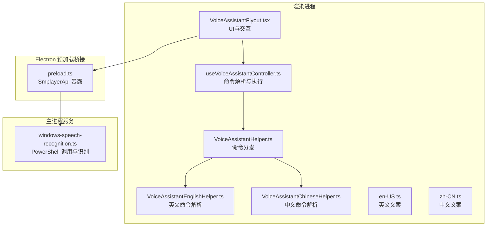
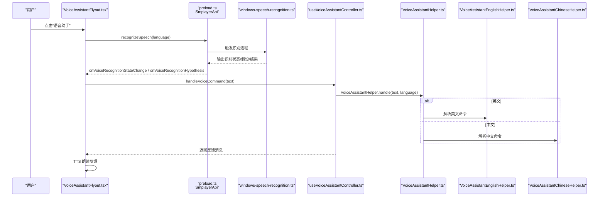
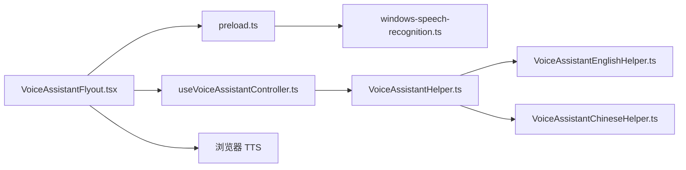

# 语音助手集成

<cite>
**本文引用的文件**
- [windows-speech-recognition.ts](file://electron/services/windows-speech-recognition.ts)
- [useVoiceAssistantController.ts](file://src/hooks/useVoiceAssistantController.ts)
- [VoiceAssistantFlyout.tsx](file://src/components/VoiceAssistantFlyout.tsx)
- [VoiceAssistantHelper.ts](file://src/shared/VoiceAssistantHelper.ts)
- [VoiceAssistantEnglishHelper.ts](file://src/shared/VoiceAssistantEnglishHelper.ts)
- [VoiceAssistantChineseHelper.ts](file://src/shared/VoiceAssistantChineseHelper.ts)
- [en-US.ts](file://src/shared/locales/en-US.ts)
- [zh-CN.ts](file://src/shared/locales/zh-CN.ts)
- [preload.ts](file://electron/preload.ts)
- [contracts.ts](file://src/shared/contracts.ts)
- [appModel.ts](file://src/appModel.ts)
</cite>

## 目录
1. [简介](#简介)
2. [项目结构](#项目结构)
3. [核心组件](#核心组件)
4. [架构总览](#架构总览)
5. [详细组件分析](#详细组件分析)
6. [依赖关系分析](#依赖关系分析)
7. [性能考虑](#性能考虑)
8. [故障排查指南](#故障排查指南)
9. [结论](#结论)
10. [附录](#附录)

## 简介
本技术文档面向 SMPlayer 的语音助手集成功能，系统性阐述 Windows 语音识别 API 的使用方式、语音命令解析与执行机制、语音反馈与 TTS 集成、语音助手控制器工作流、多语言支持与本地化配置，以及性能优化与准确性提升策略。文档同时提供语音命令清单与使用示例，帮助开发者与用户高效理解与使用该功能。

## 项目结构
语音助手相关代码主要分布在以下模块：
- Electron 主进程服务层：Windows 语音识别脚本封装与进程管理
- 渲染进程 Hook 层：语音命令解析、语义理解、命令执行与反馈
- UI 组件层：语音助手气泡窗、状态指示、帮助对话框
- 本地化与类型契约：多语言文案、IPC 接口定义

图表来源
- [VoiceAssistantFlyout.tsx:1-304](file://src/components/VoiceAssistantFlyout.tsx#L1-L304)
- [useVoiceAssistantController.ts:1-382](file://src/hooks/useVoiceAssistantController.ts#L1-L382)
- [VoiceAssistantHelper.ts:1-93](file://src/shared/VoiceAssistantHelper.ts#L1-L93)
- [VoiceAssistantEnglishHelper.ts:1-175](file://src/shared/VoiceAssistantEnglishHelper.ts#L1-L175)
- [VoiceAssistantChineseHelper.ts:1-185](file://src/shared/VoiceAssistantChineseHelper.ts#L1-L185)
- [en-US.ts:495-533](file://src/shared/locales/en-US.ts#L495-L533)
- [zh-CN.ts:470-508](file://src/shared/locales/zh-CN.ts#L470-L508)
- [preload.ts:155-179](file://electron/preload.ts#L155-L179)
- [windows-speech-recognition.ts:1-240](file://electron/services/windows-speech-recognition.ts#L1-L240)

章节来源
- [VoiceAssistantFlyout.tsx:1-304](file://src/components/VoiceAssistantFlyout.tsx#L1-L304)
- [useVoiceAssistantController.ts:1-382](file://src/hooks/useVoiceAssistantController.ts#L1-L382)
- [VoiceAssistantHelper.ts:1-93](file://src/shared/VoiceAssistantHelper.ts#L1-L93)
- [VoiceAssistantEnglishHelper.ts:1-175](file://src/shared/VoiceAssistantEnglishHelper.ts#L1-L175)
- [VoiceAssistantChineseHelper.ts:1-185](file://src/shared/VoiceAssistantChineseHelper.ts#L1-L185)
- [en-US.ts:495-533](file://src/shared/locales/en-US.ts#L495-L533)
- [zh-CN.ts:470-508](file://src/shared/locales/zh-CN.ts#L470-L508)
- [preload.ts:155-179](file://electron/preload.ts#L155-L179)
- [windows-speech-recognition.ts:1-240](file://electron/services/windows-speech-recognition.ts#L1-L240)

## 核心组件
- Windows 语音识别服务：通过 PowerShell 启动 UWP 语音识别引擎，输出识别结果与状态事件
- 语音助手控制器：接收识别文本，进行语义解析、匹配命令类型、执行对应业务逻辑
- UI 语音助手 Flyout：展示识别状态、提示与帮助，触发 TTS 文字转语音反馈
- 命令解析器：根据首选语言选择英文或中文解析器，提取参数并生成命令结果
- 多语言本地化：英文与中文语音助手文案、命令说明与提示

章节来源
- [windows-speech-recognition.ts:26-129](file://electron/services/windows-speech-recognition.ts#L26-L129)
- [useVoiceAssistantController.ts:214-324](file://src/hooks/useVoiceAssistantController.ts#L214-L324)
- [VoiceAssistantFlyout.tsx:75-160](file://src/components/VoiceAssistantFlyout.tsx#L75-L160)
- [VoiceAssistantHelper.ts:65-78](file://src/shared/VoiceAssistantHelper.ts#L65-L78)

## 架构总览
语音助手整体流程如下：
- 用户点击“语音助手”按钮，UI 打开 Flyout 并请求识别
- 预加载桥接暴露 recognizeSpeech/cancelSpeechRecognition/onVoiceRecognition* 等接口
- 主进程启动 PowerShell 脚本，调用 UWP 语音识别 API，输出识别文本与状态
- 渲染进程监听识别状态与假设文本，实时更新 UI
- 识别完成后，调用控制器解析命令并执行，返回反馈消息
- UI 通过浏览器 TTS 将反馈消息朗读出来

图表来源
- [VoiceAssistantFlyout.tsx:97-160](file://src/components/VoiceAssistantFlyout.tsx#L97-L160)
- [preload.ts:155-179](file://electron/preload.ts#L155-L179)
- [windows-speech-recognition.ts:26-129](file://electron/services/windows-speech-recognition.ts#L26-L129)
- [useVoiceAssistantController.ts:214-324](file://src/hooks/useVoiceAssistantController.ts#L214-L324)
- [VoiceAssistantHelper.ts:65-78](file://src/shared/VoiceAssistantHelper.ts#L65-L78)
- [VoiceAssistantEnglishHelper.ts:10-65](file://src/shared/VoiceAssistantEnglishHelper.ts#L10-L65)
- [VoiceAssistantChineseHelper.ts:10-61](file://src/shared/VoiceAssistantChineseHelper.ts#L10-L61)

## 详细组件分析

### Windows 语音识别服务（主进程）
- 初始化与生命周期
  - 通过 PowerShell 启动编码后的脚本，避免命令行注入风险
  - 使用 UTF-16LE 编码与 Base64 编码传递脚本，确保跨平台兼容
  - 进程超时控制（18 秒），无语音输入时主动结束
  - 支持取消识别，终止当前识别进程
- 识别引擎配置
  - 自动解析首选语言，映射到 zh-CN 或 en-US
  - 使用 Windows.Globalization.Language 与 SpeechRecognizer.SupportedTopicLanguages 进行语言匹配
  - 通过 CompileConstraintsAsync 预编译约束，提高识别稳定性
- 事件与输出
  - HypothesisGenerated 事件输出中间结果（假设文本）
  - StateChanged 事件输出状态映射（idle/capturing/processing）
  - RecognizeWithUIAsync 完整识别结果，包含错误码与文本
- 错误处理
  - 权限不足：privacy-required
  - 不支持平台：unsupported-platform
  - 无语音：no-speech
  - 取消：canceled
  - 其他异常：failed

章节来源
- [windows-speech-recognition.ts:26-129](file://electron/services/windows-speech-recognition.ts#L26-L129)
- [windows-speech-recognition.ts:135-239](file://electron/services/windows-speech-recognition.ts#L135-L239)

### 语音助手控制器（渲染进程）
- 命令解析与执行
  - 通过 VoiceAssistantHelper.handle(text, language) 分发到英文或中文解析器
  - 支持播放控制、音量调节、搜索、帮助、取消等命令类型
  - 对“按艺术家/专辑/歌单/文件夹”类命令进行参数提取与匹配
- 数据检索与播放
  - 在音乐库中查找最佳匹配（歌曲、艺术家、专辑、歌单、文件夹）
  - 通过 playbackCommands 与 playback 控制器执行播放
- 语音反馈
  - 根据命令类型返回本地化反馈文案
  - 对音量命令返回当前音量值
  - 对“未理解”场景返回继续提示，驱动二次识别

章节来源
- [useVoiceAssistantController.ts:214-324](file://src/hooks/useVoiceAssistantController.ts#L214-L324)
- [useVoiceAssistantController.ts:368-374](file://src/hooks/useVoiceAssistantController.ts#L368-L374)

### 语音助手 UI 组件（Flyout）
- 状态与交互
  - idle/capturing/processing 三种状态，配合波纹动画与进度指示
  - 监听识别状态与假设文本，实时更新 UI
  - 识别结束后调用 onVoiceCommand，获得反馈消息
- TTS 语音反馈
  - 使用浏览器 speechSynthesis API，按语言设置朗读
  - 支持取消正在进行的 TTS
- 帮助与提示
  - 提供“获取帮助”入口，展示支持的命令清单
  - 首次识别时提供提示语，引导用户说出“快速播放”等常用命令

章节来源
- [VoiceAssistantFlyout.tsx:75-160](file://src/components/VoiceAssistantFlyout.tsx#L75-L160)
- [VoiceAssistantFlyout.tsx:179-220](file://src/components/VoiceAssistantFlyout.tsx#L179-L220)

### 命令解析器与多语言支持
- 命令类型
  - 播放控制：Play、Pause、Previous、Next
  - 播放内容：PlayMusic、PlayArtist、PlayAlbum、PlayPlaylist、PlayFolder、QuickPlay、SearchAndPlay
  - 音量控制：ChangeVolume（支持 to/turn up/down/百分比/分数）
  - 搜索与帮助：Search、Help
  - 取消：Nothing
- 英文解析器
  - 支持“play”、“resume/continue”、“volume/sound/turn up/down”等关键词
  - 支持“by”、“in/from/of”等介词短语
  - 支持“半/四分之一”等比例表达
- 中文解析器
  - 支持“播放/快速播放/恢复/继续/暂停/前一首/后一首/音量/搜索/帮助/静音/取消静音/没事/算了”
  - 支持“的/中的/的专辑/的歌曲/的歌”等标记
- 本地化文案
  - 英文：voiceAssistant.* 与 voiceAssistant.command.*
  - 中文：voiceAssistant.* 与 voiceAssistant.command.*

章节来源
- [VoiceAssistantHelper.ts:5-32](file://src/shared/VoiceAssistantHelper.ts#L5-L32)
- [VoiceAssistantEnglishHelper.ts:10-65](file://src/shared/VoiceAssistantEnglishHelper.ts#L10-L65)
- [VoiceAssistantChineseHelper.ts:10-61](file://src/shared/VoiceAssistantChineseHelper.ts#L10-L61)
- [en-US.ts:495-533](file://src/shared/locales/en-US.ts#L495-L533)
- [zh-CN.ts:470-508](file://src/shared/locales/zh-CN.ts#L470-L508)

### 预加载桥接与 IPC
- 暴露接口
  - recognizeSpeech(language)：发起识别
  - cancelSpeechRecognition()：取消识别
  - onVoiceRecognitionHypothesis(cb)：监听假设文本
  - onVoiceRecognitionStateChange(cb)：监听识别状态
- 类型契约
  - VoiceRecognitionResult/Hypothesis/StateChange 定义识别数据结构
  - SmplayerApi 定义完整的 API 面

章节来源
- [preload.ts:155-179](file://electron/preload.ts#L155-L179)
- [contracts.ts:298-309](file://src/shared/contracts.ts#L298-L309)
- [contracts.ts:527-663](file://src/shared/contracts.ts#L527-L663)

## 依赖关系分析
- 组件耦合
  - UI 依赖预加载桥接；预加载桥接依赖主进程服务
  - 控制器依赖解析器；解析器依赖语言特定解析器
  - UI 依赖控制器；控制器依赖播放与搜索能力
- 外部依赖
  - Windows UWP 语音识别 API（SpeechRecognizer）
  - 浏览器 speechSynthesis API（TTS）
  - PowerShell 进程与 UTF-8/UTF-16LE 编码转换

图表来源
- [VoiceAssistantFlyout.tsx:1-304](file://src/components/VoiceAssistantFlyout.tsx#L1-L304)
- [preload.ts:155-179](file://electron/preload.ts#L155-L179)
- [windows-speech-recognition.ts:1-240](file://electron/services/windows-speech-recognition.ts#L1-L240)
- [useVoiceAssistantController.ts:1-382](file://src/hooks/useVoiceAssistantController.ts#L1-L382)
- [VoiceAssistantHelper.ts:1-93](file://src/shared/VoiceAssistantHelper.ts#L1-L93)
- [VoiceAssistantEnglishHelper.ts:1-175](file://src/shared/VoiceAssistantEnglishHelper.ts#L1-L175)
- [VoiceAssistantChineseHelper.ts:1-185](file://src/shared/VoiceAssistantChineseHelper.ts#L1-L185)

## 性能考虑
- 识别超时与资源释放
  - 18 秒超时避免长时间占用系统资源
  - 识别结束后及时释放 SpeechRecognizer 实例
- 语言匹配与编译
  - 通过 SupportedTopicLanguages 与 SystemSpeechLanguage 选择最合适的语言
  - CompileConstraintsAsync 预编译约束，减少识别延迟
- UI 响应与 TTS
  - 假设文本实时显示，提升交互体验
  - TTS 朗读前取消之前的语音，避免叠加
- 识别状态映射
  - 将底层状态映射为 idle/capturing/processing，便于 UI 适配

章节来源
- [windows-speech-recognition.ts:96-129](file://electron/services/windows-speech-recognition.ts#L96-L129)
- [windows-speech-recognition.ts:175-237](file://electron/services/windows-speech-recognition.ts#L175-L237)
- [VoiceAssistantFlyout.tsx:75-86](file://src/components/VoiceAssistantFlyout.tsx#L75-L86)

## 故障排查指南
- 不支持平台
  - 现象：返回 unsupported-platform
  - 处理：仅在 Windows 平台启用语音识别
- 无语音输入
  - 现象：返回 no-speech
  - 处理：提示用户靠近麦克风或提高音量
- 隐私权限
  - 现象：返回 privacy-required
  - 处理：引导用户在系统设置中开启麦克风与语音输入权限
- 识别失败
  - 现象：返回 failed
  - 处理：检查系统语音服务、驱动与权限
- 取消识别
  - 现象：返回 canceled
  - 处理：正常流程，无需额外处理
- TTS 问题
  - 现象：无语音或发音异常
  - 处理：检查浏览器 TTS 支持与系统语音设置

章节来源
- [windows-speech-recognition.ts:215-232](file://electron/services/windows-speech-recognition.ts#L215-L232)
- [VoiceAssistantFlyout.tsx:121-132](file://src/components/VoiceAssistantFlyout.tsx#L121-L132)
- [en-US.ts:496-523](file://src/shared/locales/en-US.ts#L496-L523)
- [zh-CN.ts:471-498](file://src/shared/locales/zh-CN.ts#L471-L498)

## 结论
SMPlayer 的语音助手通过 Windows UWP 语音识别 API 与浏览器 TTS 能力，实现了简洁可靠的语音控制体验。其设计将识别、解析、执行与反馈解耦，既保证了易维护性，也为后续扩展（如更多命令、多轮对话、个性化提示）提供了清晰的边界。建议在生产环境中持续关注识别准确率与用户体验，结合本地化与性能优化策略，进一步提升语音助手的实用性与稳定性。

## 附录

### 语音命令清单与使用示例
- 播放控制
  - “播放/继续/恢复”：开始播放
  - “暂停”：暂停播放
  - “上一首/前一首”：上一曲
  - “下一首/后一首”：下一曲
- 播放内容
  - “播放歌曲 [关键词]”：播放指定歌曲
  - “播放歌手 [歌手名]”：随机播放该歌手歌曲
  - “播放专辑 [专辑名]”：随机播放该专辑歌曲
  - “播放歌单 [歌单名]”：随机播放该歌单歌曲
  - “播放文件夹 [文件夹名]”：随机播放该文件夹歌曲
  - “播放 [关键词] by [歌手]”：播放某歌手的歌曲
  - “播放 [关键词] in [专辑/歌单/文件夹]”：在指定容器内播放歌曲
  - “快速播放”：随机播放
- 搜索
  - “搜索 [关键词]”：搜索并展示结果
- 音量
  - “音量调高/调低 [数值|%|分数]”：调整音量
  - “音量调到 [数值|%|分数]”：设置到指定音量
  - “静音/取消静音”：静音切换
- 帮助与取消
  - “帮助”：显示支持的命令
  - “没事/算了”：取消当前操作

章节来源
- [VoiceAssistantEnglishHelper.ts:10-65](file://src/shared/VoiceAssistantEnglishHelper.ts#L10-L65)
- [VoiceAssistantChineseHelper.ts:10-61](file://src/shared/VoiceAssistantChineseHelper.ts#L10-L61)
- [en-US.ts:499-510](file://src/shared/locales/en-US.ts#L499-L510)
- [zh-CN.ts:475-484](file://src/shared/locales/zh-CN.ts#L475-L484)