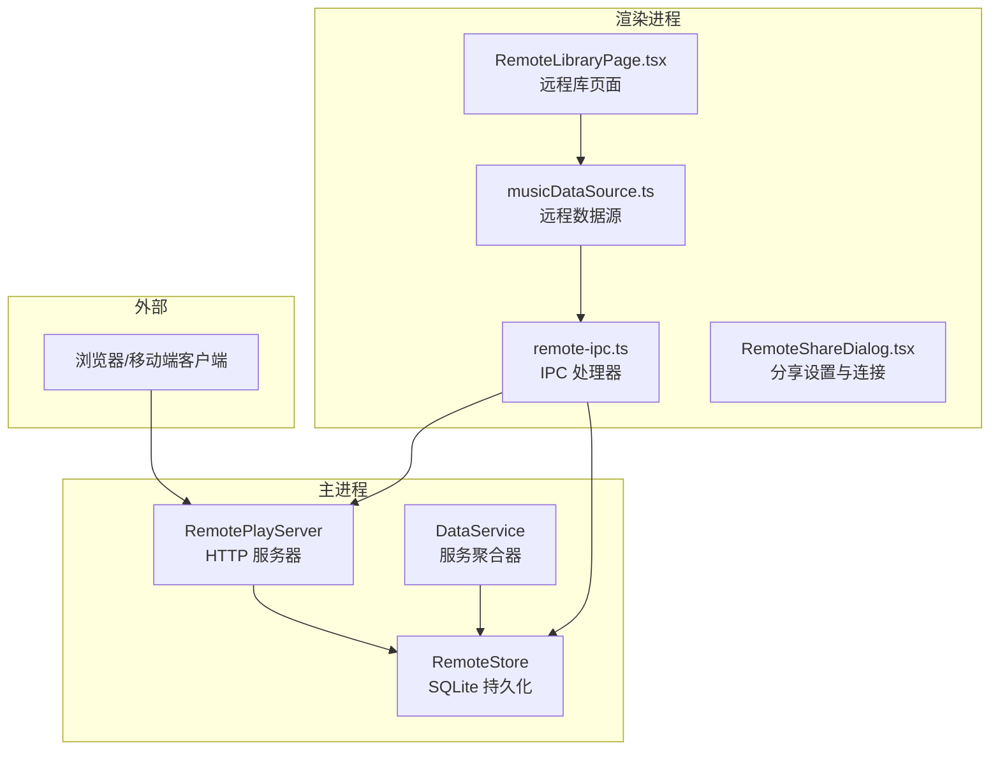
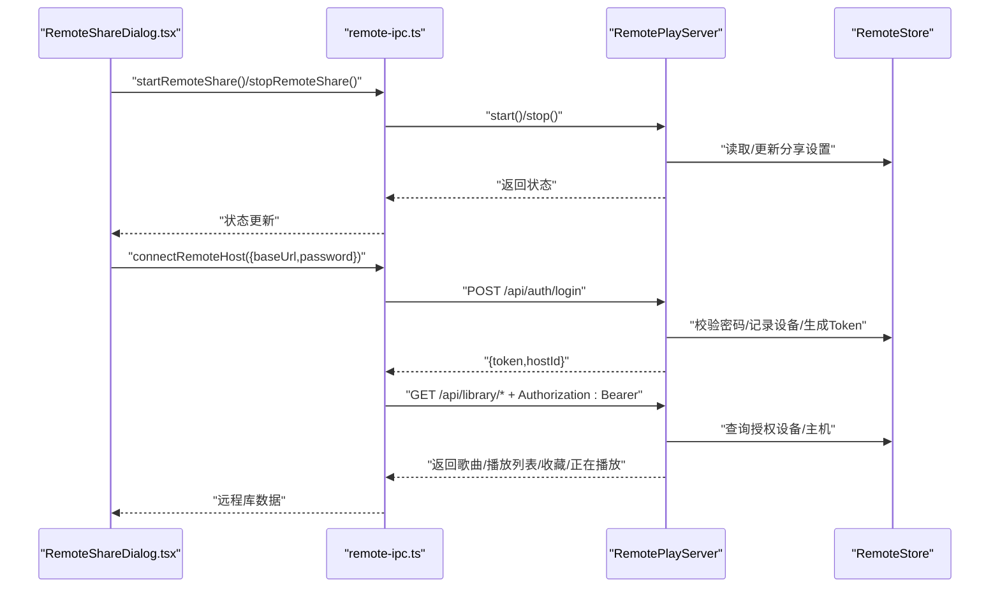
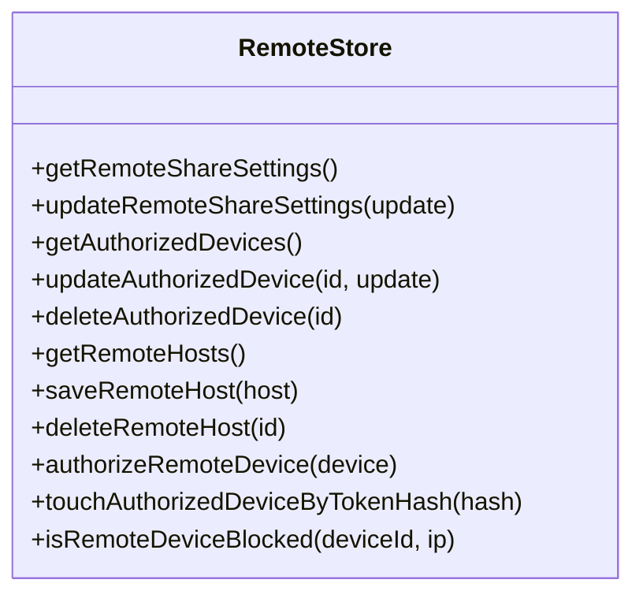
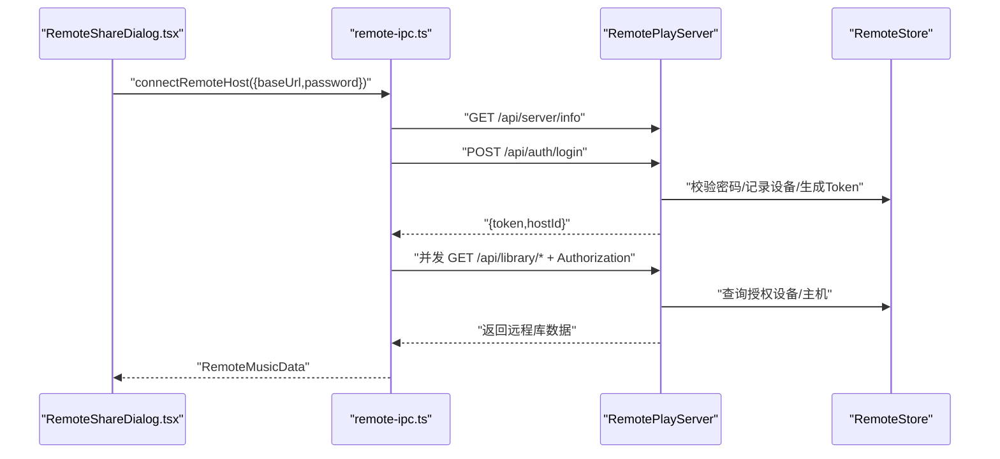
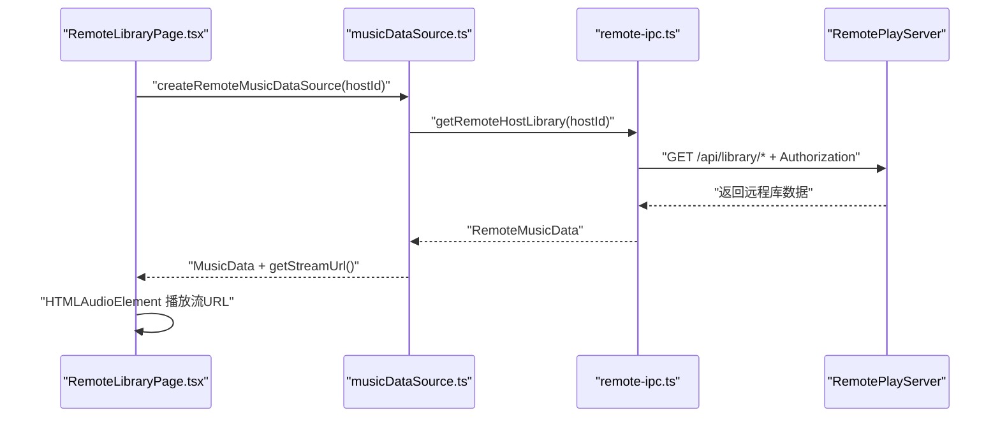
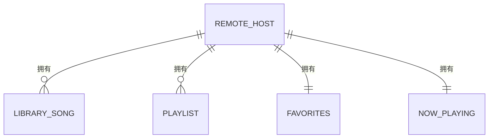
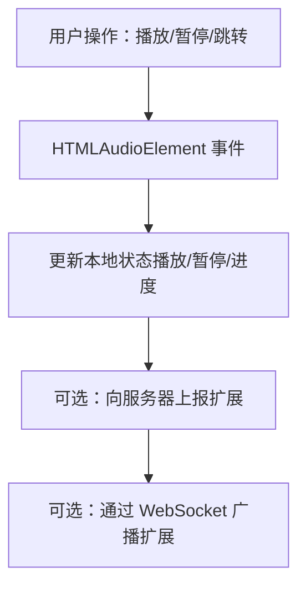
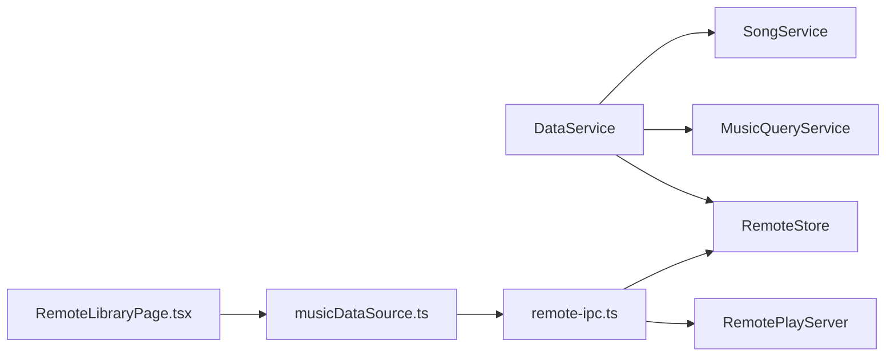
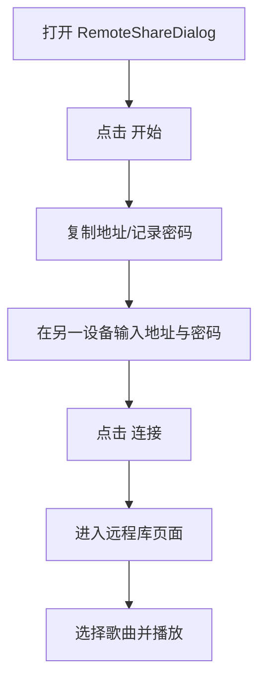

# 远程播放功能

<cite>
**本文引用的文件**
- [electron\services\remote-play-server.ts](file://electron/services/remote-play-server.ts)
- [electron\services\remote-store.ts](file://electron/services/remote-store.ts)
- [electron\ipc\remote-ipc.ts](file://electron/ipc/remote-ipc.ts)
- [src\components\RemoteShareDialog.tsx](file://src/components/RemoteShareDialog.tsx)
- [src\pages\RemoteLibraryPage.tsx](file://src/pages/RemoteLibraryPage.tsx)
- [src\data\musicDataSource.ts](file://src/data/musicDataSource.ts)
- [src\shared\contracts.ts](file://src/shared/contracts.ts)
- [electron\services\data-service.ts](file://electron/services/data-service.ts)
- [electron\services\constants.ts](file://electron/services/constants.ts)
- [src\hooks\usePlaybackController.ts](file://src/hooks/usePlaybackController.ts)
- [src\state\playbackProgressStore.ts](file://src/state/playbackProgressStore.ts)
- [src\state\useLibraryStore.ts](file://src/state/useLibraryStore.ts)
</cite>

## 目录
1. [简介](#简介)
2. [项目结构](#项目结构)
3. [核心组件](#核心组件)
4. [架构总览](#架构总览)
5. [详细组件分析](#详细组件分析)
6. [依赖关系分析](#依赖关系分析)
7. [性能考量](#性能考量)
8. [故障排查指南](#故障排查指南)
9. [结论](#结论)
10. [附录：使用流程与配置](#附录使用流程与配置)

## 简介
本文件系统性阐述 SMPlayer 的远程播放功能，覆盖远程播放服务器实现（HTTP 接口与鉴权）、客户端连接与播放控制、网络共享播放列表的数据模型与传输方式、实时播放状态同步机制、远程存储服务设计、安全与故障恢复策略，以及完整的使用流程与配置建议。需要特别说明的是：当前代码库未实现基于 WebSocket 的实时播放状态广播；实际的播放控制与状态同步通过本地 HTMLAudioElement 与前端状态管理完成，服务器侧提供音频流与基础元数据接口。

## 项目结构
远程播放功能由三部分组成：
- 服务器端：Electron 主进程中的 HTTP 服务器，负责鉴权、媒体流与元数据接口
- 客户端：渲染进程中的 UI 组件与数据源，负责连接、展示与播放控制
- 存储层：SQLite 数据库，保存远程分享设置、授权设备、远端主机信息



**图表来源**
- [electron\services\remote-play-server.ts:77-295](file://electron/services/remote-play-server.ts#L77-L295)
- [electron\services\remote-store.ts:49-525](file://electron/services/remote-store.ts#L49-L525)
- [electron\ipc\remote-ipc.ts:19-135](file://electron/ipc/remote-ipc.ts#L19-L135)
- [src\components\RemoteShareDialog.tsx:13-249](file://src/components/RemoteShareDialog.tsx#L13-L249)
- [src\pages\RemoteLibraryPage.tsx:11-198](file://src/pages/RemoteLibraryPage.tsx#L11-L198)
- [src\data\musicDataSource.ts:205-285](file://src/data/musicDataSource.ts#L205-L285)

**章节来源**
- [electron\services\remote-play-server.ts:77-295](file://electron/services/remote-play-server.ts#L77-L295)
- [electron\services\remote-store.ts:49-525](file://electron/services/remote-store.ts#L49-L525)
- [electron\ipc\remote-ipc.ts:19-135](file://electron/ipc/remote-ipc.ts#L19-L135)
- [src\components\RemoteShareDialog.tsx:13-249](file://src/components/RemoteShareDialog.tsx#L13-L249)
- [src\pages\RemoteLibraryPage.tsx:11-198](file://src/pages/RemoteLibraryPage.tsx#L11-L198)
- [src\data\musicDataSource.ts:205-285](file://src/data/musicDataSource.ts#L205-L285)

## 核心组件
- 远程播放服务器（RemotePlayServer）
  - 提供鉴权接口、媒体流接口、音乐库元数据接口
  - 基于 Node.js http.Server 实现，支持断点续播
- 远程存储（RemoteStore）
  - 管理远程分享设置、授权设备、远端主机连接信息
  - 使用 SQLite 持久化，含时间戳与状态字段
- IPC 处理器（remote-ipc.ts）
  - 将渲染进程请求转发到主进程服务，处理连接、拉取远程库、鉴权等
- 客户端 UI 与数据源
  - RemoteShareDialog.tsx：分享开关、密码修改、连接远端主机
  - RemoteLibraryPage.tsx：远程库浏览与播放控制
  - musicDataSource.ts：远程数据源封装，统一本地/远程数据接口

**章节来源**
- [electron\services\remote-play-server.ts:77-295](file://electron/services/remote-play-server.ts#L77-L295)
- [electron\services\remote-store.ts:49-525](file://electron/services/remote-store.ts#L49-L525)
- [electron\ipc\remote-ipc.ts:19-135](file://electron/ipc/remote-ipc.ts#L19-L135)
- [src\components\RemoteShareDialog.tsx:13-249](file://src/components/RemoteShareDialog.tsx#L13-L249)
- [src\pages\RemoteLibraryPage.tsx:11-198](file://src/pages/RemoteLibraryPage.tsx#L11-L198)
- [src\data\musicDataSource.ts:205-285](file://src/data/musicDataSource.ts#L205-L285)

## 架构总览
远程播放采用“主进程 HTTP 服务器 + 渲染进程 IPC 调用”的模式：
- 渲染进程通过 IPC 请求主进程启动/停止远程分享、连接远端主机、获取远程库
- 主进程 RemotePlayServer 对外暴露 REST 风格接口，鉴权基于一次性 Token
- 客户端通过 HTMLAudioElement 播放服务器返回的媒体流 URL



**图表来源**
- [electron\ipc\remote-ipc.ts:22-111](file://electron/ipc/remote-ipc.ts#L22-L111)
- [electron\services\remote-play-server.ts:104-147](file://electron/services/remote-play-server.ts#L104-L147)
- [electron\services\remote-store.ts:289-398](file://electron/services/remote-store.ts#L289-L398)

**章节来源**
- [electron\ipc\remote-ipc.ts:19-135](file://electron/ipc/remote-ipc.ts#L19-L135)
- [electron\services\remote-play-server.ts:77-295](file://electron/services/remote-play-server.ts#L77-L295)
- [electron\services\remote-store.ts:49-525](file://electron/services/remote-store.ts#L49-L525)

## 详细组件分析

### 远程播放服务器（RemotePlayServer）
- 启动与停止
  - start()：监听指定端口，失败时抛出错误；成功后更新分享状态
  - stop()：关闭服务器，清理状态
- 鉴权流程
  - 登录接口：接收密码、设备标识、平台信息；校验后生成随机 Token 并持久化
  - 授权校验：后续请求从 Authorization 或查询参数中提取 Token，哈希匹配后刷新最近活跃时间
- 媒体流接口
  - GET /api/stream/{songId}：根据 Range 支持断点续播，按扩展名返回正确 Content-Type
- 元数据接口
  - GET /api/server/info：返回设备信息与协议版本
  - GET /api/library/*：歌曲、播放列表、收藏、正在播放等快照

```mermaid
flowchart TD
Start(["收到请求"]) --> Method{"方法与路径"}
Method --> |OPTIONS| Ok204["204 No Content"]
Method --> |GET /api/server/info| Info["返回设备信息"]
Method --> |POST /api/auth/login| Login["校验密码/生成Token"]
Method --> |受保护资源| Auth["校验Token"]
Auth --> |无效| Unauthorized["401 未授权"]
Auth --> |有效| Protected["返回数据或流"]
Method --> |GET /api/stream/{id}| Stream["断点续播音频流"]
Method --> |其他| NotFound["404 未找到"]
```

**图表来源**
- [electron\services\remote-play-server.ts:149-216](file://electron/services/remote-play-server.ts#L149-L216)
- [electron\services\remote-play-server.ts:218-255](file://electron/services/remote-play-server.ts#L218-L255)
- [electron\services\remote-play-server.ts:266-293](file://electron/services/remote-play-server.ts#L266-L293)

**章节来源**
- [electron\services\remote-play-server.ts:77-295](file://electron/services/remote-play-server.ts#L77-L295)

### 远程存储服务（RemoteStore）
- 分享设置
  - 获取/更新远程分享设置（设备名、端口、密码），首次运行自动生成默认值
- 授权设备
  - 列表、更新、删除；支持允许/阻止状态；记录最近活跃时间
- 远端主机
  - 保存/删除连接信息，关联 Token；用于后续鉴权与数据拉取
- 时间与兼容性
  - 统一 ISO 时间存储，兼容 .NET 时间戳格式转换



**图表来源**
- [electron\services\remote-store.ts:49-525](file://electron/services/remote-store.ts#L49-L525)

**章节来源**
- [electron\services\remote-store.ts:49-525](file://electron/services/remote-store.ts#L49-L525)

### IPC 处理器（remote-ipc.ts）
- 远程分享控制
  - get-status、start、stop、update-settings
- 授权与主机管理
  - authorized-devices:list/update/delete
  - remote-hosts:list/connect/get-library/delete
- 连接与拉库流程
  - 读取远端 /api/server/info
  - POST /api/auth/login 获取 Token
  - 并发拉取歌曲、播放列表、收藏、正在播放
  - 为每首歌补全媒体流 URL（携带 token）



**图表来源**
- [electron\ipc\remote-ipc.ts:71-135](file://electron/ipc/remote-ipc.ts#L71-L135)

**章节来源**
- [electron\ipc\remote-ipc.ts:19-135](file://electron/ipc/remote-ipc.ts#L19-L135)

### 客户端 UI 与数据源
- RemoteShareDialog.tsx
  - 展示运行状态、复制地址、修改密码、连接远端主机、管理已连接主机与授权设备
- RemoteLibraryPage.tsx
  - 创建远程数据源，播放控制（播放/暂停/下一首），绑定 HTMLAudioElement
- musicDataSource.ts（远程）
  - 缓存远程库数据，映射歌曲/播放列表 ID，构建本地 MusicData 结构
  - 提供 getStreamUrl 返回带 token 的流地址



**图表来源**
- [src\pages\RemoteLibraryPage.tsx:16-82](file://src/pages/RemoteLibraryPage.tsx#L16-L82)
- [src\data\musicDataSource.ts:205-285](file://src/data/musicDataSource.ts#L205-L285)
- [electron\ipc\remote-ipc.ts:113-135](file://electron/ipc/remote-ipc.ts#L113-L135)

**章节来源**
- [src\components\RemoteShareDialog.tsx:13-249](file://src/components/RemoteShareDialog.tsx#L13-L249)
- [src\pages\RemoteLibraryPage.tsx:11-198](file://src/pages/RemoteLibraryPage.tsx#L11-L198)
- [src\data\musicDataSource.ts:205-285](file://src/data/musicDataSource.ts#L205-L285)

### 数据模型与传输格式
- RemoteMusicData
  - 包含 host、songs、playlists、favorites、nowPlaying
  - 每首歌包含媒体流 URL（带 token）与封面占位
- 协议版本
  - 服务器在 /api/server/info 中返回 protocolVersion 字段
- 序列化与传输
  - 所有接口以 JSON 文本传输，媒体流以字节范围响应



**图表来源**
- [src\shared\contracts.ts:162-168](file://src/shared/contracts.ts#L162-L168)

**章节来源**
- [src\shared\contracts.ts:106-180](file://src/shared/contracts.ts#L106-L180)

### 实时播放状态同步
- 当前实现
  - 服务器不提供 WebSocket 实时广播；播放控制由客户端本地 HTMLAudioElement 完成
  - 前端通过定时器与事件监听同步播放进度，维持本地状态一致
- 可扩展方向
  - 引入 WebSocket 通道，服务器广播播放状态变更（播放/暂停、进度、切换曲目）
  - 客户端订阅状态，自动同步 UI 与播放行为



**图表来源**
- [src\pages\RemoteLibraryPage.tsx:32-82](file://src/pages/RemoteLibraryPage.tsx#L32-L82)
- [src\hooks\usePlaybackController.ts:270-289](file://src/hooks/usePlaybackController.ts#L270-L289)
- [src\state\playbackProgressStore.ts:1-51](file://src/state/playbackProgressStore.ts#L1-L51)

**章节来源**
- [src\pages\RemoteLibraryPage.tsx:11-198](file://src/pages/RemoteLibraryPage.tsx#L11-L198)
- [src\hooks\usePlaybackController.ts:270-289](file://src/hooks/usePlaybackController.ts#L270-L289)
- [src\state\playbackProgressStore.ts:1-51](file://src/state/playbackProgressStore.ts#L1-L51)

## 依赖关系分析
- 服务聚合
  - DataService 聚合 RemoteStore、MusicQueryService、SongService 等，为主进程提供统一入口
- 组件耦合
  - RemoteLibraryPage 依赖 musicDataSource.ts 提供统一数据接口
  - IPC 处理器桥接渲染进程与主进程服务
- 外部依赖
  - Node.js http、fs、path、crypto、os
  - Electron ipcMain/ipcRenderer
  - SQLite（node:sqlite）



**图表来源**
- [electron\services\data-service.ts:39-145](file://electron/services/data-service.ts#L39-L145)
- [electron\services\remote-play-server.ts:77-92](file://electron/services/remote-play-server.ts#L77-L92)
- [electron\services\remote-store.ts:49-78](file://electron/services/remote-store.ts#L49-L78)
- [electron\ipc\remote-ipc.ts:19-54](file://electron/ipc/remote-ipc.ts#L19-L54)
- [src\data\musicDataSource.ts:205-285](file://src/data/musicDataSource.ts#L205-L285)

**章节来源**
- [electron\services\data-service.ts:39-145](file://electron/services/data-service.ts#L39-L145)
- [electron\services\remote-play-server.ts:77-92](file://electron/services/remote-play-server.ts#L77-L92)
- [electron\services\remote-store.ts:49-78](file://electron/services/remote-store.ts#L49-L78)
- [electron\ipc\remote-ipc.ts:19-54](file://electron/ipc/remote-ipc.ts#L19-L54)
- [src\data\musicDataSource.ts:205-285](file://src/data/musicDataSource.ts#L205-L285)

## 性能考量
- 媒体流
  - 断点续播减少带宽占用，适合局域网环境
  - Content-Type 按扩展名精确设置，提升浏览器兼容性
- 数据拉取
  - IPC 并发拉取多个元数据接口，缩短首屏加载时间
- 缓存策略
  - 远程数据源对歌曲/播放列表进行本地缓存，避免重复拉取
- I/O 优化
  - SQLite WAL 模式与定期 checkpoint（flush/close）降低写放大

**章节来源**
- [electron\services\remote-play-server.ts:266-293](file://electron/services/remote-play-server.ts#L266-L293)
- [electron\ipc\remote-ipc.ts:113-135](file://electron/ipc/remote-ipc.ts#L113-L135)
- [src\data\musicDataSource.ts:205-285](file://src/data/musicDataSource.ts#L205-L285)
- [electron\services\data-service.ts:147-154](file://electron/services/data-service.ts#L147-L154)

## 故障排查指南
- 无法连接远端主机
  - 检查远端是否已启动远程分享、端口是否开放、密码是否正确
  - 查看授权设备是否被阻止（blocked）
- 播放无声音或卡顿
  - 确认媒体流 URL 正确且带有有效 token
  - 检查断点续播 Range 请求是否被正确解析
- 鉴权失败
  - 确保登录请求头包含正确的 Authorization 或查询参数 token
  - 若密码变更，旧 token 会失效，需重新登录获取新 token

**章节来源**
- [electron\services\remote-play-server.ts:174-177](file://electron/services/remote-play-server.ts#L174-L177)
- [electron\services\remote-store.ts:289-398](file://electron/services/remote-store.ts#L289-L398)
- [electron\ipc\remote-ipc.ts:71-111](file://electron/ipc/remote-ipc.ts#L71-L111)

## 结论
SMPlayer 的远程播放功能以简洁稳健的方式实现了“主进程 HTTP 服务器 + 渲染进程 IPC”的解耦架构。服务器提供鉴权与媒体流接口，客户端负责播放控制与 UI 展示。当前未实现 WebSocket 实时广播，但通过本地状态管理与断点续播已满足基本播放需求。未来可在保持现有接口不变的前提下，引入 WebSocket 实现实时状态同步与多端一致性。

## 附录：使用流程与配置

### 使用流程
- 启动远程分享
  - 在 RemoteShareDialog 中点击“开始”，获取本地地址与密码
- 连接远端主机
  - 输入远端地址与密码，点击“连接”；成功后显示已连接主机列表
- 浏览与播放
  - 打开“远程库”页面，选择艺术家/专辑/播放列表，点击歌曲播放
  - 播放控制：播放/暂停、下一首、进度跳转



**图表来源**
- [src\components\RemoteShareDialog.tsx:50-90](file://src/components/RemoteShareDialog.tsx#L50-L90)
- [src\pages\RemoteLibraryPage.tsx:26-82](file://src/pages/RemoteLibraryPage.tsx#L26-L82)

**章节来源**
- [src\components\RemoteShareDialog.tsx:13-249](file://src/components/RemoteShareDialog.tsx#L13-L249)
- [src\pages\RemoteLibraryPage.tsx:11-198](file://src/pages/RemoteLibraryPage.tsx#L11-L198)

### 配置选项
- 分享设置
  - 设备名、端口、密码；支持动态更新
- 授权设备
  - 允许/阻止设备；查看最近活跃时间
- 远端主机
  - 保存连接信息与 Token；支持删除

**章节来源**
- [electron\services\remote-store.ts:56-115](file://electron/services/remote-store.ts#L56-L115)
- [electron\services\remote-store.ts:117-169](file://electron/services/remote-store.ts#L117-L169)
- [electron\services\remote-store.ts:171-263](file://electron/services/remote-store.ts#L171-L263)

### 安全与合规
- 认证
  - 登录时校验密码，生成一次性 Token 并持久化；后续请求必须携带有效 Token
- 访问控制
  - 支持按设备 ID/IP 拉黑授权设备
- 加密
  - 当前未实现 TLS；建议在可信局域网内使用，或通过反向代理启用 HTTPS

**章节来源**
- [electron\services\remote-play-server.ts:218-255](file://electron/services/remote-play-server.ts#L218-L255)
- [electron\services\remote-store.ts:289-398](file://electron/services/remote-store.ts#L289-L398)

### 故障恢复与重试
- 连接失败
  - 重试登录流程，确认密码与远端状态
- Token 失效
  - 重新发起登录获取新 Token
- 服务器重启
  - 客户端需重新连接并重新登录

**章节来源**
- [electron\ipc\remote-ipc.ts:71-111](file://electron/ipc/remote-ipc.ts#L71-L111)
- [electron\services\remote-play-server.ts:104-147](file://electron/services/remote-play-server.ts#L104-L147)