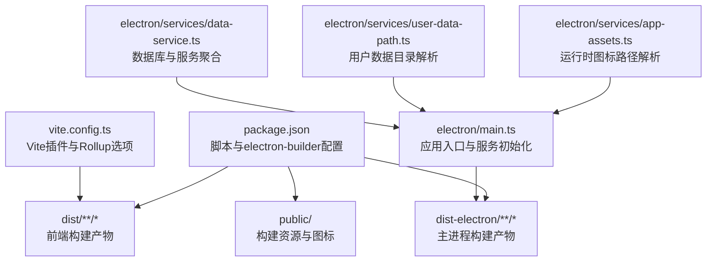
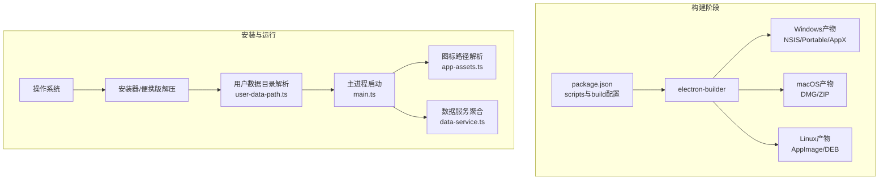
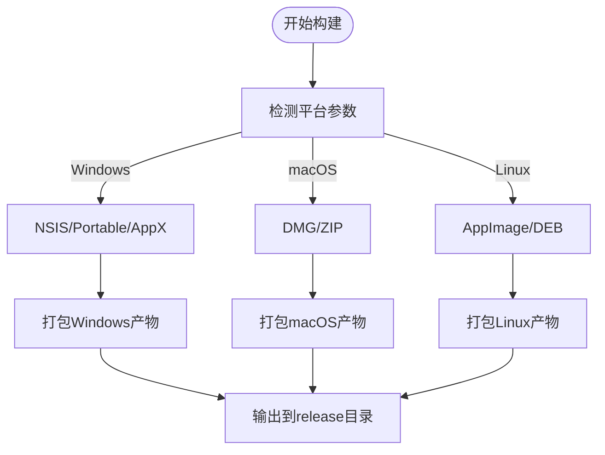
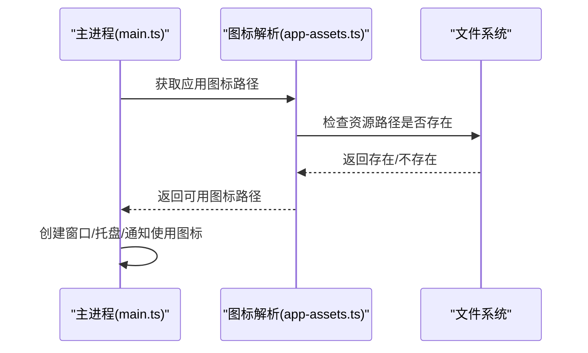
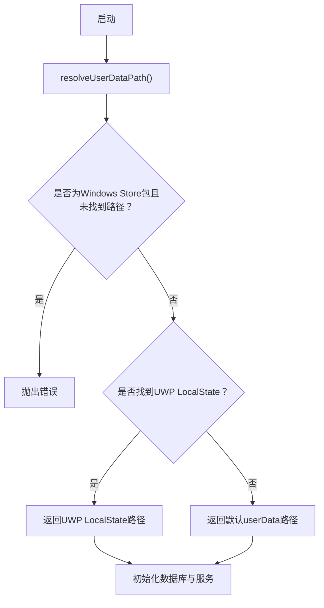
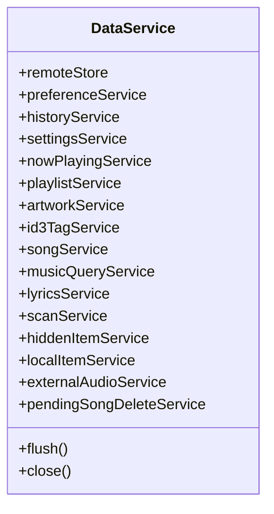
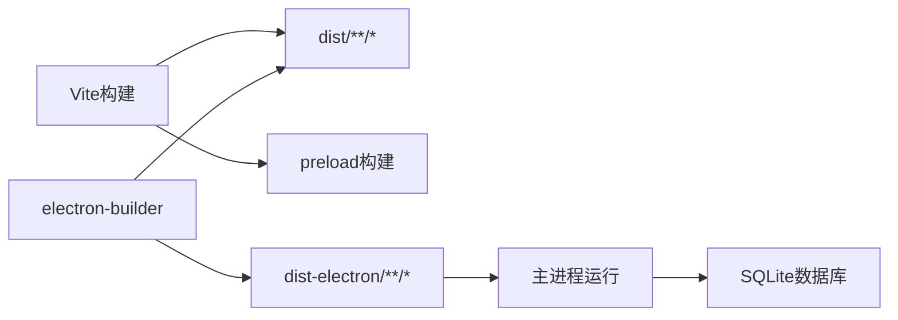

# 部署打包

<cite>
**本文引用的文件**
- [package.json](file://package.json)
- [vite.config.ts](file://vite.config.ts)
- [electron/main.ts](file://electron/main.ts)
- [electron/services/app-assets.ts](file://electron/services/app-assets.ts)
- [electron/services/user-data-path.ts](file://electron/services/user-data-path.ts)
- [electron/services/data-service.ts](file://electron/services/data-service.ts)
</cite>

## 目录
1. [简介](#简介)
2. [项目结构](#项目结构)
3. [核心组件](#核心组件)
4. [架构总览](#架构总览)
5. [详细组件分析](#详细组件分析)
6. [依赖关系分析](#依赖关系分析)
7. [性能考虑](#性能考虑)
8. [故障排除指南](#故障排除指南)
9. [结论](#结论)
10. [附录](#附录)

## 简介
本指南面向SMPlayer项目的部署与打包，聚焦于electron-builder的配置与使用，覆盖多平台构建（Windows NSIS/便携版/AppX；macOS DMG/ZIP；Linux AppImage/DEB）、安装包定制、文件关联、图标与资源、发布流程、安装/卸载行为以及部署后的维护与更新策略。文档同时结合项目现有配置，给出可执行的构建命令与注意事项，并提供常见问题排查建议。

## 项目结构
SMPlayer采用Electron + Vite的前端渲染架构，构建产物分为Web端与主进程两部分。electron-builder通过package.json中的build字段统一配置各平台目标与打包细节，Vite负责前端构建，主进程由vite-plugin-electron进行编译与打包。

**图表来源**
- [package.json:50-173](file://package.json#L50-L173)
- [vite.config.ts:7-35](file://vite.config.ts#L7-L35)
- [electron/main.ts:141-219](file://electron/main.ts#L141-L219)
- [electron/services/app-assets.ts:12-27](file://electron/services/app-assets.ts#L12-L27)
- [electron/services/user-data-path.ts:11-28](file://electron/services/user-data-path.ts#L11-L28)
- [electron/services/data-service.ts:39-145](file://electron/services/data-service.ts#L39-L145)

**章节来源**
- [package.json:8-22](file://package.json#L8-L22)
- [vite.config.ts:7-35](file://vite.config.ts#L7-L35)
- [electron/main.ts:141-219](file://electron/main.ts#L141-L219)

## 核心组件
- 构建与打包
  - 使用electron-builder在多平台生成安装包或便携版，支持NSIS（Windows）、Portable（Windows）、DMG/ZIP（macOS）、AppImage/DEB（Linux）。
  - 通过脚本命令快速触发构建：开发、打包为目录、生成发布产物、按平台定向构建。
- 资源与图标
  - 在build.extraResources中将图标复制到打包资源目录，运行时根据平台选择ico/png。
  - fileAssociations定义音频扩展名与默认图标，便于系统侧文件关联。
- 应用入口与服务
  - 主进程初始化窗口、托盘、远程播放、协议注册、单实例锁、用户数据目录解析等。
  - 数据服务聚合数据库、扫描、歌词、播放列表、历史等子服务。

**章节来源**
- [package.json:50-173](file://package.json#L50-L173)
- [electron/services/app-assets.ts:12-27](file://electron/services/app-assets.ts#L12-L27)
- [electron/main.ts:141-219](file://electron/main.ts#L141-L219)

## 架构总览
下图展示从构建到安装后运行的关键节点与交互：

**图表来源**
- [package.json:50-173](file://package.json#L50-L173)
- [electron/services/user-data-path.ts:11-28](file://electron/services/user-data-path.ts#L11-L28)
- [electron/services/app-assets.ts:12-27](file://electron/services/app-assets.ts#L12-L27)
- [electron/main.ts:141-219](file://electron/main.ts#L141-L219)

## 详细组件分析

### electron-builder配置与多平台构建
- 基本设置
  - appId、productName、copyright、asar启用、asarUnpack、npmRebuild、输出目录与制品命名模板、需要打包的文件列表。
- 资源与图标
  - extraResources复制图标至assets目录，fileAssociations声明音频扩展与图标，确保系统侧文件关联生效。
- 平台目标
  - macOS：生成DMG与ZIP。
  - Windows：生成NSIS安装器与Portable便携版，请求执行级别为“以当前用户身份”。
  - Linux：生成AppImage与DEB。
  - AppX：指定身份名称、应用ID、发布者信息、显示名、背景色、语言、最低/最高版本、能力集等。
- 安装器定制（Windows NSIS）
  - 允许自定义安装目录、桌面/开始菜单快捷方式、安装标题栏文本、卸载时不删除应用数据等。

**图表来源**
- [package.json:100-171](file://package.json#L100-L171)

**章节来源**
- [package.json:50-173](file://package.json#L50-L173)

### 图标与资源文件
- 图标来源
  - Windows使用ICO，macOS/Linux使用PNG；运行时根据平台选择对应图标路径。
- 资源打包
  - 通过extraResources将图标复制到打包资源目录，保证运行时可访问。
- 文件关联
  - fileAssociations声明多种音频格式与图标，提升系统侧打开体验。

**图表来源**
- [electron/services/app-assets.ts:12-27](file://electron/services/app-assets.ts#L12-L27)
- [electron/main.ts:141-219](file://electron/main.ts#L141-L219)

**章节来源**
- [package.json:69-99](file://package.json#L69-L99)
- [electron/services/app-assets.ts:12-27](file://electron/services/app-assets.ts#L12-L27)

### 用户数据目录与安装位置
- 数据目录解析
  - 优先查找旧版UWP LocalState路径以保持数据连续性；若为Windows Store包但未找到路径则抛错；否则使用默认userData目录。
- 单实例与协议
  - 设置AppUserModelID（Windows），请求单实例锁，处理二次启动与外部文件打开事件。

**图表来源**
- [electron/services/user-data-path.ts:11-28](file://electron/services/user-data-path.ts#L11-L28)
- [electron/main.ts:74-81](file://electron/main.ts#L74-L81)

**章节来源**
- [electron/services/user-data-path.ts:11-28](file://electron/services/user-data-path.ts#L11-L28)
- [electron/main.ts:74-81](file://electron/main.ts#L74-L81)

### 数据服务与持久化
- 服务聚合
  - 数据服务聚合RemoteStore、PreferenceService、HistoryService、NowPlayingService、PlaylistService、ArtworkService、Id3TagService、SongService、MusicQueryService、LyricsService、ScanService、HiddenItemService、LocalItemService、ExternalAudioService、PendingSongDeleteService。
- 初始化与清理
  - 启动时初始化设置、清理扫描副作用、恢复播放状态等。

**图表来源**
- [electron/services/data-service.ts:39-145](file://electron/services/data-service.ts#L39-L145)

**章节来源**
- [electron/services/data-service.ts:39-145](file://electron/services/data-service.ts#L39-L145)

## 依赖关系分析
- 构建工具链
  - Vite负责前端构建，vite-plugin-electron配置主进程入口与preload，Rollup外部化原生模块避免重复打包。
- 打包工具
  - electron-builder读取package.json的build配置，按平台生成目标产物。
- 运行时依赖
  - 主进程使用SQLite本地数据库，配合数据服务进行音乐元数据、歌词、播放历史等管理。

**图表来源**
- [vite.config.ts:10-24](file://vite.config.ts#L10-L24)
- [package.json:50-68](file://package.json#L50-L68)
- [electron/services/data-service.ts:64-71](file://electron/services/data-service.ts#L64-L71)

**章节来源**
- [vite.config.ts:10-24](file://vite.config.ts#L10-L24)
- [package.json:50-68](file://package.json#L50-L68)

## 性能考虑
- 打包体积
  - 启用asar并使用asarUnpack仅解包必要原生模块，减少解压开销。
  - npmRebuild确保原生模块与目标平台匹配，避免运行时重编译。
- 构建速度
  - Vite构建目标设为esnext，结合Rollup外部化原生模块，缩短主进程打包时间。
- 运行时性能
  - 数据库使用WAL模式，退出时执行checkpoint以降低碎片化与IO压力。

**章节来源**
- [package.json:54-58](file://package.json#L54-L58)
- [vite.config.ts:32-18](file://vite.config.ts#L32-L18)
- [electron/services/data-service.ts:147-154](file://electron/services/data-service.ts#L147-L154)

## 故障排除指南
- Windows NSIS安装失败
  - 检查管理员权限与杀毒软件拦截；确认安装器参数（允许更改安装目录、创建快捷方式）符合预期。
- macOS DMG/ZIP无法打开
  - 确认签名与公证流程（如适用）已完成；检查构建日志中是否有资源缺失或权限问题。
- Linux AppImage/DEB不可执行
  - 确保AppImage具备可执行权限；DEB需满足依赖与控制字段；检查extraResources与图标路径。
- 图标不显示或显示默认图
  - 确认打包时已复制图标至assets目录；运行时平台判断逻辑正确；fallback路径存在。
- 单实例冲突或二次启动无响应
  - 检查单实例锁获取与二次启动事件处理；确认外部文件打开事件转发正常。
- 数据迁移与丢失
  - 若从旧版UWP迁移，确保LocalState路径存在且数据库文件完整；否则将使用默认userData路径。

**章节来源**
- [package.json:150-157](file://package.json#L150-L157)
- [electron/services/app-assets.ts:12-27](file://electron/services/app-assets.ts#L12-L27)
- [electron/main.ts:74-81](file://electron/main.ts#L74-L81)
- [electron/services/user-data-path.ts:11-28](file://electron/services/user-data-path.ts#L11-L28)

## 结论
本指南基于项目现有配置，系统梳理了SMPlayer的部署打包流程与关键配置点。通过合理利用electron-builder的多平台目标、文件关联与安装器定制，结合运行时图标解析与用户数据目录策略，可实现跨平台稳定交付。建议在CI中固定Node与electron-builder版本，完善签名与公证流程，并建立自动化测试与发布校验机制。

## 附录

### 构建与发布步骤
- 本地构建
  - 开发：npm run dev 或 npm start
  - 构建：npm run build
  - 打包为目录：npm run pack
  - 生成发布产物：npm run dist
  - 指定平台：npm run dist:win / dist:mac / dist:linux
- 发布准备
  - 版本号管理：更新package.json version字段
  - 产物校验：核对release目录产物完整性与命名
  - 平台签名与公证：Windows签名、macOS公证、Linux发布渠道
- 安装与卸载
  - Windows：NSIS安装器写入注册表与开始菜单；Portable无需注册表；卸载清理用户数据可按需配置
  - macOS：DMG安装至Applications；ZIP解压即用
  - Linux：AppImage直接运行；DEB安装至系统

**章节来源**
- [package.json:8-22](file://package.json#L8-L22)
- [package.json:108-171](file://package.json#L108-L171)