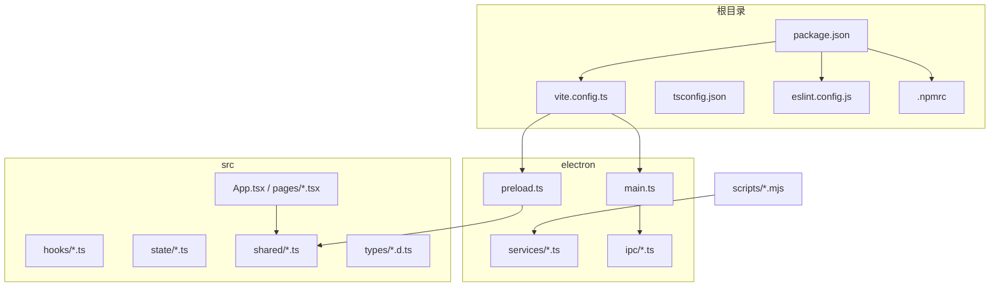
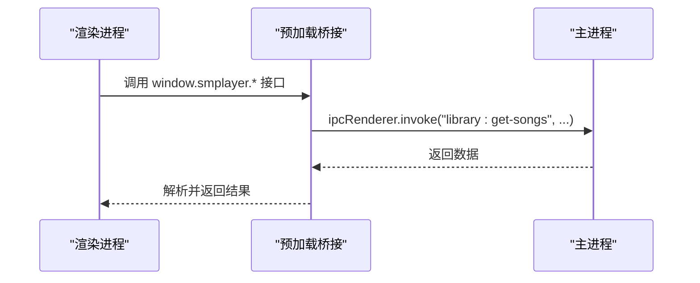
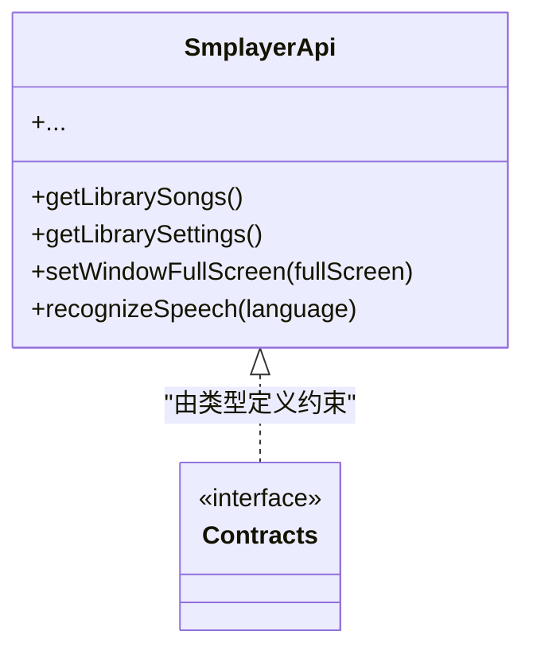
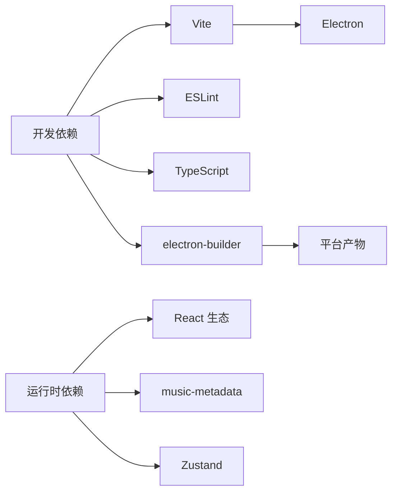

# 开发环境

<cite>
**本文引用的文件**
- [package.json](file://package.json)
- [vite.config.ts](file://vite.config.ts)
- [tsconfig.json](file://tsconfig.json)
- [tsconfig.app.json](file://tsconfig.app.json)
- [tsconfig.node.json](file://tsconfig.node.json)
- [eslint.config.js](file://eslint.config.js)
- [.npmrc](file://.npmrc)
- [README.md](file://README.md)
- [electron/main.ts](file://electron/main.ts)
- [electron/preload.ts](file://electron/preload.ts)
- [src/types/global.d.ts](file://src/types/global.d.ts)
- [src/shared/contracts.ts](file://src/shared/contracts.ts)
- [scripts/voice-assistant-parity.mjs](file://scripts/voice-assistant-parity.mjs)
- [scripts/sync-artists-from-files.mjs](file://scripts/sync-artists-from-files.mjs)
</cite>

## 目录
1. [简介](#简介)
2. [项目结构](#项目结构)
3. [核心组件](#核心组件)
4. [架构总览](#架构总览)
5. [详细组件分析](#详细组件分析)
6. [依赖分析](#依赖分析)
7. [性能考虑](#性能考虑)
8. [故障排除指南](#故障排除指南)
9. [结论](#结论)
10. [附录](#附录)

## 简介
本文件面向SMPlayer项目的开发者，提供从零到一的完整开发环境搭建与使用指南。内容覆盖：
- 环境要求与工具链（Node.js、npm/yarn、镜像源）
- 构建系统（Vite、TypeScript、ESLint）配置要点
- 开发服务器与热重载、调试流程
- IDE配置建议（VS Code插件与设置）
- 代码规范与最佳实践（风格、提交、分支）
- 常见问题与排障

SMPlayer基于Electron + React + TypeScript + Vite构建，采用主进程/渲染进程/预加载桥接模式，并通过TypeScript严格约束IPC接口契约。

## 项目结构
仓库采用“根目录脚本 + 源码分层”的组织方式：
- 根目录：包管理与构建脚本、配置文件
- electron：主进程、预加载、服务与IPC注册
- src：React前端、页面、hooks、状态、样式、国际化与共享类型
- scripts：迁移与辅助脚本（如语音助手一致性测试、艺术家同步）

图表来源
- [package.json](file://package.json)
- [vite.config.ts](file://vite.config.ts)
- [electron/main.ts](file://electron/main.ts)
- [electron/preload.ts](file://electron/preload.ts)
- [src/shared/contracts.ts](file://src/shared/contracts.ts)

章节来源
- [README.md](file://README.md)
- [package.json](file://package.json)

## 核心组件
- 包管理与脚本：统一通过npm/yarn执行开发、构建、打包与发布命令
- 构建工具：Vite负责开发服务器与产物打包；TypeScript进行类型检查与编译
- 代码质量：ESLint配合TypeScript规则与React Hooks/Refresh规则
- Electron集成：vite-plugin-electron提供主进程、预加载与渲染三段式构建
- IPC契约：通过共享类型定义约束主/渲染通信接口

章节来源
- [package.json](file://package.json)
- [vite.config.ts](file://vite.config.ts)
- [tsconfig.json](file://tsconfig.json)
- [eslint.config.js](file://eslint.config.js)
- [src/shared/contracts.ts](file://src/shared/contracts.ts)

## 架构总览
SMPlayer采用经典的Electron三进程模型：
- 主进程：应用生命周期、窗口控制、系统级能力（托盘、媒体键、协议注册）、IPC注册
- 预加载：在受控上下文暴露安全的API桥接对象给渲染进程
- 渲染进程：React应用，消费共享类型与状态，通过桥接对象调用主进程能力

图表来源
- [electron/preload.ts](file://electron/preload.ts)
- [electron/main.ts](file://electron/main.ts)
- [src/shared/contracts.ts](file://src/shared/contracts.ts)

## 详细组件分析

### Node.js与包管理器
- Node.js版本：仓库未显式锁定版本，建议使用LTS长期支持版本（如18.x或20.x），以确保与Electron生态兼容
- npm/yarn：项目使用npm脚本；若偏好yarn，可直接替换命令（例如将npm run dev改为yarn dev）
- 镜像加速：已配置国内镜像源，便于下载Electron与electron-builder二进制

章节来源
- [.npmrc](file://.npmrc)
- [package.json](file://package.json)

### Vite构建配置
- 插件组合：React插件 + vite-plugin-electron（简化主/预加载入口与打包）
- 入口与打包：
  - 主进程入口：electron/main.ts
  - 预加载入口：electron/preload.ts
  - 外部化：对特定模块（如音乐元数据与SQLite）声明外部化，避免浏览器打包错误
- 别名：@ 指向 src 目录，便于导入
- 目标：构建目标为esnext，以获得更现代的语法与更好的Tree-shaking
- 屏蔽清屏：关闭Vite默认清屏行为，提升日志可读性

章节来源
- [vite.config.ts](file://vite.config.ts)

### TypeScript编译设置
- 根配置：tsconfig.json通过references聚合应用与Node两类编译配置
- 应用编译（tsconfig.app.json）：
  - 目标与库：ES2023 + DOM/Iterable
  - 模块解析：bundler模式，启用ESM语法严格校验
  - JSX：react-jsx
  - 严格性：开启严格模式与未使用检测
- Node编译（tsconfig.node.json）：
  - 目标与库：ES2023
  - 类型：包含node与electron类型
  - 模块解析：bundler模式
  - 严格性：同上

章节来源
- [tsconfig.json](file://tsconfig.json)
- [tsconfig.app.json](file://tsconfig.app.json)
- [tsconfig.node.json](file://tsconfig.node.json)

### ESLint代码质量
- 规则集：继承js推荐、tseslint推荐、React Hooks推荐、React Refresh推荐
- 语言选项：ECMAScript 2020，浏览器全局
- 关键规则：关闭部分React Hooks严格依赖与状态副作用警告，以适配现有代码风格
- 忽略：忽略dist输出目录

章节来源
- [eslint.config.js](file://eslint.config.js)

### 开发服务器与热重载
- 启动命令：npm run dev
- 运行时：Vite提供开发服务器与HMR，自动刷新渲染进程
- Electron集成：vite-plugin-electron同时监听主进程与预加载变更，触发重启

章节来源
- [package.json](file://package.json)
- [vite.config.ts](file://vite.config.ts)

### 调试配置
- 主进程调试：使用VS Code的Electron主进程调试配置（参考扩展与launch.json），或在终端运行npm run start后附加调试
- 渲染进程调试：在浏览器中打开开发服务器地址，使用浏览器开发者工具
- 预加载调试：结合主/渲染两端断点，定位IPC交互问题
- 日志与错误：利用Electron日志与控制台输出排查

章节来源
- [electron/main.ts](file://electron/main.ts)
- [electron/preload.ts](file://electron/preload.ts)

### IDE配置建议（VS Code）
- 推荐插件：
  - ESLint：实时检查与修复
  - Prettier：统一格式化
  - TypeScript Importer：自动导入
  - ES7+ React/Redux/React-Native snippets：提高效率
  - Bracket Pair Colorizer：括号匹配
- 设置建议：
  - editor.formatOnSave：启用保存即格式化
  - editor.codeActionsOnSave：启用ESLint自动修复
  - typescript.preferences.importModuleSpecifier：选择相对路径
  - files.associations：将*.css映射到stylesheet
- launch.json（示例思路）：
  - 配置两个配置项：Electron主进程与渲染进程，分别指向main.ts与开发服务器端口

章节来源
- [eslint.config.js](file://eslint.config.js)

### IPC与类型契约
- 预加载桥接：在预加载中通过contextBridge.exposeInMainWorld暴露SmplayerApi
- 共享类型：src/shared/contracts.ts定义了所有IPC方法签名与数据结构
- 使用约定：渲染进程通过window.smplayer访问API，主进程通过ipcMain注册对应处理逻辑

图表来源
- [electron/preload.ts](file://electron/preload.ts)
- [src/shared/contracts.ts](file://src/shared/contracts.ts)

章节来源
- [electron/preload.ts](file://electron/preload.ts)
- [src/shared/contracts.ts](file://src/shared/contracts.ts)
- [src/types/global.d.ts](file://src/types/global.d.ts)

### 辅助脚本与迁移工具
- 语音助手一致性测试：scripts/voice-assistant-parity.mjs用于验证多语言意图识别与参数提取
- 艺术家同步脚本：scripts/sync-artists-from-files.mjs用于从旧数据库批量同步艺术家信息

章节来源
- [scripts/voice-assistant-parity.mjs](file://scripts/voice-assistant-parity.mjs)
- [scripts/sync-artists-from-files.mjs](file://scripts/sync-artists-from-files.mjs)

## 依赖分析
- 运行时依赖：React、ReactDOM、路由、图标库、状态库、音乐元数据解析
- 开发依赖：Vite、React插件、Electron、TypeScript、ESLint及其插件、electron-builder
- 构建与打包：electron-builder按平台生成安装包，配置包含图标、文件关联、NSIS、AppImage/Deb等

图表来源
- [package.json](file://package.json)

章节来源
- [package.json](file://package.json)

## 性能考虑
- 构建目标：esnext可获得更优的Tree-shaking与现代语法优化
- 外部化策略：将node:sqlite与音乐元数据模块外部化，避免浏览器打包体积膨胀
- 模块解析：bundler模式与严格ESM语法有助于减少运行时开销
- 打包体积：合理拆分与延迟加载，避免一次性引入大模块

章节来源
- [vite.config.ts](file://vite.config.ts)
- [tsconfig.app.json](file://tsconfig.app.json)
- [tsconfig.node.json](file://tsconfig.node.json)

## 故障排除指南
- Vite关于node:sqlite的外部化警告：属于预期行为，不影响Electron构建
- vite-plugin-electron的inlineDynamicImports弃用警告：可忽略，不影响功能
- 无法找到模块或类型错误：确认TypeScript引用关系与模块解析配置一致
- ESLint报错：根据规则集修正或在局部禁用不适用规则
- Electron启动失败：检查主进程入口与插件配置，确认外部化列表正确
- IPC调用无响应：核对预加载桥接暴露的方法名与主进程注册是否一致

章节来源
- [README.md](file://README.md)
- [vite.config.ts](file://vite.config.ts)
- [eslint.config.js](file://eslint.config.js)
- [electron/main.ts](file://electron/main.ts)
- [electron/preload.ts](file://electron/preload.ts)

## 结论
本指南提供了SMPlayer项目的开发环境搭建与使用全链路说明。遵循本文档的工具链、构建与调试配置，可快速投入开发并保持高质量交付。建议团队在CI中加入类型检查、ESLint与构建产物校验，持续保障代码健康度。

## 附录

### 常用命令速查
- 安装依赖：npm install
- 开发启动：npm run dev
- 构建：npm run build
- 预览：npm run preview
- 启动Electron：npm run start
- 代码检查：npm run lint
- 打包（通用）：npm run dist
- 打包（Windows/macOS/Linux）：npm run dist:win / dist:mac / dist:linux

章节来源
- [package.json](file://package.json)