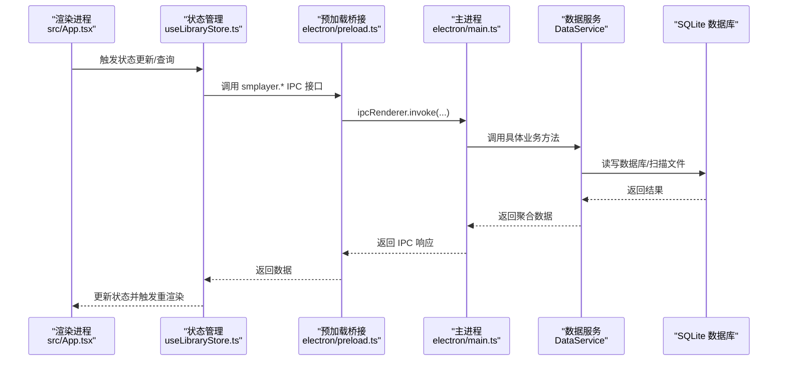
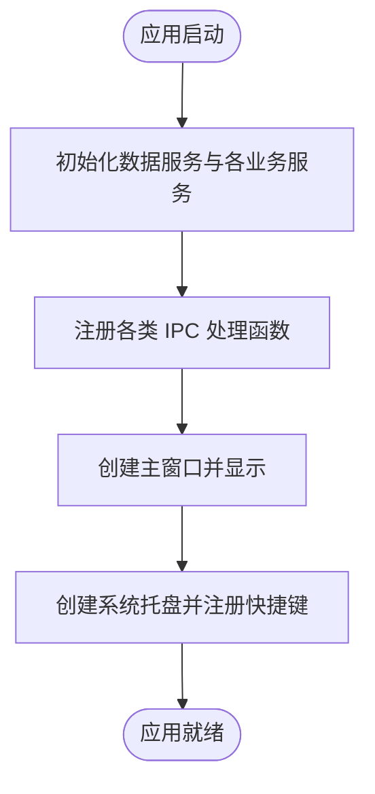
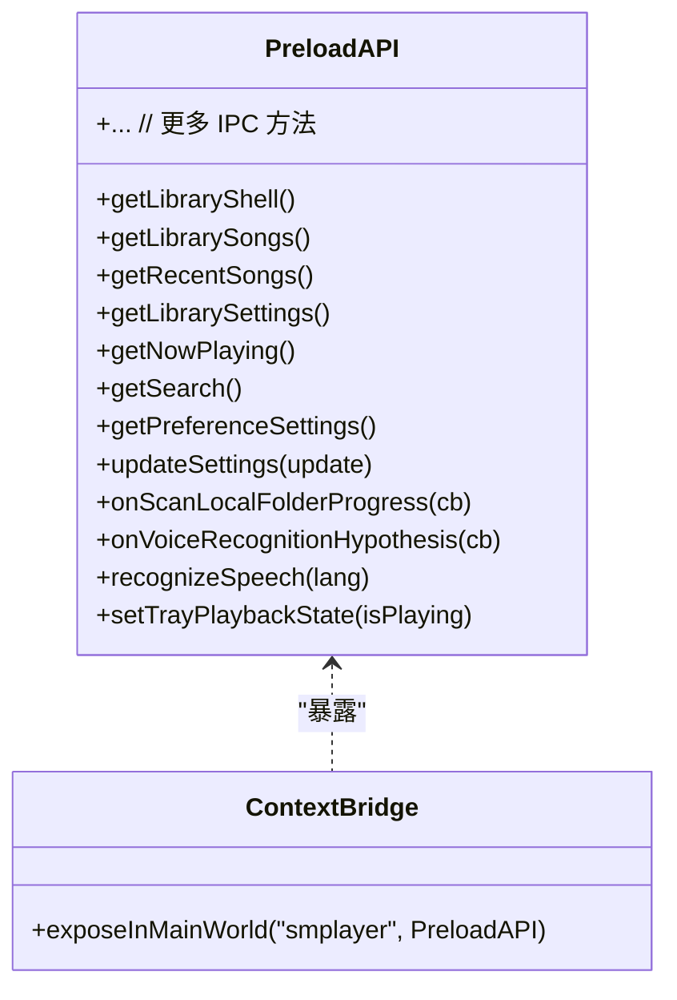
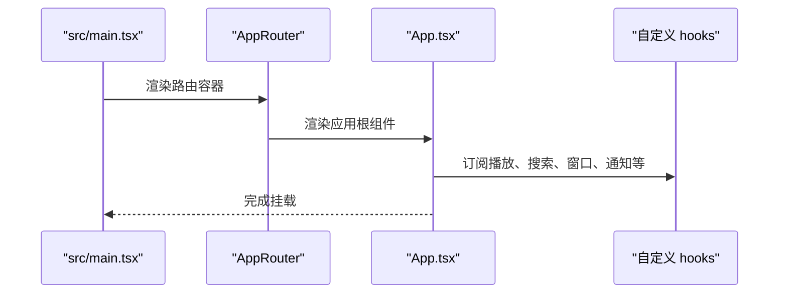
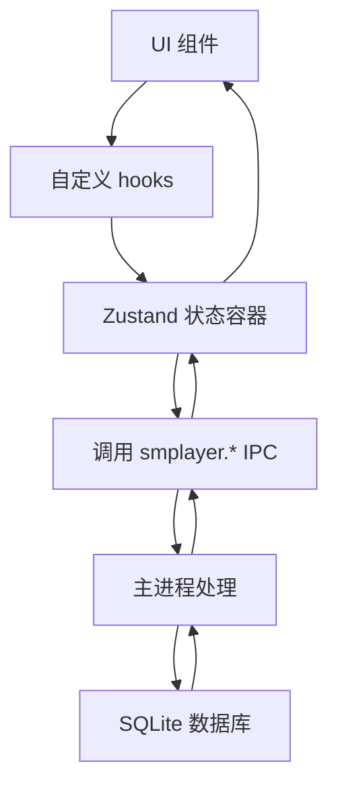
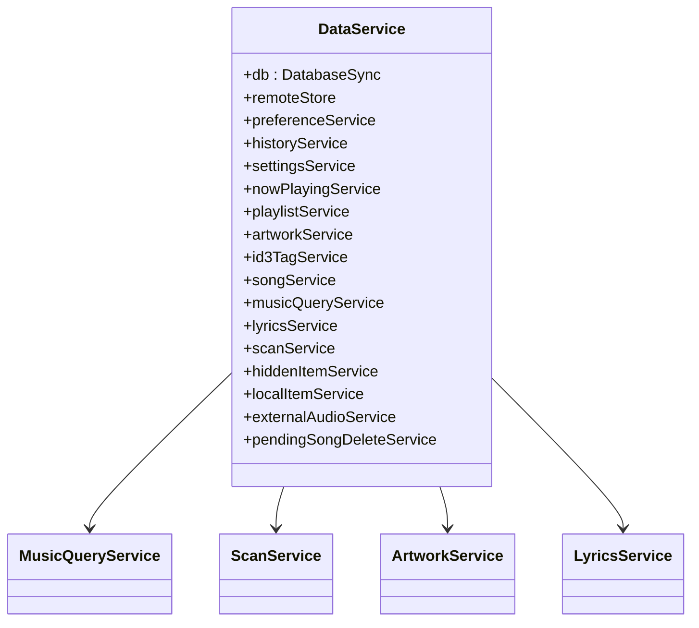
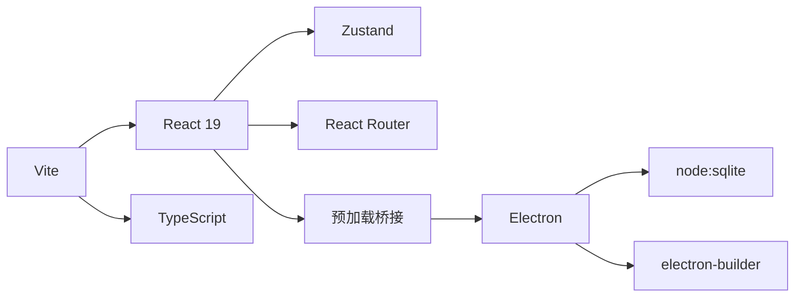

# 技术栈

<cite>
**本文引用的文件列表**
- [package.json](file://package.json)
- [vite.config.ts](file://vite.config.ts)
- [tsconfig.json](file://tsconfig.json)
- [tsconfig.app.json](file://tsconfig.app.json)
- [tsconfig.node.json](file://tsconfig.node.json)
- [electron/main.ts](file://electron/main.ts)
- [electron/preload.ts](file://electron/preload.ts)
- [electron/ipc/app-ipc.ts](file://electron/ipc/app-ipc.ts)
- [electron/services/data-service.ts](file://electron/services/data-service.ts)
- [src/main.tsx](file://src/main.tsx)
- [src/App.tsx](file://src/App.tsx)
- [src/state/useLibraryStore.ts](file://src/state/useLibraryStore.ts)
- [README.md](file://README.md)
</cite>

## 目录
1. [简介](#简介)
2. [项目结构](#项目结构)
3. [核心组件](#核心组件)
4. [架构总览](#架构总览)
5. [详细组件分析](#详细组件分析)
6. [依赖关系分析](#依赖关系分析)
7. [性能考量](#性能考量)
8. [故障排查指南](#故障排查指南)
9. [结论](#结论)
10. [附录：版本与兼容性](#附录版本与兼容性)

## 简介
本技术栈文档面向 SMPlayer 桌面音乐播放器项目，系统梳理其基于 Electron 的桌面应用技术选型与实现方式，重点说明：
- Electron 作为桌面应用框架的优势与在本项目中的落地点
- React 19 作为用户界面库的选择理由与使用模式
- TypeScript 提供的类型安全与工程化能力
- Zustand 作为轻量状态管理库的集成方式与收益
- Vite 构建工具带来的现代化开发体验与打包策略
- 各技术之间的协同工作机制，以及如何共同支撑高质量的桌面应用开发

同时，文档提供版本要求与兼容性信息，帮助开发者理解运行环境需求与迁移注意事项。

## 项目结构
该项目采用典型的“主进程 + 预加载桥接 + 渲染进程”三层架构，并以 Vite 作为前端构建工具，TypeScript 提供类型保障，React 负责 UI 层，Zustand 管理应用状态，Electron 负责系统级能力与原生窗口控制。

```mermaid
graph TB
subgraph "主进程"
M["electron/main.ts"]
S["electron/services/data-service.ts"]
IPC["electron/ipc/*"]
end
subgraph "预加载层"
P["electron/preload.ts"]
end
subgraph "渲染进程"
R["src/main.tsx"]
A["src/App.tsx"]
Z["src/state/useLibraryStore.ts"]
end
M --> S
M --> IPC
P <- --> M
R --> A
A --> Z
P --> A
```

图表来源
- [electron/main.ts:141-209](file://electron/main.ts#L141-L209)
- [electron/preload.ts:45-286](file://electron/preload.ts#L45-L286)
- [src/main.tsx:1-15](file://src/main.tsx#L1-L15)
- [src/App.tsx:1-120](file://src/App.tsx#L1-L120)
- [src/state/useLibraryStore.ts:1-120](file://src/state/useLibraryStore.ts#L1-L120)

章节来源
- [README.md:1-157](file://README.md#L1-L157)
- [package.json:1-175](file://package.json#L1-L175)
- [vite.config.ts:1-36](file://vite.config.ts#L1-L36)

## 核心组件
- Electron 主进程：负责应用生命周期、窗口创建、系统托盘、媒体协议注册、全局快捷键、数据服务初始化与 IPC 注册。
- 预加载脚本：通过 contextBridge 暴露受控 API 到渲染进程，屏蔽直接访问 Node/Electron 能力的风险。
- 渲染进程（React 19）：承载 UI、路由、交互与业务逻辑；通过 Zustand 管理应用状态。
- 数据服务（SQLite + node:sqlite）：本地音乐库的数据层，包含歌曲、播放列表、历史、歌词、封面缓存等。
- 构建与类型系统：Vite + TypeScript 双轨配置，确保开发体验与类型安全。

章节来源
- [electron/main.ts:141-209](file://electron/main.ts#L141-L209)
- [electron/preload.ts:45-286](file://electron/preload.ts#L45-L286)
- [src/main.tsx:1-15](file://src/main.tsx#L1-L15)
- [src/App.tsx:1-120](file://src/App.tsx#L1-L120)
- [src/state/useLibraryStore.ts:1-120](file://src/state/useLibraryStore.ts#L1-L120)
- [electron/services/data-service.ts:39-145](file://electron/services/data-service.ts#L39-L145)

## 架构总览
下图展示从渲染进程到主进程的关键调用链路与职责边界，体现 IPC 通信、状态管理与数据服务的协作。



图表来源
- [src/App.tsx:134-167](file://src/App.tsx#L134-L167)
- [src/state/useLibraryStore.ts:124-144](file://src/state/useLibraryStore.ts#L124-L144)
- [electron/preload.ts:45-286](file://electron/preload.ts#L45-L286)
- [electron/main.ts:156-203](file://electron/main.ts#L156-L203)
- [electron/services/data-service.ts:39-145](file://electron/services/data-service.ts#L39-L145)

## 详细组件分析

### Electron 主进程（应用生命周期与系统集成）
- 单实例锁、窗口创建、托盘菜单、媒体协议注册、全局媒体键处理、语音识别桥接、远程分享服务启动等。
- 初始化数据服务与各业务服务，注册各类 IPC 处理函数，建立渲染进程与系统能力的桥梁。



图表来源
- [electron/main.ts:141-209](file://electron/main.ts#L141-L209)
- [electron/services/data-service.ts:39-145](file://electron/services/data-service.ts#L39-L145)

章节来源
- [electron/main.ts:141-209](file://electron/main.ts#L141-L209)
- [electron/ipc/app-ipc.ts:10-16](file://electron/ipc/app-ipc.ts#L10-L16)

### 预加载桥接（安全暴露 API）
- 通过 contextBridge 将主进程能力以白名单形式暴露给渲染进程，统一命名空间 smplayer。
- 提供库查询、播放控制、窗口控制、歌词、封面、扫描进度、语音识别等接口。
- 支持一次性监听与取消监听，避免内存泄漏。



图表来源
- [electron/preload.ts:45-286](file://electron/preload.ts#L45-L286)

章节来源
- [electron/preload.ts:45-286](file://electron/preload.ts#L45-L286)

### 渲染进程（React 19 + 路由）
- 入口文件创建根节点并挂载 AppRouter 与 App。
- App 组件集中管理主题、夜间模式、导航、搜索、播放控制、通知、语音助手等。
- 使用 hooks 管理窗口控制、滚动位置恢复、触摸上下文菜单、打开文件播放等。



图表来源
- [src/main.tsx:1-15](file://src/main.tsx#L1-L15)
- [src/App.tsx:1-120](file://src/App.tsx#L1-L120)

章节来源
- [src/main.tsx:1-15](file://src/main.tsx#L1-L15)
- [src/App.tsx:1-120](file://src/App.tsx#L1-L120)

### 状态管理（Zustand）
- 使用 create 创建全局状态容器，封装对 smplayer IPC 的调用，统一数据加载、刷新、错误处理与进度反馈。
- 支持并发请求去重、懒加载、批量刷新、扫描进度监听、最近播放记录、设置持久化等。



图表来源
- [src/state/useLibraryStore.ts:124-144](file://src/state/useLibraryStore.ts#L124-L144)
- [electron/preload.ts:45-286](file://electron/preload.ts#L45-L286)
- [electron/services/data-service.ts:39-145](file://electron/services/data-service.ts#L39-L145)

章节来源
- [src/state/useLibraryStore.ts:1-120](file://src/state/useLibraryStore.ts#L1-L120)

### 数据服务（SQLite + node:sqlite）
- 封装数据库连接、表初始化、播放队列、歌词、封面缓存、扫描、隐藏项、外部音频、删除回收站等。
- 通过 MusicQueryService 提供查询能力，通过 ScanService 执行扫描与清理副作用。



图表来源
- [electron/services/data-service.ts:39-145](file://electron/services/data-service.ts#L39-L145)

章节来源
- [electron/services/data-service.ts:39-145](file://electron/services/data-service.ts#L39-L145)

## 依赖关系分析
- 构建与开发工具：Vite 作为构建器，配合 @vitejs/plugin-react、vite-plugin-electron 等插件；TypeScript 双配置（app/node）确保前后端类型安全。
- 运行时依赖：React 19、React Router、Zustand、Fluent UI Icons、clsx、music-metadata 等。
- Electron 生态：electron、electron-builder、node:sqlite（原生模块）、vite-plugin-electron 等。



图表来源
- [package.json:23-48](file://package.json#L23-L48)
- [vite.config.ts:1-36](file://vite.config.ts#L1-L36)

章节来源
- [package.json:23-48](file://package.json#L23-L48)
- [vite.config.ts:1-36](file://vite.config.ts#L1-L36)

## 性能考量
- 开发体验：Vite 提供快速热更新与按需编译，结合 esnext 目标与 bundler 模式，提升开发效率。
- 运行时性能：React 19 在渲染层面具备更优的并发与调度能力；Zustand 无样板代码，状态更新路径清晰，减少不必要重渲染。
- 数据访问：通过 IPC 与预加载桥接，避免直接在渲染进程使用 Node/Electron 能力，降低安全风险与复杂度。
- 打包与分发：electron-builder 提供多平台打包与安装器生成，支持 NSIS、AppImage、deb 等格式。

## 故障排查指南
- 构建警告：已知关于 node:sqlite externalized 与 vite-plugin-electron 的非阻塞性告警，不影响 Electron 构建与运行。
- IPC 未响应：检查预加载桥接是否正确暴露接口，确认主进程 IPC 是否注册成功，以及渲染进程调用是否传入正确参数。
- 状态未更新：确认 Zustand 状态容器中对应 action 是否被调用，以及错误分支是否设置了 error 字段。
- 数据库异常：检查 DataService 初始化流程与表结构，确认 WAL checkpoint 与关闭流程是否执行。

章节来源
- [README.md:145-149](file://README.md#L145-L149)
- [electron/preload.ts:45-286](file://electron/preload.ts#L45-L286)
- [src/state/useLibraryStore.ts:121-144](file://src/state/useLibraryStore.ts#L121-L144)
- [electron/services/data-service.ts:147-154](file://electron/services/data-service.ts#L147-L154)

## 结论
SMPlayer 采用“Electron + React 19 + TypeScript + Vite + Zustand”的现代桌面应用技术栈，既保证了跨平台与原生系统能力的深度集成，又通过类型系统与状态管理提升了可维护性与开发效率。Electron 主进程负责系统级能力与数据服务，预加载桥接提供安全可控的 API，渲染进程以 React 19 构建 UI 并通过 Zustand 管理状态，最终形成稳定高效的桌面音乐播放器架构。

## 附录：版本与兼容性
- Node.js 与 Electron：Electron 版本见 package.json 中 devDependencies，建议使用与目标平台兼容的 LTS 版本。
- Vite：vite 版本见 package.json，配合 @vitejs/plugin-react 与 vite-plugin-electron。
- TypeScript：双配置 tsconfig.app.json 与 tsconfig.node.json，目标 ES2023，严格模式开启。
- 浏览器与运行时：Vite 构建目标为 esnext，确保现代浏览器与 Electron 渲染进程支持。
- 数据库：node:sqlite 用于 SQLite 访问，注意在打包时的 asar 与原生模块处理策略。

章节来源
- [package.json:32-48](file://package.json#L32-L48)
- [tsconfig.app.json:1-29](file://tsconfig.app.json#L1-L29)
- [tsconfig.node.json:1-27](file://tsconfig.node.json#L1-L27)
- [vite.config.ts:31-34](file://vite.config.ts#L31-L34)