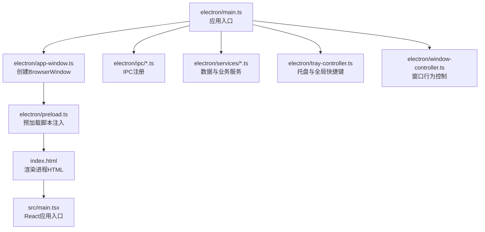
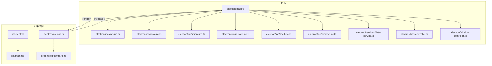
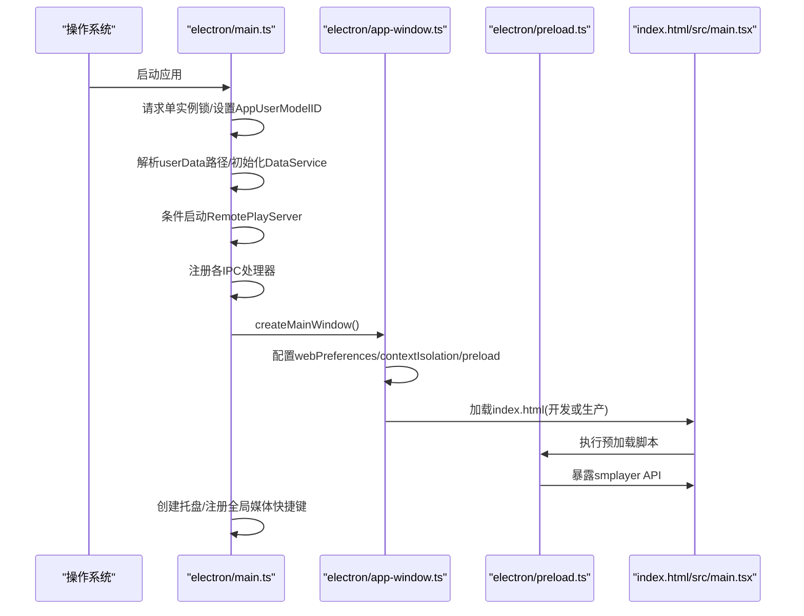
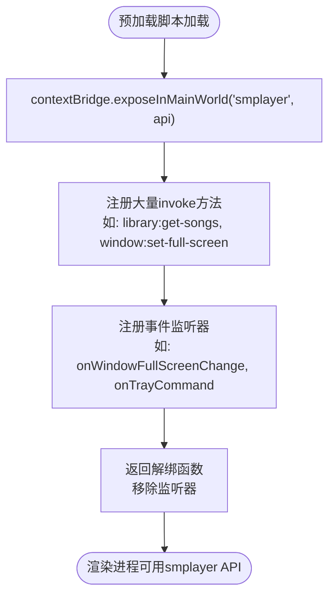
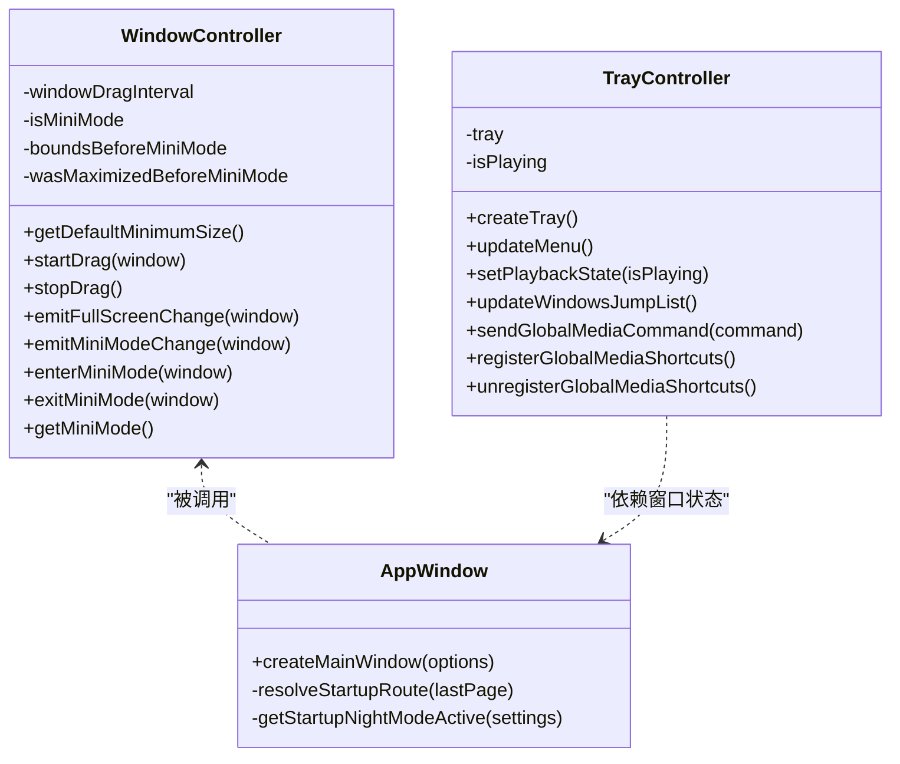
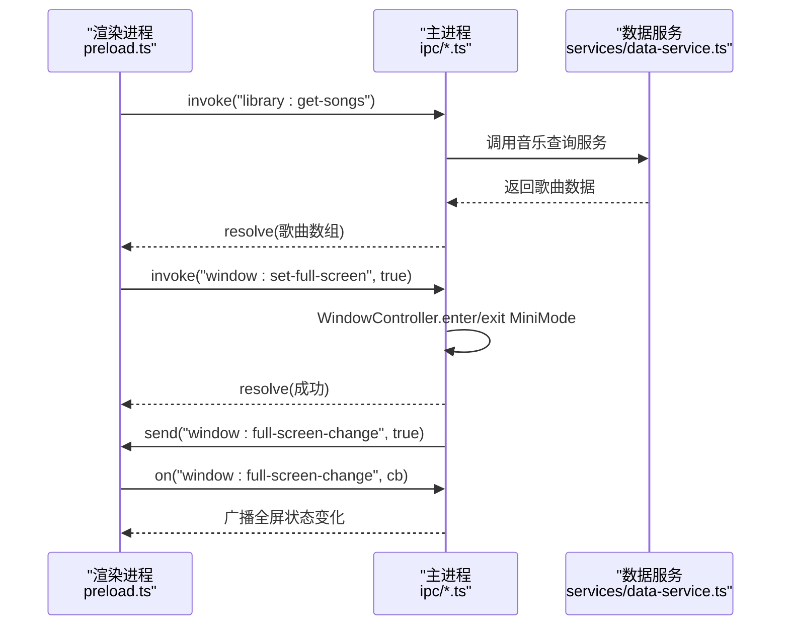
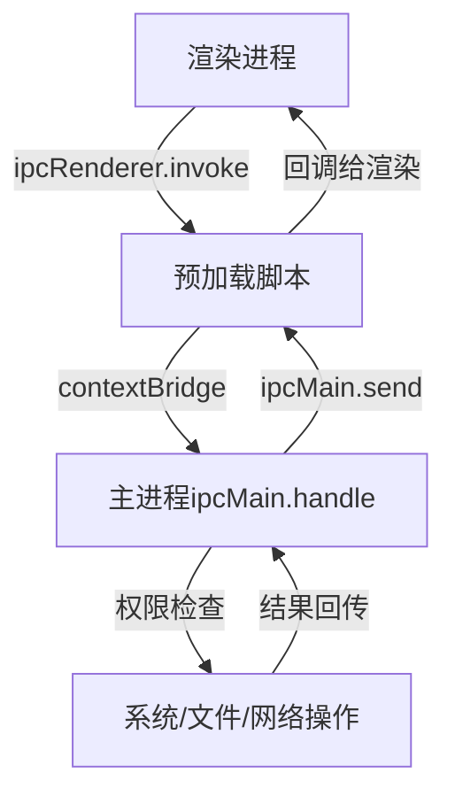
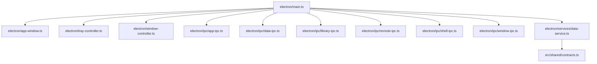

# Electron双进程架构

<cite>
**本文档引用的文件**
- [electron/main.ts](file://electron/main.ts)
- [electron/preload.ts](file://electron/preload.ts)
- [electron/app-window.ts](file://electron/app-window.ts)
- [electron/window-controller.ts](file://electron/window-controller.ts)
- [electron/tray-controller.ts](file://electron/tray-controller.ts)
- [electron/ipc/app-ipc.ts](file://electron/ipc/app-ipc.ts)
- [electron/ipc/data-ipc.ts](file://electron/ipc/data-ipc.ts)
- [electron/ipc/library-ipc.ts](file://electron/ipc/library-ipc.ts)
- [electron/ipc/remote-ipc.ts](file://electron/ipc/remote-ipc.ts)
- [electron/ipc/shell-ipc.ts](file://electron/ipc/shell-ipc.ts)
- [electron/ipc/window-ipc.ts](file://electron/ipc/window-ipc.ts)
- [electron/services/data-service.ts](file://electron/services/data-service.ts)
- [src/shared/contracts.ts](file://src/shared/contracts.ts)
- [index.html](file://index.html)
- [package.json](file://package.json)
</cite>

## 目录
1. [简介](#简介)
2. [项目结构](#项目结构)
3. [核心组件](#核心组件)
4. [架构总览](#架构总览)
5. [详细组件分析](#详细组件分析)
6. [依赖关系分析](#依赖关系分析)
7. [性能考量](#性能考量)
8. [故障排除指南](#故障排除指南)
9. [结论](#结论)

## 简介
本文件系统性阐述SMPlayer项目的Electron双进程架构设计与实现，重点覆盖以下方面：
- 主进程（Main Process）与渲染进程（Renderer Process）的职责划分：主进程负责应用生命周期、窗口控制、系统集成与安全策略；渲染进程负责UI渲染与交互。
- 进程间的安全隔离与权限控制：contextIsolation、preload脚本注入、权限检查与限制。
- 启动流程：从main.ts入口到渲染进程初始化的完整路径。
- IPC通信与安全最佳实践：基于ipcMain/ipcRenderer的类型化接口设计与事件监听模式。
- 架构图与数据流图：帮助开发者快速理解双进程架构的设计原理与实现细节。

## 项目结构
SMPlayer采用典型的Electron项目布局，前端React应用位于src目录，Electron相关逻辑集中在electron目录。关键入口与配置如下：
- 入口文件：electron/main.ts
- 预加载脚本：electron/preload.ts
- 窗口创建与Web偏好设置：electron/app-window.ts
- 窗口控制器：electron/window-controller.ts
- 托盘控制器：electron/tray-controller.ts
- IPC注册模块：electron/ipc/*.ts
- 数据服务与业务逻辑：electron/services/*.ts
- 类型契约：src/shared/contracts.ts
- 应用打包与构建：package.json

图表来源
- [electron/main.ts:141-209](file://electron/main.ts#L141-L209)
- [electron/app-window.ts:41-137](file://electron/app-window.ts#L41-L137)
- [electron/preload.ts:45-286](file://electron/preload.ts#L45-L286)
- [index.html:1-26](file://index.html#L1-L26)

章节来源
- [electron/main.ts:141-209](file://electron/main.ts#L141-L209)
- [electron/app-window.ts:41-137](file://electron/app-window.ts#L41-L137)
- [package.json:1-175](file://package.json#L1-L175)

## 核心组件
本节概述双进程架构中的关键组件及其职责：

- 主进程（electron/main.ts）
  - 应用生命周期管理：单实例锁、窗口创建、退出前清理、全局快捷键注册等。
  - 系统集成：媒体协议注册、跳转列表（JumpList）、系统通知、文件关联。
  - 服务初始化：数据服务（DataService）、远程播放服务器、外部音频打开协调器。
  - IPC注册：将主进程服务暴露为渲染进程可调用的API。

- 预加载脚本（electron/preload.ts）
  - 通过contextBridge将受控API注入到渲染进程的全局命名空间。
  - 提供类型化的IPC调用封装，统一事件名与参数格式。
  - 支持一次性事件监听与回调解绑，避免内存泄漏。

- 窗口与托盘（electron/app-window.ts、electron/window-controller.ts、electron/tray-controller.ts）
  - 窗口创建：设置背景色、标题栏样式、最小尺寸、权限策略与外链打开处理。
  - 窗口行为：全屏切换、迷你模式、拖拽移动、状态变更广播。
  - 托盘：菜单、图标、全局媒体快捷键、Windows跳转列表。

- IPC模块（electron/ipc/*.ts）
  - 按功能域拆分：应用信息、数据操作、库管理、远程分享、Shell操作、窗口控制。
  - 统一使用ipcMain.handle与ipcRenderer.invoke进行请求-响应式通信。
  - 部分即时设置通过ipcRenderer.sendSync与ipcMain.on实现。

- 数据服务（electron/services/data-service.ts）
  - 聚合多个子服务：播放队列、歌单、歌词、扫描、历史、设置、本地项等。
  - SQLite数据库访问与WAL检查点刷新，保证数据一致性与性能。

章节来源
- [electron/main.ts:156-203](file://electron/main.ts#L156-L203)
- [electron/preload.ts:45-286](file://electron/preload.ts#L45-L286)
- [electron/app-window.ts:41-137](file://electron/app-window.ts#L41-L137)
- [electron/window-controller.ts:6-121](file://electron/window-controller.ts#L6-L121)
- [electron/tray-controller.ts:28-208](file://electron/tray-controller.ts#L28-L208)
- [electron/services/data-service.ts:39-197](file://electron/services/data-service.ts#L39-L197)

## 架构总览
下图展示SMPlayer的双进程架构与数据流：

图表来源
- [electron/main.ts:156-203](file://electron/main.ts#L156-L203)
- [electron/preload.ts:45-286](file://electron/preload.ts#L45-L286)
- [electron/ipc/app-ipc.ts:10-25](file://electron/ipc/app-ipc.ts#L10-L25)
- [electron/ipc/data-ipc.ts:20-150](file://electron/ipc/data-ipc.ts#L20-L150)
- [electron/ipc/library-ipc.ts:28-302](file://electron/ipc/library-ipc.ts#L28-L302)
- [electron/ipc/remote-ipc.ts:19-54](file://electron/ipc/remote-ipc.ts#L19-L54)
- [electron/ipc/shell-ipc.ts:20-67](file://electron/ipc/shell-ipc.ts#L20-L67)
- [electron/ipc/window-ipc.ts:16-58](file://electron/ipc/window-ipc.ts#L16-L58)
- [electron/services/data-service.ts:39-197](file://electron/services/data-service.ts#L39-L197)
- [src/shared/contracts.ts:527-663](file://src/shared/contracts.ts#L527-L663)

## 详细组件分析

### 主进程启动流程
主进程启动时执行的关键步骤：
- 单实例锁与平台适配（Windows AppUserModelID）
- 用户数据目录解析与数据服务初始化
- 远程播放服务器按设置启动
- 注册各类IPC处理器
- 创建主窗口并加载页面
- 初始化托盘与全局媒体快捷键

图表来源
- [electron/main.ts:74-209](file://electron/main.ts#L74-L209)
- [electron/app-window.ts:41-137](file://electron/app-window.ts#L41-L137)
- [electron/preload.ts:45-286](file://electron/preload.ts#L45-L286)
- [index.html:1-26](file://index.html#L1-L26)

章节来源
- [electron/main.ts:74-209](file://electron/main.ts#L74-L209)
- [electron/app-window.ts:41-137](file://electron/app-window.ts#L41-L137)

### 预加载脚本与安全上下文
预加载脚本通过contextBridge将受控API注入渲染进程，确保：
- contextIsolation启用，渲染进程无法直接访问Node.js与Electron API。
- 仅暴露明确声明的API方法，降低攻击面。
- 使用ipcRenderer.invoke进行请求-响应通信，避免直接执行代码。
- 对高频事件提供一次性监听与解绑能力，防止内存泄漏。

图表来源
- [electron/preload.ts:45-286](file://electron/preload.ts#L45-L286)

章节来源
- [electron/preload.ts:45-286](file://electron/preload.ts#L45-L286)

### 窗口控制与系统集成
窗口控制器负责窗口行为与状态变更广播；托盘控制器负责系统托盘菜单与全局媒体快捷键；窗口创建时设置权限策略与外链处理。

图表来源
- [electron/window-controller.ts:6-121](file://electron/window-controller.ts#L6-L121)
- [electron/tray-controller.ts:28-208](file://electron/tray-controller.ts#L28-L208)
- [electron/app-window.ts:41-173](file://electron/app-window.ts#L41-L173)

章节来源
- [electron/window-controller.ts:6-121](file://electron/window-controller.ts#L6-L121)
- [electron/tray-controller.ts:28-208](file://electron/tray-controller.ts#L28-L208)
- [electron/app-window.ts:41-173](file://electron/app-window.ts#L41-L173)

### IPC通信与数据流
IPC模块按功能域拆分，统一通过ipcMain.handle与ipcRenderer.invoke进行通信，并在需要时使用sendSync/on实现即时设置读取。

图表来源
- [electron/ipc/library-ipc.ts:40-52](file://electron/ipc/library-ipc.ts#L40-L52)
- [electron/ipc/window-ipc.ts:34-42](file://electron/ipc/window-ipc.ts#L34-L42)
- [electron/preload.ts:251-261](file://electron/preload.ts#L251-L261)
- [electron/services/data-service.ts:39-197](file://electron/services/data-service.ts#L39-L197)

章节来源
- [electron/ipc/library-ipc.ts:28-302](file://electron/ipc/library-ipc.ts#L28-L302)
- [electron/ipc/window-ipc.ts:16-58](file://electron/ipc/window-ipc.ts#L16-L58)
- [electron/preload.ts:251-261](file://electron/preload.ts#L251-L261)
- [electron/services/data-service.ts:39-197](file://electron/services/data-service.ts#L39-L197)

### 安全隔离与权限控制
- contextIsolation: true，确保渲染进程无法直接访问Node.js与Electron API。
- preload脚本作为唯一桥接层，仅暴露受控API。
- 权限策略：窗口会话仅允许媒体权限（麦克风/摄像头），外链默认交由系统浏览器打开。
- 外部文件打开：通过open-file与second-instance事件处理，避免直接执行任意命令行。

图表来源
- [electron/app-window.ts:112-122](file://electron/app-window.ts#L112-L122)
- [electron/preload.ts:45-286](file://electron/preload.ts#L45-L286)
- [electron/main.ts:131-139](file://electron/main.ts#L131-L139)

章节来源
- [electron/app-window.ts:112-122](file://electron/app-window.ts#L112-L122)
- [electron/main.ts:131-139](file://electron/main.ts#L131-L139)

## 依赖关系分析
主进程对各模块的依赖关系如下：

图表来源
- [electron/main.ts:156-203](file://electron/main.ts#L156-L203)
- [electron/ipc/*.ts:28-302](file://electron/ipc/library-ipc.ts#L28-L302)
- [electron/services/data-service.ts:39-197](file://electron/services/data-service.ts#L39-L197)
- [src/shared/contracts.ts:527-663](file://src/shared/contracts.ts#L527-L663)

章节来源
- [electron/main.ts:156-203](file://electron/main.ts#L156-L203)
- [electron/ipc/library-ipc.ts:28-302](file://electron/ipc/library-ipc.ts#L28-L302)
- [electron/services/data-service.ts:39-197](file://electron/services/data-service.ts#L39-L197)
- [src/shared/contracts.ts:527-663](file://src/shared/contracts.ts#L527-L663)

## 性能考量
- 数据库优化：DataService在构造时初始化SQLite并执行WAL检查点刷新，减少写入阻塞。
- 扫描与进度：库扫描支持分步回调与取消标志，避免长时间阻塞UI。
- 缓存与资源：封面缓存路径与会话缓存清理，平衡存储占用与加载速度。
- 窗口行为：迷你模式与全屏切换时的边界处理，减少不必要的重绘与布局计算。

## 故障排除指南
- 渲染进程无法调用API
  - 检查预加载脚本是否正确注入contextBridge。
  - 确认ipcRenderer.invoke的事件名与主进程ipcMain.handle一致。
- 窗口关闭后无法恢复
  - 确认quitOnClose设置与窗口close事件处理逻辑。
  - 检查托盘菜单与showWindow逻辑。
- 托盘快捷键无效
  - 确认全局快捷键注册与注销时机。
  - Windows平台检查JumpList更新与任务项配置。
- 外部文件打开无响应
  - 检查open-file与second-instance事件处理与外部音频打开协调器。
- 远程分享无法启动
  - 确认RemotePlayServer启动条件与权限设置。

章节来源
- [electron/preload.ts:45-286](file://electron/preload.ts#L45-L286)
- [electron/main.ts:221-242](file://electron/main.ts#L221-L242)
- [electron/tray-controller.ts:171-188](file://electron/tray-controller.ts#L171-L188)
- [electron/ipc/remote-ipc.ts:22-36](file://electron/ipc/remote-ipc.ts#L22-L36)

## 结论
SMPlayer的Electron双进程架构以“主进程负责系统集成与安全控制、渲染进程专注UI与交互”为核心原则，通过严格的contextIsolation与受控API注入，结合模块化的IPC与服务层，实现了稳定、可维护且安全的应用架构。窗口控制器与托盘控制器进一步提升了用户体验与系统集成度。建议在后续迭代中持续完善错误监控与日志记录，以提升问题定位效率。