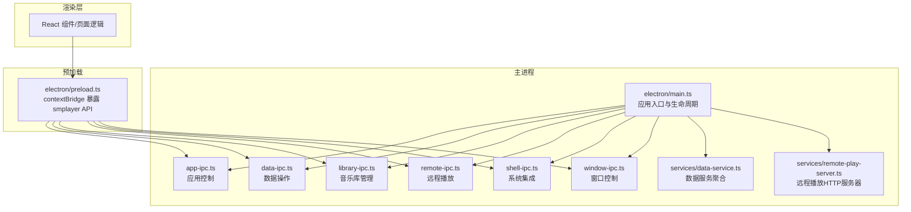
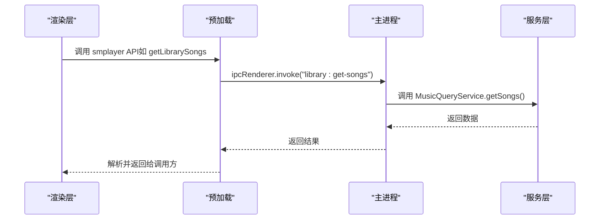
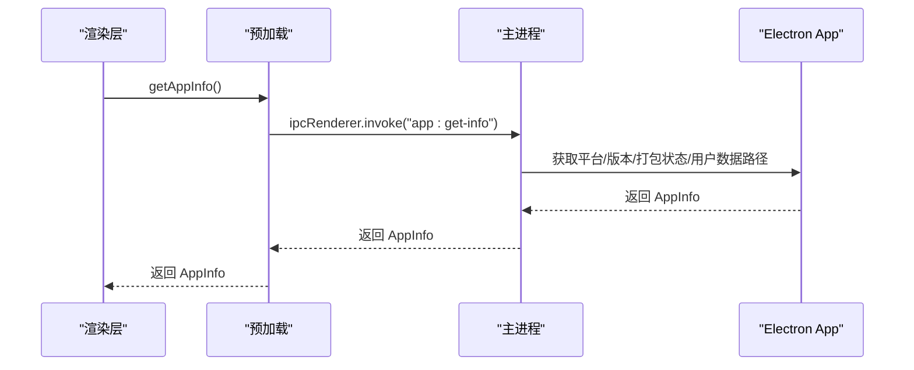
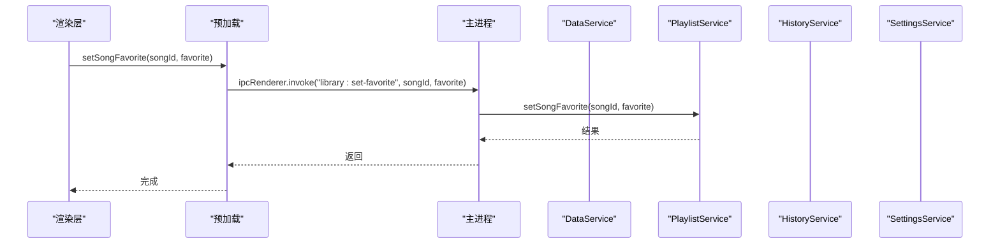
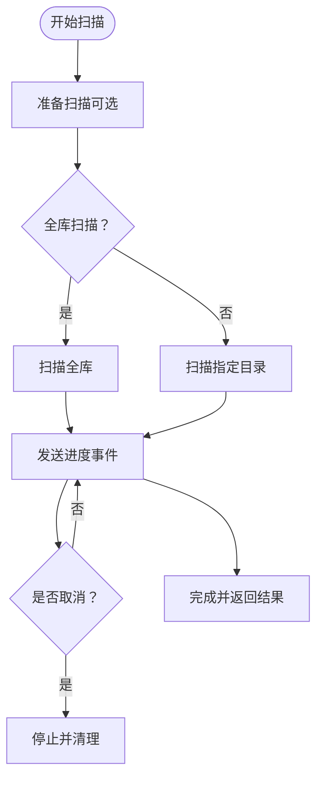
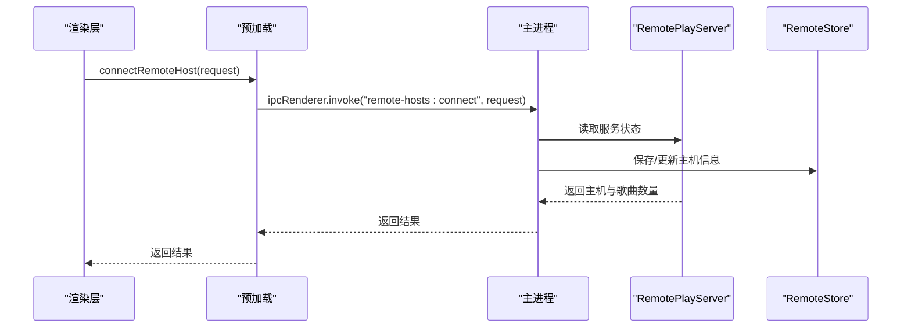
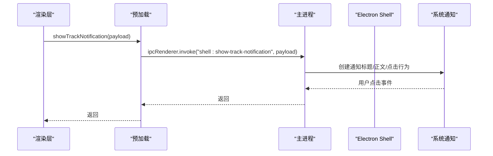
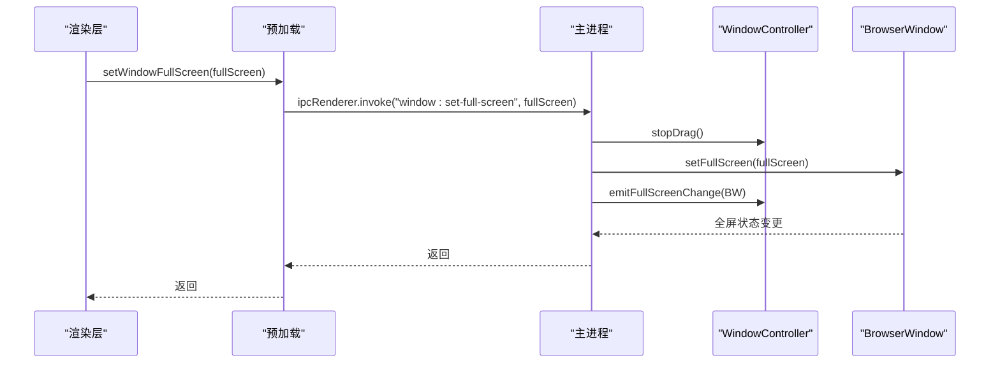
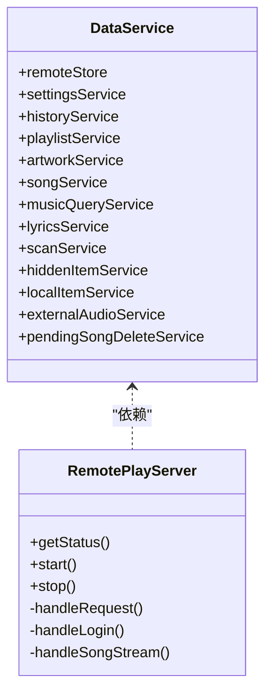

# IPC通信机制

<cite>
**本文引用的文件**
- [electron/main.ts](file://electron/main.ts)
- [electron/preload.ts](file://electron/preload.ts)
- [electron/ipc/app-ipc.ts](file://electron/ipc/app-ipc.ts)
- [electron/ipc/data-ipc.ts](file://electron/ipc/data-ipc.ts)
- [electron/ipc/library-ipc.ts](file://electron/ipc/library-ipc.ts)
- [electron/ipc/remote-ipc.ts](file://electron/ipc/remote-ipc.ts)
- [electron/ipc/shell-ipc.ts](file://electron/ipc/shell-ipc.ts)
- [electron/ipc/window-ipc.ts](file://electron/ipc/window-ipc.ts)
- [electron/services/data-service.ts](file://electron/services/data-service.ts)
- [electron/services/remote-play-server.ts](file://electron/services/remote-play-server.ts)
- [src/shared/contracts.ts](file://src/shared/contracts.ts)
</cite>

## 目录
1. [简介](#简介)
2. [项目结构](#项目结构)
3. [核心组件](#核心组件)
4. [架构总览](#架构总览)
5. [详细组件分析](#详细组件分析)
6. [依赖关系分析](#依赖关系分析)
7. [性能考量](#性能考量)
8. [故障排查指南](#故障排查指南)
9. [结论](#结论)
10. [附录](#附录)

## 简介
本文件系统性梳理 SMPlayer 项目的 IPC（进程间通信）机制，聚焦 Electron 主进程与渲染进程之间的消息传递，涵盖同步（sendSync/send/on）与异步（invoke/handle/on）两类模式。文档围绕六大 IPC 模块（app-ipc、data-ipc、library-ipc、remote-ipc、shell-ipc、window-ipc）逐项解析其职责、消息协议、错误处理与性能优化策略，并通过多种图示展示典型交互流程与数据流。

## 项目结构
SMPlayer 的 IPC 架构由“主进程注册器 + 预加载桥接 + 渲染层调用”三层组成：
- 主进程：在应用启动时注册各模块的 IPC 处理器，注入服务实例与回调。
- 预加载脚本：通过 contextBridge 暴露统一的 smplayer API，封装 invoke/sendSync/on 等调用。
- 渲染层：通过 smplayer API 发起请求或订阅事件，完成跨进程交互。

图表来源
- [electron/main.ts:141-209](file://electron/main.ts#L141-L209)
- [electron/preload.ts:45-284](file://electron/preload.ts#L45-L284)
- [electron/ipc/app-ipc.ts:10-26](file://electron/ipc/app-ipc.ts#L10-L26)
- [electron/ipc/data-ipc.ts:20-151](file://electron/ipc/data-ipc.ts#L20-L151)
- [electron/ipc/library-ipc.ts:28-302](file://electron/ipc/library-ipc.ts#L28-L302)
- [electron/ipc/remote-ipc.ts:19-54](file://electron/ipc/remote-ipc.ts#L19-L54)
- [electron/ipc/shell-ipc.ts:20-67](file://electron/ipc/shell-ipc.ts#L20-L67)
- [electron/ipc/window-ipc.ts:16-58](file://electron/ipc/window-ipc.ts#L16-L58)
- [electron/services/data-service.ts:39-198](file://electron/services/data-service.ts#L39-L198)
- [electron/services/remote-play-server.ts:77-295](file://electron/services/remote-play-server.ts#L77-L295)

章节来源
- [electron/main.ts:141-209](file://electron/main.ts#L141-L209)
- [electron/preload.ts:45-284](file://electron/preload.ts#L45-L284)

## 核心组件
- 应用控制（app-ipc）
  - 提供应用元信息查询、待打开文件队列提取、托盘播放状态设置等。
  - 关键处理器：app:get-info、app:take-pending-open-files、app:set-tray-playback-state。
- 数据操作（data-ipc）
  - 聚合播放列表、历史、偏好、设置、正在播放队列等数据变更与查询。
  - 关键处理器：library:*、playlist:*、queue:*、search:*、recent-played:*、settings:update、preferences:*、view-state:save、playback:*。
- 音乐库管理（library-ipc）
  - 库快照、歌曲属性、歌词、封面、扫描、导入导出、本地文件移动/删除、隐藏项恢复等。
  - 关键处理器：library:get-*、library:update-*、lyrics:*、library:scan*、data:export/import、library:move-*、library:delete-*、library:hide-*。
- 远程播放（remote-ipc）
  - 远程分享开关、授权设备管理、远端主机连接与库拉取、HTTP 服务启停。
  - 关键处理器：remote-share:*、authorized-devices:*、remote-hosts:*。
- 系统集成（shell-ipc）
  - 文件夹显示、本地目录创建、反馈渠道、语音识别、系统日志查看、媒体通知。
  - 关键处理器：shell:reveal-item、shell:create-local-folder、shell:send-feedback-email、voice:recognize、shell:show-track-notification。
- 窗口控制（window-ipc）
  - 标题栏拖拽、全屏切换、迷你模式切换、窗口背景色与标题栏覆盖样式。
  - 关键处理器：window:start-drag、window:stop-drag、window:set-controls-light、window:set-full-screen、window:get-full-screen、window:set-mini-mode、window:get-mini-mode。

章节来源
- [electron/ipc/app-ipc.ts:10-26](file://electron/ipc/app-ipc.ts#L10-L26)
- [electron/ipc/data-ipc.ts:20-151](file://electron/ipc/data-ipc.ts#L20-L151)
- [electron/ipc/library-ipc.ts:28-302](file://electron/ipc/library-ipc.ts#L28-L302)
- [electron/ipc/remote-ipc.ts:19-54](file://electron/ipc/remote-ipc.ts#L19-L54)
- [electron/ipc/shell-ipc.ts:20-67](file://electron/ipc/shell-ipc.ts#L20-L67)
- [electron/ipc/window-ipc.ts:16-58](file://electron/ipc/window-ipc.ts#L16-L58)

## 架构总览
主进程在应用就绪后，按模块注册 IPC 处理器，并注入服务实例与回调；预加载脚本通过 contextBridge 将 smplayer API 暴露给渲染层，渲染层通过该 API 调用主进程能力。

图表来源
- [electron/preload.ts:50-51](file://electron/preload.ts#L50-L51)
- [electron/ipc/library-ipc.ts:43](file://electron/ipc/library-ipc.ts#L43)
- [electron/services/data-service.ts:120-132](file://electron/services/data-service.ts#L120-L132)

章节来源
- [electron/main.ts:141-209](file://electron/main.ts#L141-L209)
- [electron/preload.ts:45-284](file://electron/preload.ts#L45-L284)

## 详细组件分析

### 应用控制（app-ipc）
- 功能要点
  - 获取平台版本、打包状态、用户数据路径等应用信息。
  - 提供待打开文件队列（用于外部音频文件打开）。
  - 设置托盘播放状态（与系统托盘菜单联动）。
- 同步/异步选择
  - 使用 handle（异步）处理应用信息与队列提取，确保 UI 不阻塞。
  - 托盘状态设置为异步处理，避免阻塞主循环。
- 错误处理
  - 无显式 try/catch，依赖 Electron 默认错误传播。
- 性能建议
  - 应用信息为纯只读，可缓存于主进程内存，减少重复计算。

图表来源
- [electron/ipc/app-ipc.ts:10-26](file://electron/ipc/app-ipc.ts#L10-L26)
- [electron/preload.ts:46](file://electron/preload.ts#L46)

章节来源
- [electron/ipc/app-ipc.ts:10-26](file://electron/ipc/app-ipc.ts#L10-L26)
- [electron/preload.ts:46](file://electron/preload.ts#L46)

### 数据操作（data-ipc）
- 功能要点
  - 歌曲收藏/取消、批量收藏、歌曲时长更新。
  - 播放列表创建/删除/重命名/排序、歌曲增删改。
  - 正在播放队列替换/移除/清空。
  - 搜索历史保存/添加/移除/恢复/清空。
  - 最近播放记录记录/移除/恢复/清空。
  - 设置与偏好更新、视图状态保存、播放设置即时读写。
- 同步/异步选择
  - 即时播放设置采用 sendSync（playback:get-settings-immediate），满足渲染层快速获取当前音量/静音/模式。
  - 其余均为 invoke/handle 异步处理。
- 错误处理
  - 未见显式 try/catch，异常会透传至渲染层；建议在渲染层捕获并提示。
- 性能建议
  - 对高频读取（如播放设置）使用 sendSync，但仅限轻量数据；复杂操作保持异步。

图表来源
- [electron/ipc/data-ipc.ts:28-33](file://electron/ipc/data-ipc.ts#L28-L33)
- [electron/preload.ts:180-183](file://electron/preload.ts#L180-L183)

章节来源
- [electron/ipc/data-ipc.ts:20-151](file://electron/ipc/data-ipc.ts#L20-L151)
- [electron/preload.ts:180-183](file://electron/preload.ts#L180-L183)

### 音乐库管理（library-ipc）
- 功能要点
  - 库快照查询（设置、统计、歌曲、文件夹、最近、播放列表、收藏、正在播放、搜索）。
  - 歌曲属性读取/更新、播放计数更新。
  - 封面选择/保存/删除（专辑/歌曲），支持从音乐文件提取封面。
  - 歌曲/文件夹删除（软删除/撤销/提交），本地文件移动与进度上报。
  - 歌词导入/保存/搜索浏览器/保存网络歌词到文件。
  - 选择库根目录、全库/单目录扫描、取消扫描、艺术家拆分分析与应用。
  - 数据导入/导出（数据库复制）。
- 同步/异步选择
  - 扫描进度通过事件推送（library:scan-folder-progress），避免阻塞。
  - 移动进度通过事件推送（library:move-local-items-progress）。
- 错误处理
  - 封面源准备可能抛出“未找到封面”错误，区分返回 no-artwork 与 error。
  - 导入导出涉及文件系统操作，需注意权限与路径有效性。
- 性能建议
  - 扫描/移动过程使用增量进度事件，避免一次性大对象传输。
  - 封面缓存清理（清空浏览器缓存）在修改封面后触发，保证资源刷新。

图表来源
- [electron/ipc/library-ipc.ts:205-250](file://electron/ipc/library-ipc.ts#L205-L250)

章节来源
- [electron/ipc/library-ipc.ts:28-302](file://electron/ipc/library-ipc.ts#L28-L302)
- [electron/preload.ts:127-148](file://electron/preload.ts#L127-L148)

### 远程播放（remote-ipc）
- 功能要点
  - 远程分享状态查询、设置更新（含自动启停服务）、启动/停止。
  - 授权设备列表与更新、删除。
  - 远端主机列表、连接（登录鉴权）、拉取远程库（歌曲/播放列表/收藏/正在播放）。
- 同步/异步选择
  - 全部使用 invoke/handle 异步处理。
- 错误处理
  - 连接与鉴权失败返回明确错误码（如密码错误、被阻止）。
  - 远端 HTTP 请求失败统一抛错。
- 安全考虑
  - 使用 Bearer Token 进行鉴权，服务端对 token 做哈希存储与轮换。
  - 支持设备黑名单与 IP 白名单策略（服务端实现）。

图表来源
- [electron/ipc/remote-ipc.ts:44-53](file://electron/ipc/remote-ipc.ts#L44-L53)
- [electron/services/remote-play-server.ts:104-147](file://electron/services/remote-play-server.ts#L104-L147)

章节来源
- [electron/ipc/remote-ipc.ts:19-54](file://electron/ipc/remote-ipc.ts#L19-L54)
- [electron/services/remote-play-server.ts:77-295](file://electron/services/remote-play-server.ts#L77-L295)

### 系统集成（shell-ipc）
- 功能要点
  - 在文件管理器中定位文件、创建本地目录。
  - 反馈邮箱与问题页打开、语音助手隐私设置跳转。
  - Windows 语音识别启动/取消、识别假设与状态事件推送。
  - 系统日志目录打开、媒体通知弹窗（含点击行为）。
- 同步/异步选择
  - 全部为 invoke/handle 异步处理。
- 错误处理
  - 通知支持检测（不支持则忽略），避免平台差异导致崩溃。
- 性能建议
  - 通知内容延迟生成（歌词预览），避免阻塞主线程。

图表来源
- [electron/ipc/shell-ipc.ts:34-66](file://electron/ipc/shell-ipc.ts#L34-L66)
- [electron/preload.ts:79](file://electron/preload.ts#L79)

章节来源
- [electron/ipc/shell-ipc.ts:20-67](file://electron/ipc/shell-ipc.ts#L20-L67)
- [electron/preload.ts:79](file://electron/preload.ts#L79)

### 窗口控制（window-ipc）
- 功能要点
  - 标题栏拖拽开始/结束（结合窗口控制器）。
  - 控件主题切换（浅色/深色）、标题栏覆盖样式调整。
  - 全屏切换（进入迷你模式时自动退出迷你模式）。
  - 迷你模式切换与状态查询。
- 同步/异步选择
  - 全部为 invoke/handle 异步处理。
- 错误处理
  - 无显式错误处理，依赖 Electron 默认行为。
- 性能建议
  - 标题栏覆盖样式更新仅在 Windows 平台生效，避免不必要的重绘。

图表来源
- [electron/ipc/window-ipc.ts:34-42](file://electron/ipc/window-ipc.ts#L34-L42)
- [electron/preload.ts:74](file://electron/preload.ts#L74)

章节来源
- [electron/ipc/window-ipc.ts:16-58](file://electron/ipc/window-ipc.ts#L16-L58)
- [electron/preload.ts:74](file://electron/preload.ts#L74)

## 依赖关系分析
- 主进程依赖
  - DataService 聚合多子服务（设置、历史、播放列表、歌词、扫描、本地项、外部音频、删除队列等）。
  - RemotePlayServer 提供远程播放 HTTP 服务，负责鉴权、路由与媒体流。
- 预加载依赖
  - 通过 contextBridge 暴露统一 API，屏蔽底层 IPC 细节。
- 类关系示意

图表来源
- [electron/services/data-service.ts:39-198](file://electron/services/data-service.ts#L39-L198)
- [electron/services/remote-play-server.ts:77-295](file://electron/services/remote-play-server.ts#L77-L295)

章节来源
- [electron/services/data-service.ts:39-198](file://electron/services/data-service.ts#L39-L198)
- [electron/services/remote-play-server.ts:77-295](file://electron/services/remote-play-server.ts#L77-L295)

## 性能考量
- 异步优先：绝大多数操作使用 invoke/handle，避免阻塞 UI。
- sendSync 限定：仅在需要立即返回的轻量数据（如播放设置）使用 sendSync。
- 事件驱动：扫描/移动等耗时任务通过事件推送进度，降低内存占用与卡顿风险。
- 缓存与清理：封面修改后清理浏览器缓存，确保新封面及时生效。
- 资源释放：退出前提交待删除项、关闭数据库与远程服务，避免资源泄漏。

## 故障排查指南
- 常见问题
  - 远程连接失败：检查密码、设备授权状态与网络可达性。
  - 扫描/移动中断：确认取消标识与进度事件监听是否正确。
  - 通知不显示：检查系统通知支持与设置开关。
  - 语音识别异常：确认平台支持与隐私设置。
- 定位方法
  - 查看系统日志目录（smplayer:reveal-system-logs）。
  - 检查预加载 API 是否正确暴露（contextBridge）。
  - 核对主进程处理器注册顺序与参数类型（contracts.ts）。

章节来源
- [electron/ipc/shell-ipc.ts:95-99](file://electron/ipc/shell-ipc.ts#L95-L99)
- [electron/preload.ts:286](file://electron/preload.ts#L286)
- [src/shared/contracts.ts:527-663](file://src/shared/contracts.ts#L527-L663)

## 结论
SMPlayer 的 IPC 架构清晰地划分了职责边界：主进程专注业务与系统交互，预加载脚本提供统一 API，渲染层专注 UI 表现。通过异步处理与事件驱动，系统在功能丰富的同时保持良好的响应性。建议在新增接口时遵循现有模式（invoke/handle + 事件进度），并在渲染层做好错误兜底与用户提示。

## 附录
- IPC 消息格式规范
  - 请求：字符串通道名 + 参数数组（严格对应 contracts.ts 中的类型定义）。
  - 响应：Promise 成功值或事件负载（如进度、识别状态）。
- 安全与数据验证
  - 远程播放使用 Bearer Token 鉴权，服务端对 token 做哈希存储。
  - 封面源准备可能返回 no-artwork/error，调用方可据此提示用户。
  - 所有参数类型以 contracts.ts 为准，预加载与主进程处理器均基于该契约。

章节来源
- [src/shared/contracts.ts:527-663](file://src/shared/contracts.ts#L527-L663)
- [electron/ipc/remote-ipc.ts:23-34](file://electron/ipc/remote-ipc.ts#L23-L34)
- [electron/ipc/library-ipc.ts:331-349](file://electron/ipc/library-ipc.ts#L331-L349)