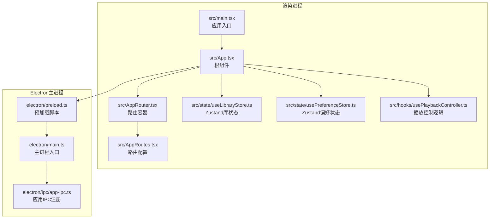
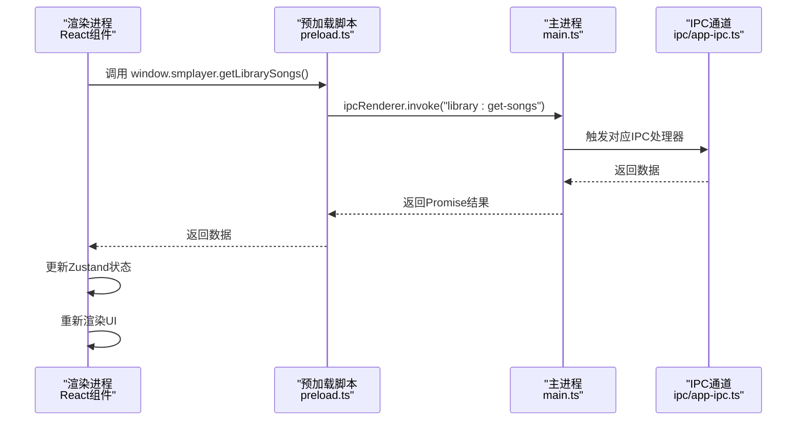
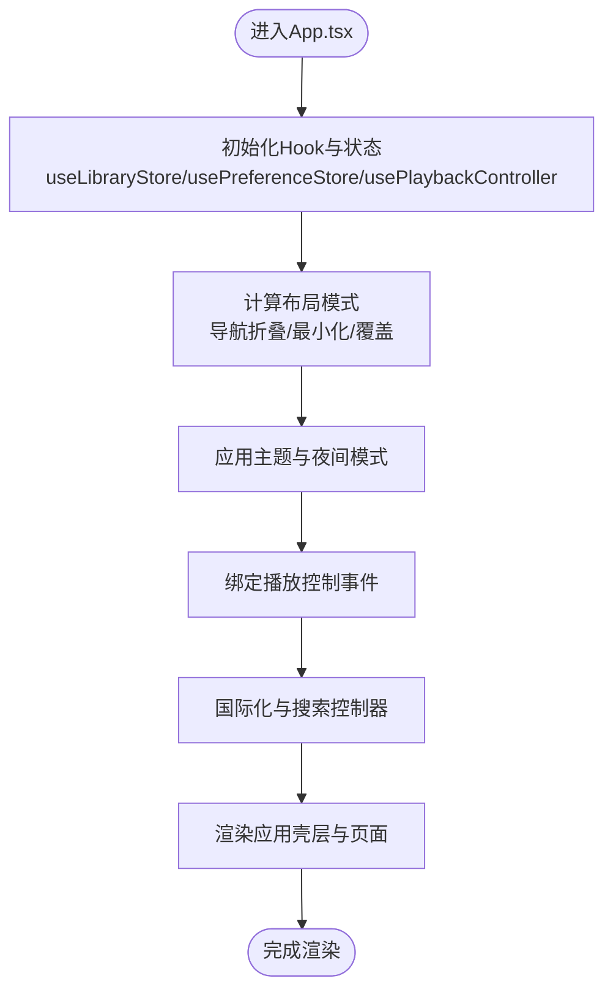
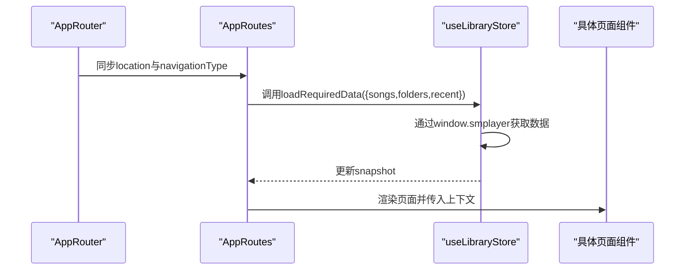
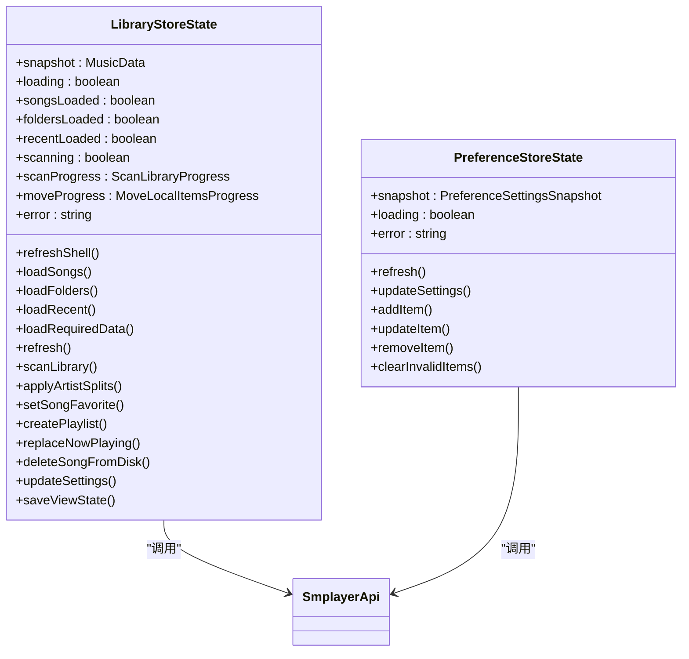
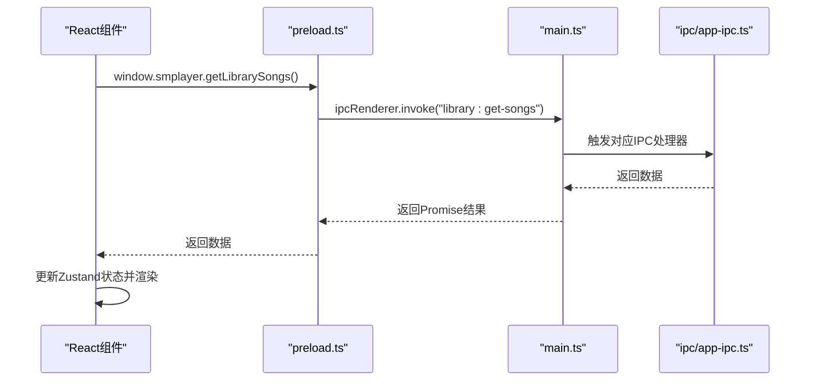
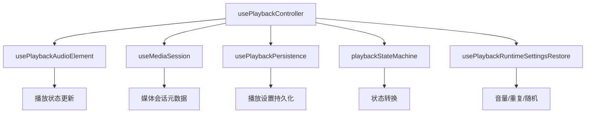
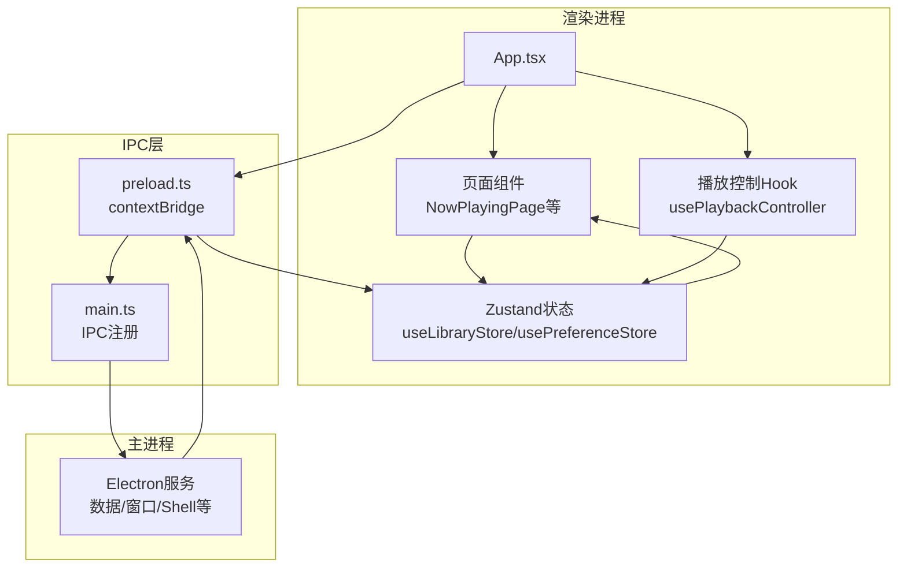
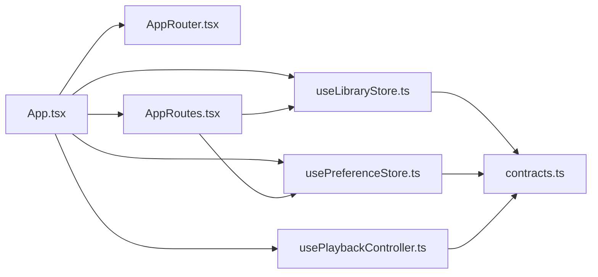

# React前端集成

<cite>
**本文档引用的文件**
- [src/main.tsx](file://src/main.tsx)
- [src/App.tsx](file://src/App.tsx)
- [src/AppRouter.tsx](file://src/AppRouter.tsx)
- [src/AppRoutes.tsx](file://src/AppRoutes.tsx)
- [src/components/AppBar.tsx](file://src/components/AppBar.tsx)
- [src/pages/NowPlayingPage.tsx](file://src/pages/NowPlayingPage.tsx)
- [src/hooks/usePlaybackController.ts](file://src/hooks/usePlaybackController.ts)
- [src/state/useLibraryStore.ts](file://src/state/useLibraryStore.ts)
- [src/state/usePreferenceStore.ts](file://src/state/usePreferenceStore.ts)
- [src/shared/contracts.ts](file://src/shared/contracts.ts)
- [electron/main.ts](file://electron/main.ts)
- [electron/preload.ts](file://electron/preload.ts)
- [electron/ipc/app-ipc.ts](file://electron/ipc/app-ipc.ts)
</cite>

## 目录
1. [简介](#简介)
2. [项目结构](#项目结构)
3. [核心组件](#核心组件)
4. [架构总览](#架构总览)
5. [详细组件分析](#详细组件分析)
6. [依赖关系分析](#依赖关系分析)
7. [性能考虑](#性能考虑)
8. [故障排除指南](#故障排除指南)
9. [结论](#结论)
10. [附录](#附录)

## 简介
本文件面向SMPlayer项目的React前端与Electron主进程的集成，系统性阐述渲染进程中的React组件架构、状态管理（Zustand）、路由体系、以及React组件与Electron服务通过IPC通信的交互方式。文档同时提供组件架构图与状态流向图，帮助开发者理解数据在React应用中的流转过程，并给出响应式设计与跨平台适配的实现要点及最佳实践与性能优化建议。

## 项目结构
SMPlayer采用典型的Electron + React架构：
- 渲染进程入口位于src/main.tsx，负责挂载根组件App与AppRouter。
- 根组件App.tsx承担应用壳层、主题与夜间模式、导航布局、播放控制绑定、国际化、搜索与视图状态等职责。
- 路由层由AppRouter.tsx与AppRoutes.tsx组成，实现基于hash的单页路由与页面级数据加载策略。
- 状态管理采用Zustand，分别在useLibraryStore.ts与usePreferenceStore.ts中定义全局音乐库与偏好设置的状态模型。
- Electron主进程在electron/main.ts中初始化窗口、注册IPC通道，并在electron/ipc下按功能模块注册IPC处理器。
- 预加载脚本electron/preload.ts通过contextBridge暴露SmplayerApi给渲染进程，作为所有IPC调用的统一入口。

图表来源
- [src/main.tsx:1-15](file://src/main.tsx#L1-L15)
- [src/App.tsx:1-1258](file://src/App.tsx#L1-L1258)
- [src/AppRouter.tsx:1-82](file://src/AppRouter.tsx#L1-L82)
- [src/AppRoutes.tsx:1-1108](file://src/AppRoutes.tsx#L1-L1108)
- [src/state/useLibraryStore.ts:1-1339](file://src/state/useLibraryStore.ts#L1-L1339)
- [src/state/usePreferenceStore.ts:1-160](file://src/state/usePreferenceStore.ts#L1-L160)
- [src/hooks/usePlaybackController.ts:1-958](file://src/hooks/usePlaybackController.ts#L1-L958)
- [electron/main.ts:1-243](file://electron/main.ts#L1-L243)
- [electron/preload.ts:1-287](file://electron/preload.ts#L1-L287)
- [electron/ipc/app-ipc.ts:1-26](file://electron/ipc/app-ipc.ts#L1-L26)

章节来源
- [src/main.tsx:1-15](file://src/main.tsx#L1-L15)
- [electron/main.ts:141-209](file://electron/main.ts#L141-L209)

## 核心组件
- 应用入口与根组件
  - 入口文件src/main.tsx负责创建根DOM并挂载App与AppRouter。
  - 根组件App.tsx承担应用壳层、主题与夜间模式切换、导航布局、播放控制绑定、国际化、搜索与视图状态等职责，并通过useLibraryStore与usePreferenceStore访问全局状态。
- 路由系统
  - AppRouter.tsx实现基于hash的自定义路由器，同步window.history与路由状态，支持push/replace/go等操作。
  - AppRoutes.tsx定义各页面路由与懒加载策略，结合RequireLibraryData确保必要数据先加载。
- 状态管理
  - useLibraryStore.ts基于Zustand定义音乐库全局状态，封装对SmplayerApi的调用，实现歌曲、播放列表、最近播放、扫描进度等状态的获取与更新。
  - usePreferenceStore.ts定义偏好设置状态，用于个性化配置的读取与更新。
- 播放控制
  - usePlaybackController.ts抽象播放器状态机与音频元素控制，处理播放/暂停、跳转、音量、重复/随机模式、播放队列等。
- 预加载与IPC桥接
  - electron/preload.ts通过contextBridge.exposeInMainWorld('smplayer', api)暴露SmplayerApi，渲染进程通过window.smplayer调用主进程能力。
  - electron/main.ts注册各类IPC通道，如app-ipc、data-ipc、library-ipc等，供渲染进程调用。

章节来源
- [src/main.tsx:8-14](file://src/main.tsx#L8-L14)
- [src/App.tsx:71-791](file://src/App.tsx#L71-L791)
- [src/AppRouter.tsx:25-81](file://src/AppRouter.tsx#L25-L81)
- [src/AppRoutes.tsx:176-325](file://src/AppRoutes.tsx#L176-L325)
- [src/state/useLibraryStore.ts:111-411](file://src/state/useLibraryStore.ts#L111-L411)
- [src/state/usePreferenceStore.ts:51-160](file://src/state/usePreferenceStore.ts#L51-L160)
- [src/hooks/usePlaybackController.ts:68-584](file://src/hooks/usePlaybackController.ts#L68-L584)
- [electron/preload.ts:45-287](file://electron/preload.ts#L45-L287)
- [electron/main.ts:156-203](file://electron/main.ts#L156-L203)

## 架构总览
SMPlayer的前端架构围绕“渲染进程 + 预加载桥接 + 主进程IPC”的模式构建。渲染进程通过Zustand集中管理音乐库与偏好设置状态，通过SmplayerApi与主进程通信，主进程根据路由与页面需求返回数据或执行动作。

图表来源
- [electron/preload.ts:50-52](file://electron/preload.ts#L50-L52)
- [electron/main.ts:156-170](file://electron/main.ts#L156-L170)
- [electron/ipc/app-ipc.ts:10-16](file://electron/ipc/app-ipc.ts#L10-L16)
- [src/state/useLibraryStore.ts:154-167](file://src/state/useLibraryStore.ts#L154-L167)

## 详细组件分析

### 根组件App.tsx设计与职责
- 布局与主题
  - 管理导航折叠/展开、最小化导航、覆盖式导航等布局模式，依据窗口宽度与用户设置动态切换。
  - 夜间模式与主题色切换，通过CSS类与DOM属性控制，支持自动模式与定时边界。
- 状态与数据流
  - 从useLibraryStore读取snapshot、loading、scanning、error等状态，驱动页面渲染与交互。
  - 通过usePreferenceStore读取偏好设置，影响播放行为与界面显示。
- 播放控制绑定
  - 将播放控制器方法绑定到媒体控制组件，实现播放/暂停、上一首/下一首、音量、重复/随机等操作。
- 国际化与搜索
  - 使用createTranslator根据首选语言生成翻译函数；useSearchController管理搜索输入与历史记录。
- 事件与通知
  - 订阅窗口事件（全屏、迷你模式）与托盘命令，触发UI更新与通知。
- 页面与对话框
  - 条件渲染迷你模式页面与完整播放页面，管理对话框栈与通知提示。

图表来源
- [src/App.tsx:71-791](file://src/App.tsx#L71-L791)
- [src/state/useLibraryStore.ts:111-144](file://src/state/useLibraryStore.ts#L111-L144)
- [src/state/usePreferenceStore.ts:51-71](file://src/state/usePreferenceStore.ts#L51-L71)
- [src/hooks/usePlaybackController.ts:68-177](file://src/hooks/usePlaybackController.ts#L68-L177)

章节来源
- [src/App.tsx:71-791](file://src/App.tsx#L71-L791)

### 路由系统与页面加载策略
- 自定义路由器
  - AppRouter.tsx基于window.history与hash实现push/replace/go，保证与Electron窗口状态一致。
- 页面路由与数据加载
  - AppRoutes.tsx定义多条路由，结合RequireLibraryData确保歌曲、文件夹、最近播放等数据按需加载。
  - 对于需要库根路径的页面，若未设置则引导选择库根并可直接触发扫描。

图表来源
- [src/AppRouter.tsx:25-81](file://src/AppRouter.tsx#L25-L81)
- [src/AppRoutes.tsx:74-82](file://src/AppRoutes.tsx#L74-L82)
- [src/AppRoutes.tsx:202-230](file://src/AppRoutes.tsx#L202-L230)
- [src/state/useLibraryStore.ts:228-254](file://src/state/useLibraryStore.ts#L228-L254)

章节来源
- [src/AppRouter.tsx:25-81](file://src/AppRouter.tsx#L25-L81)
- [src/AppRoutes.tsx:74-82](file://src/AppRoutes.tsx#L74-L82)
- [src/AppRoutes.tsx:176-325](file://src/AppRoutes.tsx#L176-L325)

### Zustand状态管理库使用模式
- useLibraryStore
  - 定义MusicData快照与加载状态，封装对SmplayerApi的调用，实现歌曲、播放列表、最近播放、扫描进度等状态的获取与更新。
  - 提供批量刷新、延迟加载、错误处理与进度监听等机制。
- usePreferenceStore
  - 定义偏好设置快照与加载状态，封装对SmplayerApi的调用，实现启用/禁用、级别调整、新增/删除偏好项等操作。

图表来源
- [src/state/useLibraryStore.ts:42-109](file://src/state/useLibraryStore.ts#L42-L109)
- [src/state/useLibraryStore.ts:111-411](file://src/state/useLibraryStore.ts#L111-L411)
- [src/state/usePreferenceStore.ts:14-24](file://src/state/usePreferenceStore.ts#L14-L24)
- [src/state/usePreferenceStore.ts:51-160](file://src/state/usePreferenceStore.ts#L51-L160)
- [src/shared/contracts.ts:527-663](file://src/shared/contracts.ts#L527-L663)

章节来源
- [src/state/useLibraryStore.ts:111-411](file://src/state/useLibraryStore.ts#L111-L411)
- [src/state/usePreferenceStore.ts:51-160](file://src/state/usePreferenceStore.ts#L51-L160)

### React组件与Electron服务交互
- 预加载桥接
  - preload.ts通过contextBridge.exposeInMainWorld('smplayer', api)暴露SmplayerApi，渲染进程通过window.smplayer调用主进程能力。
- IPC注册与处理
  - main.ts注册各类IPC通道，如app-ipc、data-ipc、library-ipc等，处理来自渲染进程的请求。
- 事件监听
  - preload.ts提供onVoiceRecognitionHypothesis/onVoiceRecognitionStateChange/onTrayCommand等事件监听器，渲染进程订阅以响应系统事件。

图表来源
- [electron/preload.ts:50-52](file://electron/preload.ts#L50-L52)
- [electron/main.ts:156-170](file://electron/main.ts#L156-L170)
- [electron/ipc/app-ipc.ts:10-16](file://electron/ipc/app-ipc.ts#L10-L16)

章节来源
- [electron/preload.ts:45-287](file://electron/preload.ts#L45-L287)
- [electron/main.ts:156-203](file://electron/main.ts#L156-L203)
- [electron/ipc/app-ipc.ts:10-16](file://electron/ipc/app-ipc.ts#L10-L16)

### 播放控制与状态机
- usePlaybackController
  - 抽象播放器状态机与音频元素控制，处理播放/暂停、跳转、音量、重复/随机模式、播放队列等。
  - 结合usePlaybackAudioElement、useMediaSession、usePlaybackPersistence等Hook实现播放状态持久化与媒体会话同步。
  - 支持播放失败恢复、卡顿检测与自动重试。

图表来源
- [src/hooks/usePlaybackController.ts:68-584](file://src/hooks/usePlaybackController.ts#L68-L584)
- [src/hooks/usePlaybackController.ts:179-177](file://src/hooks/usePlaybackController.ts#L179-L177)

章节来源
- [src/hooks/usePlaybackController.ts:68-584](file://src/hooks/usePlaybackController.ts#L68-L584)

### 组件架构图与状态流向图
- 组件架构
  - 根组件App.tsx聚合导航、播放控制、国际化、搜索与视图状态，向下传递至页面组件。
  - 页面组件（如NowPlayingPage）消费useLibraryStore与usePreferenceStore，通过SmplayerApi与主进程交互。
- 状态流向
  - 数据从主进程通过IPC返回到预加载脚本，再由Zustand状态管理，最终驱动React组件渲染。

图表来源
- [src/App.tsx:71-791](file://src/App.tsx#L71-L791)
- [src/pages/NowPlayingPage.tsx:68-93](file://src/pages/NowPlayingPage.tsx#L68-L93)
- [src/state/useLibraryStore.ts:111-411](file://src/state/useLibraryStore.ts#L111-L411)
- [src/state/usePreferenceStore.ts:51-160](file://src/state/usePreferenceStore.ts#L51-L160)
- [src/hooks/usePlaybackController.ts:68-584](file://src/hooks/usePlaybackController.ts#L68-L584)
- [electron/preload.ts:45-287](file://electron/preload.ts#L45-L287)
- [electron/main.ts:156-203](file://electron/main.ts#L156-L203)

章节来源
- [src/pages/NowPlayingPage.tsx:68-93](file://src/pages/NowPlayingPage.tsx#L68-L93)
- [src/state/useLibraryStore.ts:111-411](file://src/state/useLibraryStore.ts#L111-L411)
- [src/state/usePreferenceStore.ts:51-160](file://src/state/usePreferenceStore.ts#L51-L160)
- [electron/preload.ts:45-287](file://electron/preload.ts#L45-L287)
- [electron/main.ts:156-203](file://electron/main.ts#L156-L203)

## 依赖关系分析
- 组件耦合
  - App.tsx与各Hook、Store紧密耦合，但通过接口与上下文传递解耦页面组件。
  - 页面组件通过useLibraryStore与usePreferenceStore间接依赖SmplayerApi。
- 外部依赖
  - react-router-dom用于路由管理。
  - clsx用于条件样式拼接。
  - Electron IPC用于与主进程通信。
- 可能的循环依赖
  - 当前结构通过Hook与Store分层避免了直接循环依赖；Zustand状态通过回调与异步调用避免强耦合。

图表来源
- [src/App.tsx:71-791](file://src/App.tsx#L71-L791)
- [src/AppRouter.tsx:25-81](file://src/AppRouter.tsx#L25-L81)
- [src/AppRoutes.tsx:176-325](file://src/AppRoutes.tsx#L176-L325)
- [src/state/useLibraryStore.ts:111-411](file://src/state/useLibraryStore.ts#L111-L411)
- [src/state/usePreferenceStore.ts:51-160](file://src/state/usePreferenceStore.ts#L51-L160)
- [src/hooks/usePlaybackController.ts:68-584](file://src/hooks/usePlaybackController.ts#L68-L584)
- [src/shared/contracts.ts:527-663](file://src/shared/contracts.ts#L527-L663)

章节来源
- [src/App.tsx:71-791](file://src/App.tsx#L71-L791)
- [src/AppRoutes.tsx:176-325](file://src/AppRoutes.tsx#L176-L325)
- [src/state/useLibraryStore.ts:111-411](file://src/state/useLibraryStore.ts#L111-L411)
- [src/state/usePreferenceStore.ts:51-160](file://src/state/usePreferenceStore.ts#L51-L160)
- [src/hooks/usePlaybackController.ts:68-584](file://src/hooks/usePlaybackController.ts#L68-L584)
- [src/shared/contracts.ts:527-663](file://src/shared/contracts.ts#L527-L663)

## 性能考虑
- 状态粒度与订阅
  - 使用Zustand时仅订阅必要字段，避免不必要的重渲染；例如App.tsx通过选择器读取snapshot特定字段。
- 异步加载与并发
  - useLibraryStore.loadRequiredData支持并发加载不同数据源，减少等待时间。
- 虚拟滚动与滚动优化
  - NowPlayingPage使用虚拟滚动与可视区域计算，降低长列表渲染开销。
- 播放器性能
  - usePlaybackController内置卡顿检测与自动恢复，避免长时间无响应。
- 资源缓存
  - 预加载阶段应用夜间模式样式，减少首次闪烁。

章节来源
- [src/state/useLibraryStore.ts:228-254](file://src/state/useLibraryStore.ts#L228-L254)
- [src/pages/NowPlayingPage.tsx:173-226](file://src/pages/NowPlayingPage.tsx#L173-L226)
- [src/hooks/usePlaybackController.ts:270-305](file://src/hooks/usePlaybackController.ts#L270-L305)
- [electron/preload.ts:20-43](file://electron/preload.ts#L20-L43)

## 故障排除指南
- IPC调用失败
  - 检查preload.ts是否正确暴露SmplayerApi，确认main.ts已注册对应IPC处理器。
  - 在useLibraryStore与usePreferenceStore中捕获错误并设置error字段，渲染层根据error显示提示。
- 播放异常
  - usePlaybackController内置播放失败恢复逻辑，检查网络与音频URL有效性。
  - 关注卡顿检测与自动恢复流程，必要时清理定时器与进度同步。
- 路由不生效
  - 确认AppRouter.tsx的hash同步逻辑，确保push/replace/go正确更新window.history。
- 夜间模式切换异常
  - 检查App.tsx中夜间模式类名与定时边界逻辑，确认DOM属性移除与添加顺序。

章节来源
- [electron/preload.ts:45-287](file://electron/preload.ts#L45-L287)
- [electron/main.ts:156-203](file://electron/main.ts#L156-L203)
- [src/state/useLibraryStore.ts:139-143](file://src/state/useLibraryStore.ts#L139-L143)
- [src/hooks/usePlaybackController.ts:292-304](file://src/hooks/usePlaybackController.ts#L292-L304)
- [src/AppRouter.tsx:56-70](file://src/AppRouter.tsx#L56-L70)
- [src/App.tsx:217-244](file://src/App.tsx#L217-L244)

## 结论
SMPlayer的React前端通过Zustand集中管理音乐库与偏好设置状态，借助自定义路由与按需数据加载策略，实现了高效且可维护的桌面音乐播放体验。Electron预加载脚本作为IPC桥接层，使渲染进程能够安全地访问主进程能力。整体架构清晰、职责分离明确，具备良好的扩展性与跨平台适配能力。

## 附录
- 最佳实践
  - 保持状态订阅最小化，避免过度渲染。
  - 使用虚拟滚动处理长列表，提升滚动性能。
  - 在播放器层面实现失败恢复与卡顿检测，提升用户体验。
  - 通过事件监听与状态持久化，确保播放状态在应用重启后可恢复。
- 跨平台适配
  - 使用CSS媒体查询与响应式布局适配桌面端与移动端差异。
  - 通过usePlaybackRuntimeSettingsRestore与useMediaSession，确保跨平台媒体控制一致性。