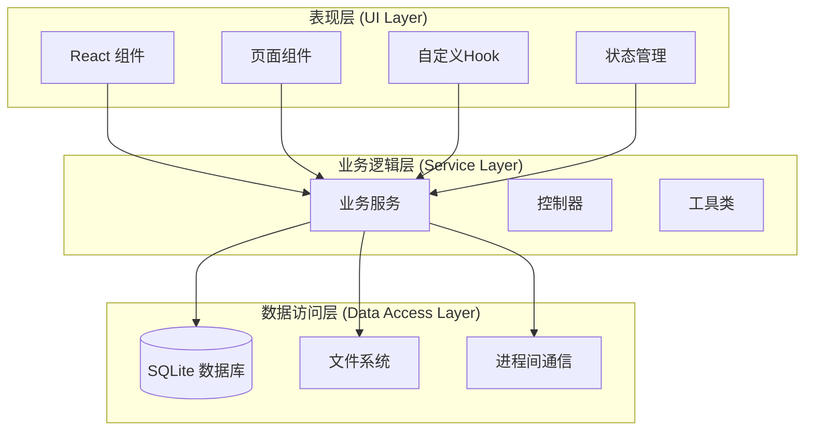
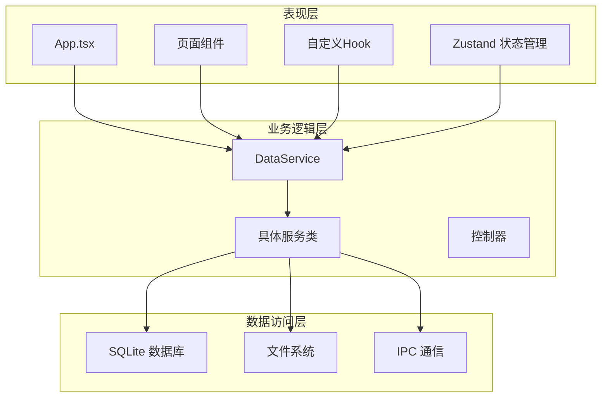
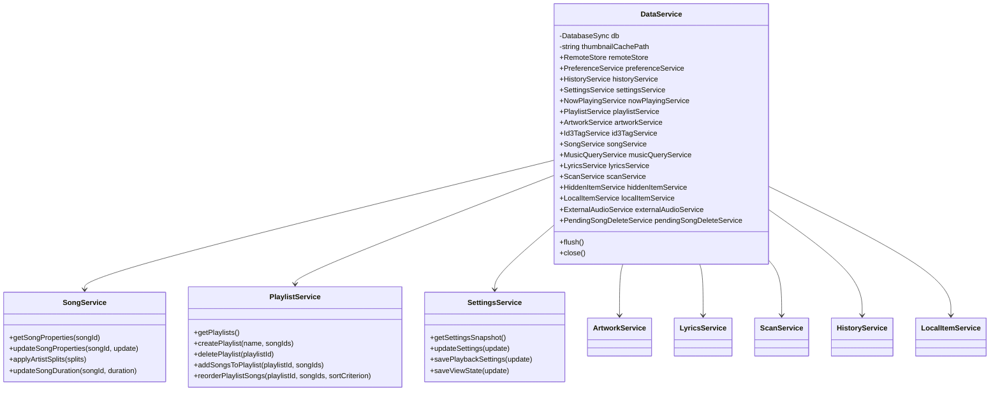
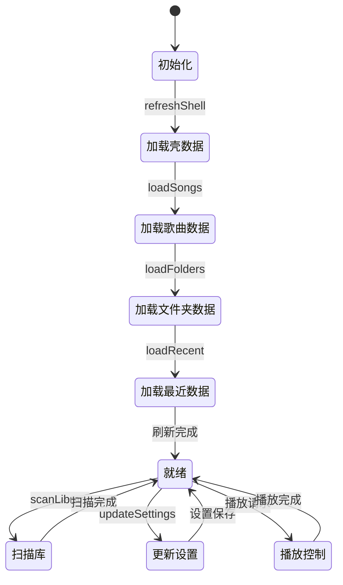
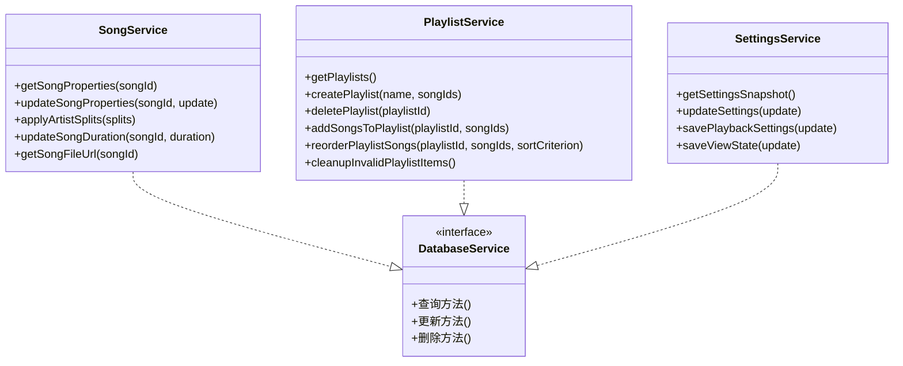
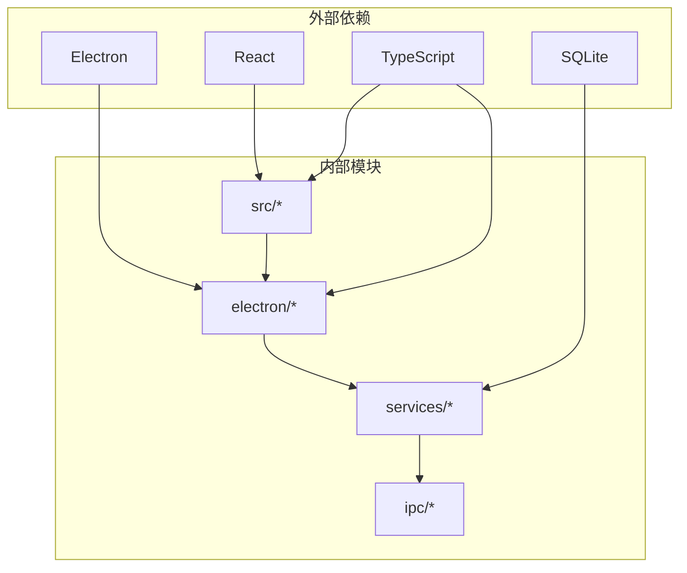

# 分层架构设计

<cite>
**本文档引用的文件**
- [README.md](file://README.md)
- [App.tsx](file://src/App.tsx)
- [useLibraryStore.ts](file://src/state/useLibraryStore.ts)
- [libraryStoreModel.ts](file://src/state/libraryStoreModel.ts)
- [usePreferenceStore.ts](file://src/state/usePreferenceStore.ts)
- [usePlaybackController.ts](file://src/hooks/usePlaybackController.ts)
- [contracts.ts](file://src/shared/contracts.ts)
- [main.ts](file://electron/main.ts)
- [data-service.ts](file://electron/services/data-service.ts)
- [schema.ts](file://electron/services/schema.ts)
- [song-service.ts](file://electron/services/song-service.ts)
- [playlist-service.ts](file://electron/services/playlist-service.ts)
- [settings-service.ts](file://electron/services/settings-service.ts)
- [data-ipc.ts](file://electron/ipc/data-ipc.ts)
</cite>

## 目录
1. [引言](#引言)
2. [项目结构](#项目结构)
3. [核心组件](#核心组件)
4. [架构概览](#架构概览)
5. [详细组件分析](#详细组件分析)
6. [依赖分析](#依赖分析)
7. [性能考虑](#性能考虑)
8. [故障排除指南](#故障排除指南)
9. [结论](#结论)
10. [附录](#附录)

## 引言

SMPlayer是一个基于Electron的跨平台音乐播放器项目，采用分层架构设计，将用户界面、业务逻辑和服务层清晰分离。该项目实现了完整的本地音乐库管理、播放控制、歌词处理和远程分享功能。

本项目的核心目标是提供一个现代化的音乐播放体验，支持多种音频格式、智能歌词同步、本地和远程音乐库管理，以及丰富的用户个性化设置。

## 项目结构

SMPlayer项目采用典型的三层架构模式：

**图表来源**
- [App.tsx:1-800](file://src/App.tsx#L1-L800)
- [useLibraryStore.ts:1-800](file://src/state/useLibraryStore.ts#L1-L800)
- [main.ts:1-243](file://electron/main.ts#L1-L243)

**章节来源**
- [README.md:1-157](file://README.md#L1-L157)
- [App.tsx:1-800](file://src/App.tsx#L1-L800)

## 核心组件

### 表现层 (UI Layer)

表现层由React组件构成，负责用户界面渲染和用户交互处理：

- **应用入口**: App.tsx作为主应用组件，管理全局状态和路由
- **页面组件**: 各种功能页面，如专辑详情、播放列表、设置页面等
- **自定义Hook**: 处理特定业务逻辑的状态管理，如播放控制、搜索等
- **状态管理**: 使用Zustand进行全局状态管理

### 业务逻辑层 (Service Layer)

业务逻辑层封装了应用程序的核心业务规则和流程控制：

- **数据服务总线**: DataService作为统一的服务入口点
- **具体服务**: 针对不同功能域的具体服务实现
- **控制器**: 处理复杂的业务流程和状态转换

### 数据访问层 (Data Access Layer)

数据访问层负责与底层数据存储和外部资源的交互：

- **数据库**: 使用SQLite进行本地数据持久化
- **文件系统**: 处理音频文件和元数据读取
- **进程间通信**: 通过IPC机制与主进程通信

**章节来源**
- [App.tsx:1-800](file://src/App.tsx#L1-L800)
- [useLibraryStore.ts:1-800](file://src/state/useLibraryStore.ts#L1-L800)
- [data-service.ts:1-198](file://electron/services/data-service.ts#L1-L198)

## 架构概览

SMPlayer采用分层架构设计，各层之间有明确的职责划分和依赖关系：

**图表来源**
- [data-service.ts:1-198](file://electron/services/data-service.ts#L1-L198)
- [main.ts:1-243](file://electron/main.ts#L1-L243)
- [data-ipc.ts:1-151](file://electron/ipc/data-ipc.ts#L1-L151)

### 层间依赖关系

- **表现层依赖业务逻辑层**: UI组件通过DataService访问各种业务服务
- **业务逻辑层依赖数据访问层**: 服务类直接操作数据库和文件系统
- **数据访问层独立运行**: 数据库操作和文件系统访问相互独立

### 接口定义

系统定义了清晰的接口契约：

- **统一服务接口**: DataService提供统一的服务访问入口
- **标准化数据模型**: contracts.ts定义了所有数据传输对象
- **标准化API**: 通过IPC暴露统一的API接口

**章节来源**
- [contracts.ts:527-664](file://src/shared/contracts.ts#L527-L664)
- [data-service.ts:39-198](file://electron/services/data-service.ts#L39-L198)

## 详细组件分析

### 数据服务总线 (DataService)

DataService是整个系统的中央协调者，负责管理多个子服务：

**图表来源**
- [data-service.ts:39-198](file://electron/services/data-service.ts#L39-L198)
- [song-service.ts:17-297](file://electron/services/song-service.ts#L17-L297)
- [playlist-service.ts:9-508](file://electron/services/playlist-service.ts#L9-L508)
- [settings-service.ts:61-293](file://electron/services/settings-service.ts#L61-L293)

#### 设计理念

DataService的设计遵循以下原则：

- **单一职责**: 聚合所有业务服务，提供统一访问点
- **延迟初始化**: 按需创建和初始化各个子服务
- **依赖注入**: 通过构造函数传递依赖关系
- **生命周期管理**: 提供flush和close方法进行资源清理

#### 服务协作机制

各服务之间通过DataService进行协调：

- **数据共享**: 通过共享的数据库连接实现数据一致性
- **事件传播**: 通过回调机制在服务间传递状态变化
- **事务管理**: 在需要时使用数据库事务保证操作原子性

**章节来源**
- [data-service.ts:64-145](file://electron/services/data-service.ts#L64-L145)

### 状态管理层

状态管理采用分层设计，包含全局状态、局部状态和持久化策略：

**图表来源**
- [useLibraryStore.ts:111-319](file://src/state/useLibraryStore.ts#L111-L319)
- [libraryStoreModel.ts:12-79](file://src/state/libraryStoreModel.ts#L12-L79)

#### 全局状态管理

全局状态管理使用Zustand实现：

- **MusicData模型**: 定义完整的音乐库数据结构
- **状态更新**: 提供原子化的状态更新操作
- **副作用处理**: 包装异步操作和错误处理

#### 局部状态管理

局部状态通过React Hook管理：

- **播放控制状态**: usePlaybackController管理播放器状态
- **用户偏好状态**: usePreferenceStore管理用户设置
- **对话框状态**: 通过栈管理弹窗显示

#### 状态持久化策略

- **即时持久化**: 关键状态立即写入数据库
- **批量持久化**: 非关键状态定期批量写入
- **内存缓存**: 频繁访问的数据保持在内存中

**章节来源**
- [useLibraryStore.ts:1-800](file://src/state/useLibraryStore.ts#L1-L800)
- [usePreferenceStore.ts:1-160](file://src/state/usePreferenceStore.ts#L1-L160)
- [usePlaybackController.ts:1-800](file://src/hooks/usePlaybackController.ts#L1-L800)

### 数据访问层实现

数据访问层采用服务化设计，每个功能域都有专门的服务类：

**图表来源**
- [song-service.ts:17-297](file://electron/services/song-service.ts#L17-L297)
- [playlist-service.ts:9-508](file://electron/services/playlist-service.ts#L9-L508)
- [settings-service.ts:61-293](file://electron/services/settings-service.ts#L61-L293)

#### 数据模型设计

系统使用标准化的数据模型：

- **LibrarySong**: 音乐条目数据结构
- **LibraryPlaylist**: 播放列表数据结构  
- **SettingsSnapshot**: 应用设置数据结构
- **MusicData**: 完整的音乐库快照

#### 查询优化策略

- **索引优化**: 为常用查询字段建立索引
- **预编译语句**: 使用预编译语句提高查询性能
- **批量操作**: 支持批量插入和更新操作
- **连接池**: 复用数据库连接减少开销

**章节来源**
- [contracts.ts:36-372](file://src/shared/contracts.ts#L36-L372)
- [schema.ts:33-364](file://electron/services/schema.ts#L33-L364)

## 依赖分析

系统依赖关系呈现清晰的层次结构：

**图表来源**
- [README.md:7-14](file://README.md#L7-L14)
- [main.ts:1-36](file://electron/main.ts#L1-L36)

### 内部依赖关系

- **表现层依赖**: 所有UI组件都依赖于contracts.ts中的类型定义
- **业务层依赖**: 业务服务依赖于数据访问层提供的数据库操作
- **数据层依赖**: 数据服务依赖于SQLite数据库和文件系统

### 循环依赖检测

系统设计避免了循环依赖：

- **单向依赖**: 从表现层到业务层再到数据层
- **接口隔离**: 通过接口定义避免直接耦合
- **依赖反转**: 业务层不直接依赖表现层

**章节来源**
- [contracts.ts:1-664](file://src/shared/contracts.ts#L1-L664)
- [data-service.ts:1-22](file://electron/services/data-service.ts#L1-L22)

## 性能考虑

### 数据库性能优化

- **WAL模式**: 使用Write-Ahead Logging提高并发性能
- **事务批处理**: 批量操作减少磁盘I/O次数
- **查询缓存**: 频繁查询结果进行缓存
- **索引策略**: 为热点查询字段建立复合索引

### 内存管理

- **懒加载**: 按需加载大型数据集
- **垃圾回收**: 及时释放不再使用的对象引用
- **内存池**: 复用大对象减少GC压力
- **流式处理**: 对大数据集采用流式处理方式

### 网络性能

- **连接复用**: 复用网络连接减少握手开销
- **异步处理**: 非阻塞I/O提高响应速度
- **缓存策略**: 多级缓存减少网络请求
- **压缩传输**: 压缩数据减少带宽占用

## 故障排除指南

### 常见问题诊断

#### 数据库连接问题

**症状**: 应用启动时数据库无法连接
**解决方案**: 
1. 检查数据库文件权限
2. 验证数据库文件完整性
3. 确认SQLite驱动版本兼容性

#### IPC通信异常

**症状**: UI组件无法响应用户操作
**解决方案**:
1. 检查主进程和渲染进程的IPC注册
2. 验证消息序列化和反序列化
3. 确认异步操作的Promise处理

#### 内存泄漏问题

**症状**: 应用运行时间越长内存占用越高
**解决方案**:
1. 检查事件监听器的正确移除
2. 验证定时器的及时清理
3. 确认闭包引用的正确管理

**章节来源**
- [main.ts:221-232](file://electron/main.ts#L221-L232)
- [data-ipc.ts:20-151](file://electron/ipc/data-ipc.ts#L20-L151)

## 结论

SMPlayer项目的分层架构设计体现了良好的软件工程实践：

### 优势

- **职责清晰**: 每层都有明确的职责边界
- **可维护性强**: 层间解耦便于代码维护和测试
- **可扩展性好**: 新功能可以按层添加而不影响其他层
- **性能优化**: 通过合理的缓存和数据库优化提升性能

### 局限性

- **学习成本**: 分层架构需要开发者理解多层概念
- **开发效率**: 在简单场景下可能显得过于复杂
- **调试难度**: 跨层问题的定位相对困难

### 架构演进

项目采用渐进式架构演进策略：

1. **基础层搭建**: 完成核心分层架构和基本功能
2. **功能完善**: 逐步添加更多业务功能
3. **性能优化**: 针对瓶颈进行专项优化
4. **架构重构**: 在必要时进行架构层面的重构

## 附录

### 技术栈说明

- **前端框架**: React + TypeScript + Vite
- **桌面框架**: Electron
- **数据库**: SQLite (node:sqlite)
- **状态管理**: Zustand
- **构建工具**: Vite

### 开发环境配置

- **Node.js版本**: 16.x或更高版本
- **开发工具**: VS Code + TypeScript插件
- **数据库工具**: DB Browser for SQLite
- **调试工具**: Electron DevTools

### 部署注意事项

- **打包配置**: 需要配置Electron Builder
- **签名证书**: 生产环境需要代码签名
- **自动更新**: 可选的自动更新机制
- **权限配置**: 文件系统和网络权限设置