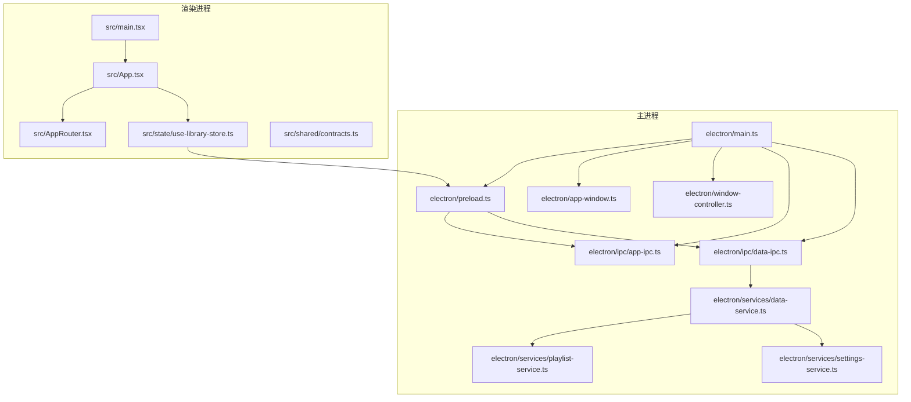
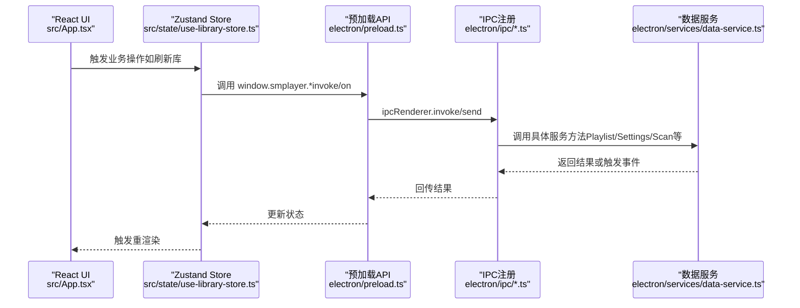
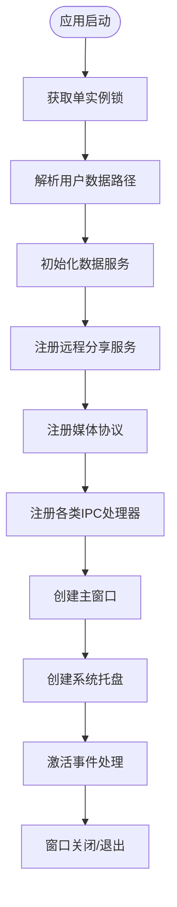
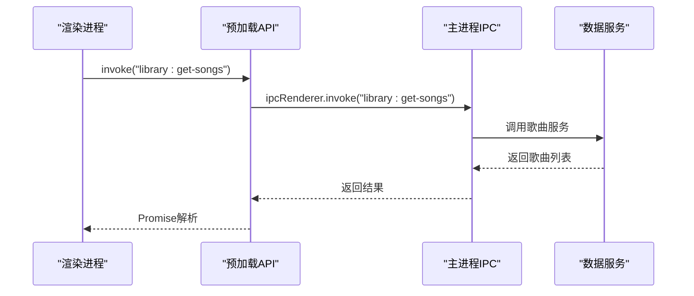
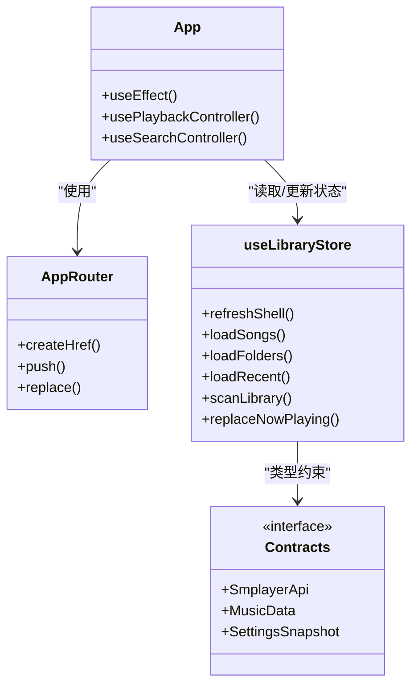
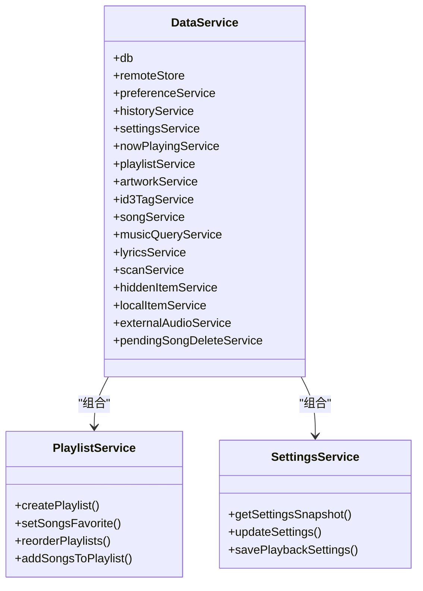
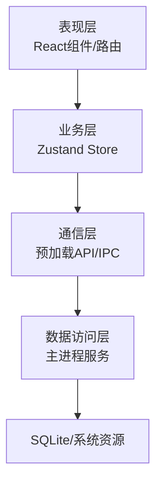
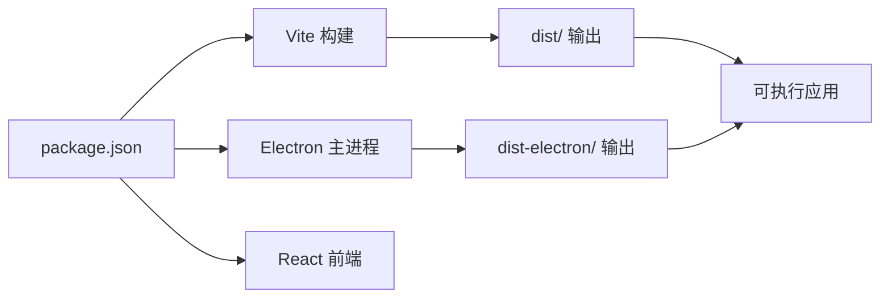

# 架构概览

<cite>
**本文档引用的文件**
- [electron/main.ts](file://electron/main.ts)
- [electron/preload.ts](file://electron/preload.ts)
- [electron/app-window.ts](file://electron/app-window.ts)
- [electron/window-controller.ts](file://electron/window-controller.ts)
- [electron/ipc/app-ipc.ts](file://electron/ipc/app-ipc.ts)
- [electron/ipc/data-ipc.ts](file://electron/ipc/data-ipc.ts)
- [electron/services/data-service.ts](file://electron/services/data-service.ts)
- [electron/services/playlist-service.ts](file://electron/services/playlist-service.ts)
- [electron/services/settings-service.ts](file://electron/services/settings-service.ts)
- [src/main.tsx](file://src/main.tsx)
- [src/App.tsx](file://src/App.tsx)
- [src/AppRouter.tsx](file://src/AppRouter.tsx)
- [src/state/useLibraryStore.ts](file://src/state/useLibraryStore.ts)
- [src/shared/contracts.ts](file://src/shared/contracts.ts)
- [package.json](file://package.json)
</cite>

## 目录
1. [简介](#简介)
2. [项目结构](#项目结构)
3. [核心组件](#核心组件)
4. [架构总览](#架构总览)
5. [详细组件分析](#详细组件分析)
6. [依赖关系分析](#依赖关系分析)
7. [性能考量](#性能考量)
8. [故障排除指南](#故障排除指南)
9. [结论](#结论)

## 简介
本项目采用基于 Electron 的双进程架构：主进程负责系统级能力（窗口管理、系统托盘、媒体协议、远程分享等），渲染进程承载 React 前端应用，通过 IPC 实现数据与控制流的解耦。主进程内嵌数据服务层，封装数据库操作与业务逻辑；渲染进程通过轻量的状态管理与 IPC 调用实现 UI 与后端服务的无缝集成。

## 项目结构
项目采用“前后端分离”的 Electron 结构：
- 主进程（electron/）：窗口生命周期、IPC 注册、系统交互、数据服务
- 渲染进程（src/）：React 应用、路由、状态管理、UI 组件
- 共享契约（src/shared/contracts.ts）：跨进程接口定义
- 预加载脚本（electron/preload.ts）：暴露受控 API 到渲染进程

**图表来源**
- [electron/main.ts:1-243](file://electron/main.ts#L1-L243)
- [electron/preload.ts:1-287](file://electron/preload.ts#L1-L287)
- [electron/app-window.ts:1-173](file://electron/app-window.ts#L1-L173)
- [electron/window-controller.ts:1-122](file://electron/window-controller.ts#L1-L122)
- [electron/ipc/app-ipc.ts:1-26](file://electron/ipc/app-ipc.ts#L1-L26)
- [electron/ipc/data-ipc.ts:1-151](file://electron/ipc/data-ipc.ts#L1-L151)
- [electron/services/data-service.ts:1-198](file://electron/services/data-service.ts#L1-L198)
- [electron/services/playlist-service.ts:1-508](file://electron/services/playlist-service.ts#L1-L508)
- [electron/services/settings-service.ts:1-577](file://electron/services/settings-service.ts#L1-L577)
- [src/main.tsx:1-15](file://src/main.tsx#L1-L15)
- [src/App.tsx:1-800](file://src/App.tsx#L1-L800)
- [src/AppRouter.tsx:1-82](file://src/AppRouter.tsx#L1-L82)
- [src/state/use-library-store.ts:1-800](file://src/state/use-library-store.ts#L1-L800)
- [src/shared/contracts.ts:1-664](file://src/shared/contracts.ts#L1-L664)

**章节来源**
- [electron/main.ts:1-243](file://electron/main.ts#L1-L243)
- [electron/preload.ts:1-287](file://electron/preload.ts#L1-L287)
- [src/main.tsx:1-15](file://src/main.tsx#L1-L15)
- [src/App.tsx:1-800](file://src/App.tsx#L1-L800)
- [src/AppRouter.tsx:1-82](file://src/AppRouter.tsx#L1-L82)
- [src/state/use-library-store.ts:1-800](file://src/state/use-library-store.ts#L1-L800)
- [src/shared/contracts.ts:1-664](file://src/shared/contracts.ts#L1-L664)

## 核心组件
- 主进程入口与生命周期：负责应用启动、窗口创建、系统托盘、媒体协议注册、远程分享服务初始化与退出处理。
- 预加载脚本：通过 contextBridge 暴露受控 API，统一管理 IPC 调用与事件监听。
- 窗口与控制器：封装窗口行为（拖拽、全屏、迷你模式）、系统权限与外链打开策略。
- IPC 层：按功能拆分（app、data、library、remote、shell、window），集中注册与处理。
- 数据服务层：以 DataService 为核心，聚合设置、播放列表、歌曲、歌词、扫描、历史、本地项等子服务。
- 前端应用：React + Zustand 状态管理，通过 useLibraryStore 与预加载 API 交互，实现数据加载、刷新与业务操作。

**章节来源**
- [electron/main.ts:141-243](file://electron/main.ts#L141-L243)
- [electron/preload.ts:45-287](file://electron/preload.ts#L45-L287)
- [electron/app-window.ts:41-138](file://electron/app-window.ts#L41-L138)
- [electron/window-controller.ts:6-122](file://electron/window-controller.ts#L6-L122)
- [electron/ipc/app-ipc.ts:10-26](file://electron/ipc/app-ipc.ts#L10-L26)
- [electron/ipc/data-ipc.ts:20-151](file://electron/ipc/data-ipc.ts#L20-L151)
- [electron/services/data-service.ts:39-198](file://electron/services/data-service.ts#L39-L198)
- [src/App.tsx:71-800](file://src/App.tsx#L71-L800)
- [src/state/use-library-store.ts:111-800](file://src/state/use-library-store.ts#L111-L800)

## 架构总览
双进程架构遵循“职责分离”原则：
- 主进程：系统资源、持久化、网络与系统交互
- 渲染进程：用户界面、交互与状态管理
- IPC：作为进程间通信桥梁，承载请求/响应与事件订阅

**图表来源**
- [src/App.tsx:255-319](file://src/App.tsx#L255-L319)
- [src/state/use-library-store.ts:255-319](file://src/state/use-library-store.ts#L255-L319)
- [electron/preload.ts:127-137](file://electron/preload.ts#L127-L137)
- [electron/ipc/data-ipc.ts:28-151](file://electron/ipc/data-ipc.ts#L28-L151)
- [electron/services/data-service.ts:39-198](file://electron/services/data-service.ts#L39-L198)

## 详细组件分析

### 主进程与窗口管理
- 启动流程：单实例锁、用户数据路径解析、数据服务初始化、远程分享服务、媒体协议注册、IPC 注册、窗口创建与托盘创建。
- 窗口行为：最小化到托盘、通知提示、外链打开策略、权限控制、标题栏覆盖样式与夜间模式支持。
- 控制器：窗口拖拽、全屏变更、迷你模式切换、边界适配与显示区域限制。

**图表来源**
- [electron/main.ts:78-243](file://electron/main.ts#L78-L243)
- [electron/app-window.ts:41-138](file://electron/app-window.ts#L41-L138)
- [electron/window-controller.ts:16-116](file://electron/window-controller.ts#L16-L116)

**章节来源**
- [electron/main.ts:78-243](file://electron/main.ts#L78-L243)
- [electron/app-window.ts:41-138](file://electron/app-window.ts#L41-L138)
- [electron/window-controller.ts:6-122](file://electron/window-controller.ts#L6-L122)

### IPC 通信机制
- 请求/响应模型：ipcRenderer.invoke 与 ipcMain.handle 配对使用，用于同步调用与返回值。
- 事件订阅模型：ipcRenderer.on 与 window.webContents.send 配对使用，用于异步事件推送（进度、状态变更）。
- 分层注册：按功能域拆分 IPC 文件，降低耦合度，便于维护与扩展。

**图表来源**
- [electron/preload.ts:154-156](file://electron/preload.ts#L154-L156)
- [electron/ipc/data-ipc.ts:28-36](file://electron/ipc/data-ipc.ts#L28-L36)
- [electron/services/data-service.ts:39-198](file://electron/services/data-service.ts#L39-L198)

**章节来源**
- [electron/preload.ts:127-137](file://electron/preload.ts#L127-L137)
- [electron/ipc/app-ipc.ts:10-26](file://electron/ipc/app-ipc.ts#L10-L26)
- [electron/ipc/data-ipc.ts:20-151](file://electron/ipc/data-ipc.ts#L20-L151)

### React 前端与状态管理
- 应用入口：创建根节点，挂载路由与应用组件。
- 路由系统：自定义 Hash 路由，与窗口位置同步，支持前进/后退与替换。
- 状态管理：Zustand Store 封装数据加载、刷新、扫描进度、播放队列、搜索历史等，统一通过 window.smplayer API 与主进程交互。

**图表来源**
- [src/main.tsx:8-14](file://src/main.tsx#L8-L14)
- [src/App.tsx:312-321](file://src/App.tsx#L312-L321)
- [src/AppRouter.tsx:25-82](file://src/AppRouter.tsx#L25-L82)
- [src/state/use-library-store.ts:111-800](file://src/state/use-library-store.ts#L111-L800)
- [src/shared/contracts.ts:527-664](file://src/shared/contracts.ts#L527-L664)

**章节来源**
- [src/main.tsx:1-15](file://src/main.tsx#L1-L15)
- [src/App.tsx:71-800](file://src/App.tsx#L71-L800)
- [src/AppRouter.tsx:1-82](file://src/AppRouter.tsx#L1-L82)
- [src/state/use-library-store.ts:111-800](file://src/state/use-library-store.ts#L111-L800)
- [src/shared/contracts.ts:1-664](file://src/shared/contracts.ts#L1-L664)

### 数据服务层与业务逻辑
- DataService：聚合多个子服务（设置、播放列表、歌曲、歌词、扫描、历史、本地项、外部音频、删除队列等），负责数据库初始化与清理。
- PlaylistService：内置歌单、收藏、排序、歌曲增删改查等。
- SettingsService：应用设置、视图状态、播放状态持久化与映射。

**图表来源**
- [electron/services/data-service.ts:39-198](file://electron/services/data-service.ts#L39-L198)
- [electron/services/playlist-service.ts:9-508](file://electron/services/playlist-service.ts#L9-L508)
- [electron/services/settings-service.ts:61-577](file://electron/services/settings-service.ts#L61-L577)

**章节来源**
- [electron/services/data-service.ts:39-198](file://electron/services/data-service.ts#L39-L198)
- [electron/services/playlist-service.ts:1-508](file://electron/services/playlist-service.ts#L1-L508)
- [electron/services/settings-service.ts:1-577](file://electron/services/settings-service.ts#L1-L577)

### 分层架构设计
- 表现层（UI层）：React 组件与路由，负责用户交互与展示。
- 业务层（状态与逻辑层）：Zustand Store 将 UI 与业务逻辑解耦，集中处理数据加载、刷新与业务操作。
- 数据访问层（服务层）：主进程内的服务类封装数据库与系统资源访问，提供稳定的数据接口。
- 通信层（IPC层）：统一的 IPC 接口定义与注册，确保前后端交互的一致性与可维护性。

[此图为概念性架构示意，不直接映射具体源码文件]

## 依赖关系分析
- 主进程依赖：Electron 核心、窗口与托盘控制器、IPC 注册器、数据服务。
- 渲染进程依赖：React 生态、路由、状态管理、共享契约。
- 构建与打包：Vite 打包前端，Electron Builder 打包应用，配置多平台目标与图标。

**图表来源**
- [package.json:1-175](file://package.json#L1-L175)

**章节来源**
- [package.json:1-175](file://package.json#L1-L175)

## 性能考量
- 数据加载优化：前端 Store 对重复请求进行去重与并发合并，避免重复网络与 IPC 调用。
- 进度与取消：扫描与移动操作提供进度事件与取消能力，减少长时间阻塞。
- 窗口与渲染：窗口最小化隐藏、夜间模式与标题栏覆盖减少不必要的绘制开销。
- 数据库：WalCheckpoint 在退出时执行，保证数据一致性与恢复效率。

[本节为通用性能建议，不直接分析具体文件]

## 故障排除指南
- 扫描进度异常：检查 onScanLocalFolderProgress 订阅与移除逻辑，确认 operationId 匹配。
- 托盘菜单不同步：确认 updateTrayMenu 与 updateWindowsJumpList 的调用时机。
- 窗口事件未触发：检查 window.webContents.send 与 ipcRenderer.on 的配对与生命周期。
- 设置保存失败：核对 SettingsService 的映射函数与事务提交/回滚逻辑。

**章节来源**
- [electron/ipc/data-ipc.ts:133-149](file://electron/ipc/data-ipc.ts#L133-L149)
- [electron/main.ts:221-232](file://electron/main.ts#L221-L232)
- [electron/preload.ts:127-137](file://electron/preload.ts#L127-L137)

## 结论
该架构通过清晰的双进程分层与 IPC 解耦，实现了稳定的本地音乐播放器体验。主进程专注系统与数据，渲染进程专注交互与展示，配合模块化的服务层与状态管理，具备良好的可维护性与扩展性。未来可在以下方面持续演进：增强错误边界与日志追踪、引入更细粒度的缓存策略、完善单元测试与端到端测试覆盖。