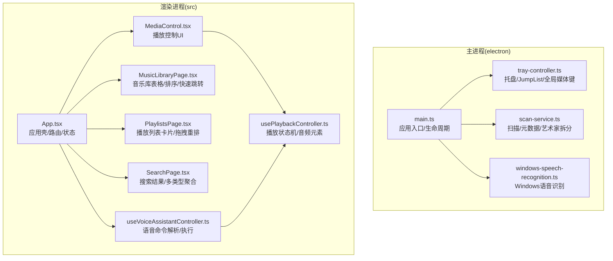
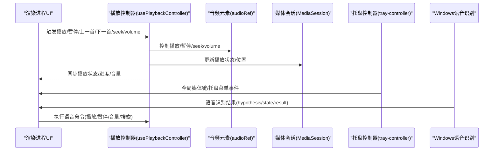
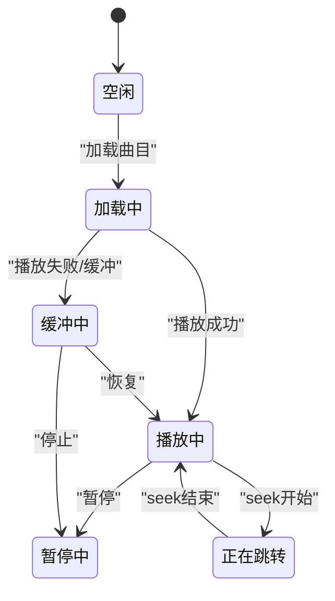
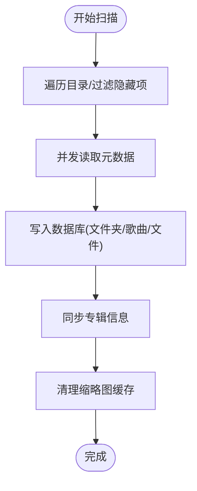
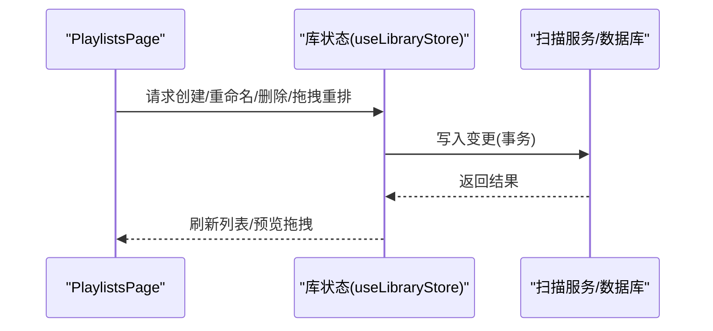
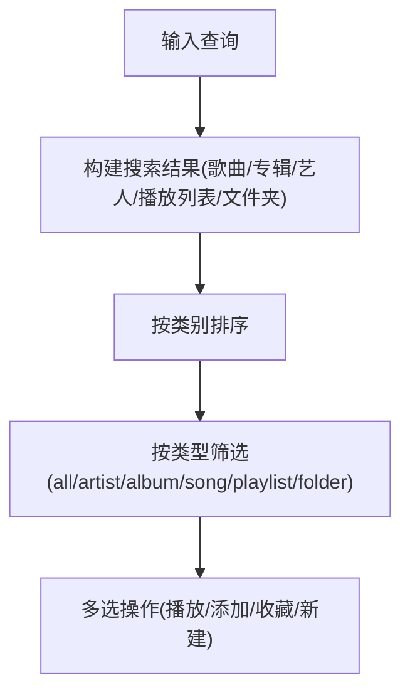
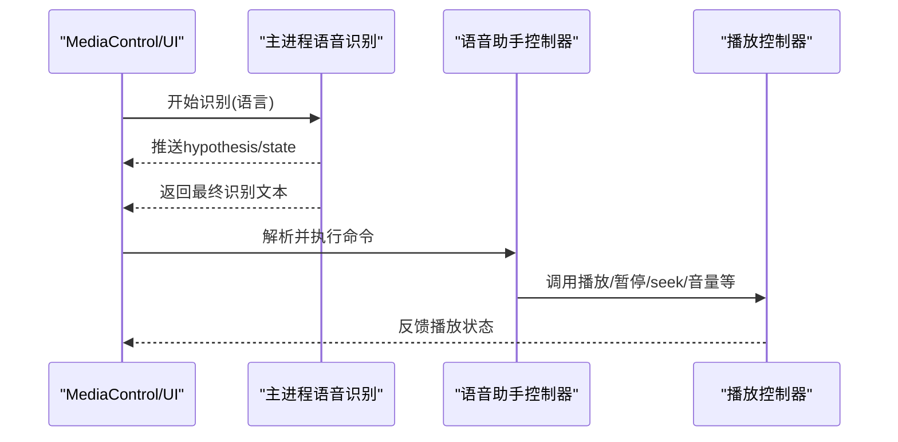
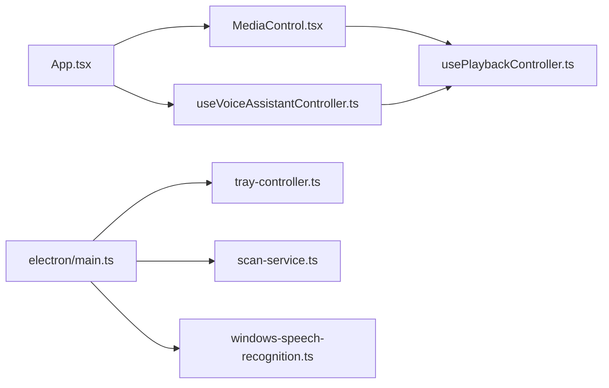

# 核心功能

<cite>
**本文引用的文件**
- [README.md](file://README.md)
- [electron/main.ts](file://electron/main.ts)
- [src/App.tsx](file://src/App.tsx)
- [src/components/MediaControl.tsx](file://src/components/MediaControl.tsx)
- [src/hooks/usePlaybackController.ts](file://src/hooks/usePlaybackController.ts)
- [src/pages/MusicLibraryPage.tsx](file://src/pages/MusicLibraryPage.tsx)
- [src/pages/PlaylistsPage.tsx](file://src/pages/PlaylistsPage.tsx)
- [src/pages/SearchPage.tsx](file://src/pages/SearchPage.tsx)
- [electron/services/scan-service.ts](file://electron/services/scan-service.ts)
- [electron/services/windows-speech-recognition.ts](file://electron/services/windows-speech-recognition.ts)
- [electron/tray-controller.ts](file://electron/tray-controller.ts)
- [src/hooks/useVoiceAssistantController.ts](file://src/hooks/useVoiceAssistantController.ts)
</cite>

## 目录
1. [简介](#简介)
2. [项目结构](#项目结构)
3. [核心组件](#核心组件)
4. [架构总览](#架构总览)
5. [详细组件分析](#详细组件分析)
6. [依赖关系分析](#依赖关系分析)
7. [性能考量](#性能考量)
8. [故障排查指南](#故障排查指南)
9. [结论](#结论)

## 简介
本文件面向SMPlayer项目的核心功能，围绕以下主题进行系统化说明：音乐播放控制（播放/暂停、上一首/下一首、进度控制、音量调节）、音乐库管理（自动扫描、分类组织、元数据提取）、播放列表功能（创建、编辑、管理）、搜索与过滤（智能搜索、快速跳转）、语音助手集成（Windows语音识别）、系统集成功能（JumpList、全局媒体键、系统托盘）。文档从代码级视角解析实现原理与用户交互体验，并给出功能间的数据流与控制流关系，帮助开发者快速理解整体架构。

## 项目结构
SMPlayer采用Electron + React + TypeScript技术栈，主进程负责系统集成与本地扫描，渲染进程负责UI与播放控制。核心目录与职责概览：
- electron 主进程：窗口、托盘、JumpList、全局媒体键、语音识别、SQLite数据库服务、扫描服务等
- src 渲染进程：页面、组件、Hooks、状态管理、国际化、媒体会话等
- docs：迁移审计与说明文档

图表来源
- [electron/main.ts:141-232](file://electron/main.ts#L141-L232)
- [src/App.tsx:312-321](file://src/App.tsx#L312-L321)
- [src/components/MediaControl.tsx:736-755](file://src/components/MediaControl.tsx#L736-L755)
- [src/hooks/usePlaybackController.ts:68-583](file://src/hooks/usePlaybackController.ts#L68-L583)
- [src/pages/MusicLibraryPage.tsx:107-182](file://src/pages/MusicLibraryPage.tsx#L107-L182)
- [src/pages/PlaylistsPage.tsx:71-152](file://src/pages/PlaylistsPage.tsx#L71-L152)
- [src/pages/SearchPage.tsx:105-178](file://src/pages/SearchPage.tsx#L105-L178)
- [electron/services/scan-service.ts:131-306](file://electron/services/scan-service.ts#L131-L306)
- [electron/services/windows-speech-recognition.ts:26-129](file://electron/services/windows-speech-recognition.ts#L26-L129)
- [electron/tray-controller.ts:28-160](file://electron/tray-controller.ts#L28-L160)

章节来源
- [README.md:1-157](file://README.md#L1-L157)

## 核心组件
- 播放控制与状态机：通过usePlaybackController集中管理播放状态、音量、重复/随机模式、进度同步与错误恢复；MediaControl提供UI与交互绑定。
- 音乐库管理：扫描服务负责递归扫描、元数据读取、艺术家智能拆分与合并建议、相册同步、缩略图缓存清理。
- 播放列表：PlaylistsPage支持卡片式浏览、重命名/删除、拖拽重排、批量操作与偏好设置。
- 搜索与过滤：SearchPage聚合歌曲/专辑/艺人/播放列表/文件夹，支持按类型筛选、排序与多选操作。
- 快速跳转：MusicLibraryPage在紧凑布局下提供字母索引快速跳转，提升长列表导航效率。
- 语音助手：Windows语音识别与命令解析，支持“播放/暂停/上一首/下一首/音量/搜索/播放某歌手/某专辑/某歌单/某文件夹”等指令。
- 系统集成：托盘菜单、JumpList最近播放、全局媒体键快捷键。

章节来源
- [src/components/MediaControl.tsx:28-72](file://src/components/MediaControl.tsx#L28-L72)
- [src/hooks/usePlaybackController.ts:28-53](file://src/hooks/usePlaybackController.ts#L28-L53)
- [src/pages/MusicLibraryPage.tsx:107-182](file://src/pages/MusicLibraryPage.tsx#L107-L182)
- [src/pages/PlaylistsPage.tsx:71-152](file://src/pages/PlaylistsPage.tsx#L71-L152)
- [src/pages/SearchPage.tsx:105-178](file://src/pages/SearchPage.tsx#L105-L178)
- [electron/services/scan-service.ts:131-306](file://electron/services/scan-service.ts#L131-L306)
- [electron/services/windows-speech-recognition.ts:26-129](file://electron/services/windows-speech-recognition.ts#L26-L129)
- [electron/tray-controller.ts:28-160](file://electron/tray-controller.ts#L28-L160)

## 架构总览
SMPlayer采用“主进程+渲染进程”的经典Electron架构。主进程负责系统能力（托盘、JumpList、全局媒体键、语音识别）与本地数据（扫描、SQLite），渲染进程负责UI与播放体验。IPC通道贯穿其中，确保跨进程通信安全高效。

图表来源
- [src/hooks/usePlaybackController.ts:486-513](file://src/hooks/usePlaybackController.ts#L486-L513)
- [src/components/MediaControl.tsx:736-800](file://src/components/MediaControl.tsx#L736-L800)
- [electron/tray-controller.ts:162-188](file://electron/tray-controller.ts#L162-L188)
- [electron/services/windows-speech-recognition.ts:34-129](file://electron/services/windows-speech-recognition.ts#L34-L129)

## 详细组件分析

### 播放控制与状态机
- 关键点
  - 状态机：idle/loading/load-track/playing/buffering/seeking/seeked/paused
  - 进度同步：定时器同步音频currentTime，处理卡顿检测与恢复
  - 错误恢复：失败曲目记录、可恢复曲目选择、重复单曲模式下的循环
  - 媒体会话：与浏览器MediaSession联动，支持前后seek与全局媒体键
  - UI绑定：MediaControl将播放状态映射到按钮、进度条、音量滑条与模式切换

图表来源
- [src/hooks/usePlaybackController.ts:120-128](file://src/hooks/usePlaybackController.ts#L120-L128)
- [src/components/MediaControl.tsx:736-755](file://src/components/MediaControl.tsx#L736-L755)

章节来源
- [src/hooks/usePlaybackController.ts:68-583](file://src/hooks/usePlaybackController.ts#L68-L583)
- [src/components/MediaControl.tsx:223-254](file://src/components/MediaControl.tsx#L223-L254)
- [src/components/MediaControl.tsx:709-755](file://src/components/MediaControl.tsx#L709-L755)

### 音乐库管理与扫描
- 自动扫描
  - 递归遍历根目录，过滤隐藏项，统计文件数量与进度
  - 并发读取音频元数据，支持“以文件名作为曲名”的回退策略
  - 写入数据库：文件夹、歌曲、文件关联，标记非活跃项
- 元数据与艺术家智能处理
  - 支持多艺术家拆分与合并建议，生成artistSplitsApplied/mergeSuggestions
  - 同步专辑信息，清理缩略图缓存
- 数据一致性
  - 事务提交，失败回滚
  - 扫描后清理播放队列/历史/歌词缓存中的失效条目

图表来源
- [electron/services/scan-service.ts:131-306](file://electron/services/scan-service.ts#L131-L306)
- [electron/services/scan-service.ts:616-684](file://electron/services/scan-service.ts#L616-L684)

章节来源
- [electron/services/scan-service.ts:131-306](file://electron/services/scan-service.ts#L131-L306)
- [electron/services/scan-service.ts:320-353](file://electron/services/scan-service.ts#L320-L353)

### 播放列表功能
- 创建/编辑/删除/重命名/拖拽重排
- 批量添加/移除歌曲、重新排序、设置偏好级别
- 卡片式网格展示，支持右键菜单与上下文操作

图表来源
- [src/pages/PlaylistsPage.tsx:71-152](file://src/pages/PlaylistsPage.tsx#L71-L152)
- [src/pages/PlaylistsPage.tsx:218-228](file://src/pages/PlaylistsPage.tsx#L218-L228)

章节来源
- [src/pages/PlaylistsPage.tsx:71-152](file://src/pages/PlaylistsPage.tsx#L71-L152)
- [src/pages/PlaylistsPage.tsx:324-341](file://src/pages/PlaylistsPage.tsx#L324-L341)

### 搜索与过滤
- 多维度聚合：歌曲、专辑、艺人、播放列表、文件夹
- 类型筛选与排序：支持按类型切换、每类独立排序
- 多选操作：一键播放、添加至播放列表、收藏、新建播放列表
- 文件夹限定：支持在指定子树内搜索

图表来源
- [src/pages/SearchPage.tsx:165-178](file://src/pages/SearchPage.tsx#L165-L178)
- [src/pages/SearchPage.tsx:250-269](file://src/pages/SearchPage.tsx#L250-L269)

章节来源
- [src/pages/SearchPage.tsx:105-178](file://src/pages/SearchPage.tsx#L105-L178)
- [src/pages/SearchPage.tsx:370-383](file://src/pages/SearchPage.tsx#L370-L383)

### 快速跳转
- 紧凑布局下显示字母索引面板，点击快速滚动到对应分组
- 与当前排序列联动，支持升/降序切换

章节来源
- [src/pages/MusicLibraryPage.tsx:156-176](file://src/pages/MusicLibraryPage.tsx#L156-L176)
- [src/pages/MusicLibraryPage.tsx:210-225](file://src/pages/MusicLibraryPage.tsx#L210-L225)

### 语音助手集成（Windows）
- 语音识别：PowerShell调用WinRT SpeechRecognizer，输出hypothesis/state/result
- 命令解析：基于语言模型匹配播放/暂停/上一首/下一首/音量/搜索/按艺人/专辑/歌单/文件夹播放等
- 交互反馈：返回执行消息或继续提示

图表来源
- [electron/services/windows-speech-recognition.ts:26-129](file://electron/services/windows-speech-recognition.ts#L26-L129)
- [src/hooks/useVoiceAssistantController.ts:214-324](file://src/hooks/useVoiceAssistantController.ts#L214-L324)
- [src/components/MediaControl.tsx:736-755](file://src/components/MediaControl.tsx#L736-L755)

章节来源
- [electron/services/windows-speech-recognition.ts:26-129](file://electron/services/windows-speech-recognition.ts#L26-L129)
- [src/hooks/useVoiceAssistantController.ts:19-381](file://src/hooks/useVoiceAssistantController.ts#L19-L381)

### 系统集成功能
- 托盘：双击/点击切换窗口；右键菜单包含播放/暂停、上一首/下一首、快速播放、设置、退出
- JumpList：Windows任务栏最近播放列表（受打包状态影响）
- 全局媒体键：注册MediaPlayPause/MediaNextTrack/MediaPreviousTrack/MediaStop，转发到渲染进程

章节来源
- [electron/tray-controller.ts:28-160](file://electron/tray-controller.ts#L28-L160)
- [electron/main.ts:208-236](file://electron/main.ts#L208-L236)

## 依赖关系分析
- 组件耦合
  - MediaControl高度依赖usePlaybackController提供的状态与方法
  - App.tsx通过usePlaybackController与useVoiceAssistantController协调播放与语音
  - 托盘控制器与主进程生命周期强相关
- 外部依赖
  - node:sqlite用于本地数据库
  - Windows WinRT用于语音识别
  - MediaSession用于浏览器媒体控制

图表来源
- [src/App.tsx:312-321](file://src/App.tsx#L312-L321)
- [src/components/MediaControl.tsx:736-755](file://src/components/MediaControl.tsx#L736-L755)
- [src/hooks/usePlaybackController.ts:68-583](file://src/hooks/usePlaybackController.ts#L68-L583)
- [src/hooks/useVoiceAssistantController.ts:19-381](file://src/hooks/useVoiceAssistantController.ts#L19-L381)
- [electron/main.ts:141-232](file://electron/main.ts#L141-L232)
- [electron/tray-controller.ts:28-160](file://electron/tray-controller.ts#L28-L160)
- [electron/services/scan-service.ts:131-306](file://electron/services/scan-service.ts#L131-L306)
- [electron/services/windows-speech-recognition.ts:26-129](file://electron/services/windows-speech-recognition.ts#L26-L129)

## 性能考量
- 渲染性能
  - 音乐库表格采用虚拟滚动与紧凑布局自适应，减少DOM节点数量
  - 自定义滚动条与节流更新，降低重绘开销
- 播放性能
  - 定时器同步播放进度，阈值判断避免频繁更新
  - 卡顿检测与自动恢复，保障连续播放体验
- 扫描性能
  - 并发读取元数据，分阶段上报进度，支持取消
  - 事务批量写入，扫描后异步清理缩略图缓存

章节来源
- [src/pages/MusicLibraryPage.tsx:65-70](file://src/pages/MusicLibraryPage.tsx#L65-L70)
- [src/pages/MusicLibraryPage.tsx:256-280](file://src/pages/MusicLibraryPage.tsx#L256-L280)
- [src/hooks/usePlaybackController.ts:270-305](file://src/hooks/usePlaybackController.ts#L270-L305)
- [electron/services/scan-service.ts:14-23](file://electron/services/scan-service.ts#L14-L23)
- [electron/services/scan-service.ts:290-293](file://electron/services/scan-service.ts#L290-L293)

## 故障排查指南
- 播放卡顿/停滞
  - 检查播放状态机是否进入buffering，确认网络/磁盘IO状况
  - 查看恢复逻辑是否触发，确认失败曲目集合
- 语音识别无响应
  - 确认平台为win32，检查隐私政策与权限
  - 观察state变化与hypothesis推送，定位识别流程问题
- 托盘/JumpList异常
  - 确认打包状态与环境变量，检查最近播放路径是否有效
  - 验证全局媒体键注册与注销时机

章节来源
- [src/hooks/usePlaybackController.ts:291-304](file://src/hooks/usePlaybackController.ts#L291-L304)
- [electron/services/windows-speech-recognition.ts:30-32](file://electron/services/windows-speech-recognition.ts#L30-L32)
- [electron/services/windows-speech-recognition.ts:225-232](file://electron/services/windows-speech-recognition.ts#L225-L232)
- [electron/tray-controller.ts:122-160](file://electron/tray-controller.ts#L122-L160)

## 结论
SMPlayer通过清晰的主/渲染进程分工与模块化组件设计，实现了从本地扫描、元数据提取、播放控制到系统集成的完整闭环。播放状态机、扫描服务、语音识别与托盘/JumpList等特性共同构成了稳定且易用的桌面音乐播放体验。建议后续关注排序/视图标准迁移、迷你播放器与远程播放等方向，持续优化用户体验与可维护性。