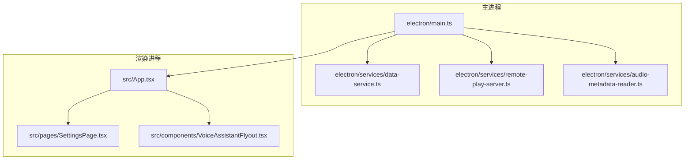
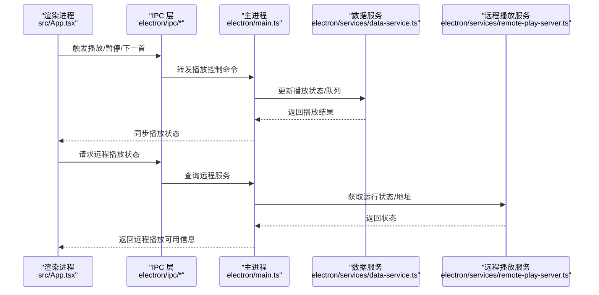
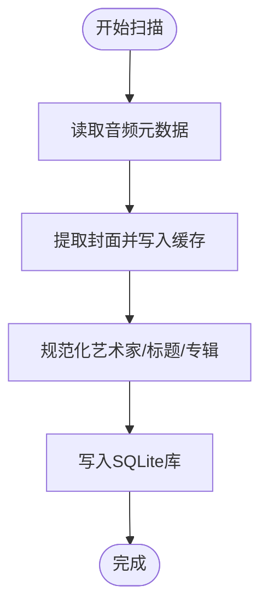
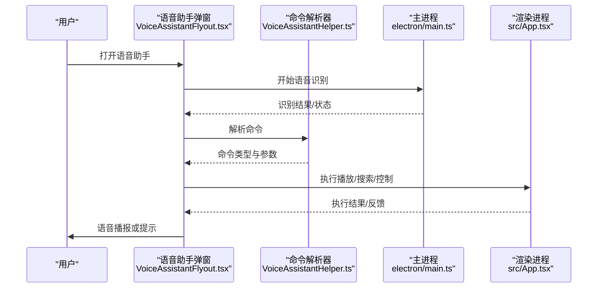
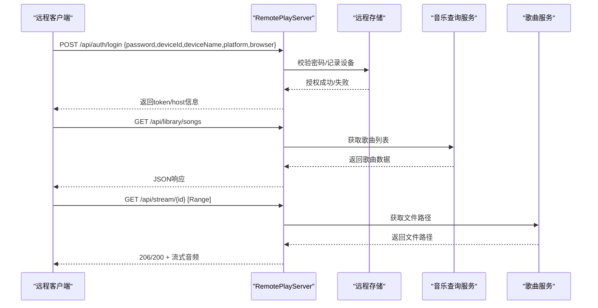
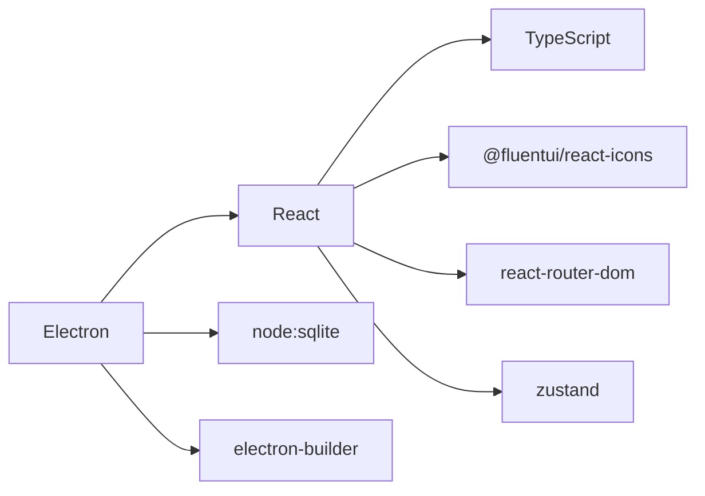

# 项目介绍

<cite>
**本文引用的文件**
- [README.md](file://README.md)
- [package.json](file://package.json)
- [electron/main.ts](file://electron/main.ts)
- [src/App.tsx](file://src/App.tsx)
- [electron/services/constants.ts](file://electron/services/constants.ts)
- [src/shared/VoiceAssistantHelper.ts](file://src/shared/VoiceAssistantHelper.ts)
- [electron/services/remote-play-server.ts](file://electron/services/remote-play-server.ts)
- [src/pages/SettingsPage.tsx](file://src/pages/SettingsPage.tsx)
- [electron/services/audio-metadata-reader.ts](file://electron/services/audio-metadata-reader.ts)
- [src/components/VoiceAssistantFlyout.tsx](file://src/components/VoiceAssistantFlyout.tsx)
- [docs/MIGRATION_AUDIT.md](file://docs/MIGRATION_AUDIT.md)
- [AGENTS.md](file://AGENTS.md)
</cite>

## 目录
1. [简介](#简介)
2. [项目结构](#项目结构)
3. [核心组件](#核心组件)
4. [架构总览](#架构总览)
5. [详细组件分析](#详细组件分析)
6. [依赖关系分析](#依赖关系分析)
7. [性能考量](#性能考量)
8. [故障排查指南](#故障排查指南)
9. [结论](#结论)
10. [附录](#附录)

## 简介
SMPlayer 是一款基于 Electron 的跨平台桌面音乐播放器，面向 Windows 平台设计，专注于本地音乐库的高效管理与播放体验。项目从原始 UWP 版本迁移而来，采用 React + TypeScript + Vite 技术栈构建，结合 SQLite 数据库存储本地音乐元数据，并提供丰富的播放控制、歌词显示、语音助手、系统托盘、媒体键支持以及远程播放共享能力。

本项目的核心目标是：
- 提供稳定、流畅的本地音乐播放体验
- 支持多种音频格式并自动提取封面与歌词
- 构建智能音乐库：扫描、索引、分类与恢复上次播放
- 集成语音助手，实现自然语言控制
- 支持远程播放共享，便于跨设备使用
- 提供可定制的主题、语言与夜间模式

## 项目结构
项目采用典型的 Electron 应用分层结构：
- 主进程（Main）：负责窗口生命周期、系统托盘、媒体协议注册、远程播放服务、IPC 注册与资源路径解析
- 渲染进程（Renderer）：React 应用，路由驱动页面、播放控制、设置面板、对话框与 UI 组件
- 服务层（Services）：数据库访问、元数据读取、歌词服务、封面缓存、扫描与重扫、偏好设置、远程分享等
- 资源与打包：electron-builder 配置、图标、文件关联、安装包目标平台

图表来源
- [electron/main.ts:141-209](file://electron/main.ts#L141-L209)
- [src/App.tsx:71-800](file://src/App.tsx#L71-L800)
- [src/pages/SettingsPage.tsx:317-946](file://src/pages/SettingsPage.tsx#L317-L946)
- [electron/services/remote-play-server.ts:77-147](file://electron/services/remote-play-server.ts#L77-L147)
- [electron/services/audio-metadata-reader.ts:31-105](file://electron/services/audio-metadata-reader.ts#L31-L105)

章节来源
- [README.md:1-157](file://README.md#L1-L157)
- [package.json:1-175](file://package.json#L1-L175)

## 核心组件
- 播放引擎与控制：支持播放/暂停、上一首/下一首、进度拖动、音量/静音、单曲/全部循环、随机播放；键盘快捷键与媒体键处理
- 本地音乐库：递归扫描音乐文件夹，提取元数据与封面，持久化到 SQLite；支持删除文件后的清理与重扫
- 歌词系统：支持嵌入式歌词与在线歌词，同步 .lrc 时间轴高亮；可批量下载并保存歌词
- 搜索与历史：按歌曲、专辑、艺术家、播放列表与文件夹搜索，持久化查询与最近搜索历史
- 播放队列与收藏：持久化的“正在播放”队列、收藏歌单、最近播放记录
- 设置中心：库根目录、重扫、标题优先策略、自动播放、进度保存、显示计数、主题色/夜间模式、通知开关、歌词源、语言等
- 语音助手：跨语言识别与命令解析，支持帮助与持续交互
- 远程播放共享：HTTP 服务器提供设备信息、认证登录、库统计与歌曲流式播放
- 托盘与全局媒体键：系统托盘菜单、最小化到托盘、全局媒体键快捷操作
- 包装与平台：electron-builder 多平台打包、NSIS 安装器、AppX 发布配置

章节来源
- [README.md:19-88](file://README.md#L19-L88)
- [src/App.tsx:741-768](file://src/App.tsx#L741-L768)
- [src/pages/SettingsPage.tsx:317-946](file://src/pages/SettingsPage.tsx#L317-L946)
- [electron/services/remote-play-server.ts:104-147](file://electron/services/remote-play-server.ts#L104-L147)

## 架构总览
SMPlayer 采用主/渲染双进程架构，主进程负责系统级能力与服务，渲染进程负责 UI 与业务逻辑。IPC 通道贯穿两者，承载库操作、播放控制、语音识别、远程播放等请求。

图表来源
- [electron/main.ts:156-203](file://electron/main.ts#L156-L203)
- [src/App.tsx:741-768](file://src/App.tsx#L741-L768)
- [electron/services/remote-play-server.ts:94-102](file://electron/services/remote-play-server.ts#L94-L102)

## 详细组件分析

### 多格式音频支持与元数据提取
- 支持格式：AAC、AIFF、ALAC、APE、FLAC、M4A、MP3、OGG、OPUS、WAV、WMA 等
- 元数据读取：通过 music-metadata 解析 ID3/ASF 等标签，提取标题、艺术家、专辑、时长、封面等
- 封面缓存：优先嵌入封面，其次系统缩略图，统一写入本地缓存
- 文件名回退：当无元数据时，使用文件名作为标题

图表来源
- [electron/services/audio-metadata-reader.ts:31-74](file://electron/services/audio-metadata-reader.ts#L31-L74)
- [electron/services/constants.ts:3-15](file://electron/services/constants.ts#L3-L15)

章节来源
- [README.md:25-27](file://README.md#L25-L27)
- [electron/services/constants.ts:3-15](file://electron/services/constants.ts#L3-L15)
- [electron/services/audio-metadata-reader.ts:31-105](file://electron/services/audio-metadata-reader.ts#L31-L105)

### 智能音乐库管理
- 递归扫描：遍历库根目录，收集音频文件并批量读取元数据
- 清理与重扫：删除文件后自动清理播放队列、历史与过期封面缓存
- 多艺术家存储：通过 MusicArtist 关系表存储多艺术家映射
- 恢复上次播放：启动时恢复播放位置、队列与最近播放

章节来源
- [README.md:23-24](file://README.md#L23-L24)
- [docs/MIGRATION_AUDIT.md:57-66](file://docs/MIGRATION_AUDIT.md#L57-L66)

### 播放列表与收藏
- 内置播放列表：收藏、正在播放队列
- 自定义播放列表：创建、重命名、删除、排序、批量增删
- 队列持久化：播放状态与顺序在重启后可恢复

章节来源
- [README.md:61-71](file://README.md#L61-L71)
- [docs/MIGRATION_AUDIT.md:57-66](file://docs/MIGRATION_AUDIT.md#L57-L66)

### 语音助手集成
- 识别与合成：跨语言语音识别与文本转语音
- 命令解析：英文/中文助手分别解析播放、搜索、音量、控制等指令
- 交互体验：支持帮助提示、持续对话、错误提示与隐私要求

图表来源
- [src/components/VoiceAssistantFlyout.tsx:97-163](file://src/components/VoiceAssistantFlyout.tsx#L97-L163)
- [src/shared/VoiceAssistantHelper.ts:65-92](file://src/shared/VoiceAssistantHelper.ts#L65-L92)
- [electron/main.ts:175-188](file://electron/main.ts#L175-L188)

章节来源
- [README.md:27-28](file://README.md#L27-L28)
- [src/shared/VoiceAssistantHelper.ts:65-92](file://src/shared/VoiceAssistantHelper.ts#L65-L92)
- [src/components/VoiceAssistantFlyout.tsx:1-304](file://src/components/VoiceAssistantFlyout.tsx#L1-L304)

### 远程播放共享
- 认证登录：客户端携带密码与设备信息进行登录，生成一次性令牌
- 授权校验：基于令牌哈希的授权与心跳维护
- 库接口：提供设备信息、库统计、歌曲/播放列表/收藏/正在播放查询
- 流式播放：按 Range 请求返回音频流，支持断点续传

图表来源
- [electron/services/remote-play-server.ts:169-255](file://electron/services/remote-play-server.ts#L169-L255)
- [electron/services/remote-play-server.ts:199-216](file://electron/services/remote-play-server.ts#L199-L216)
- [electron/services/remote-play-server.ts:266-293](file://electron/services/remote-play-server.ts#L266-L293)

章节来源
- [README.md:126-127](file://README.md#L126-L127)
- [docs/MIGRATION_AUDIT.md:48-48](file://docs/MIGRATION_AUDIT.md#L48-L48)
- [electron/services/remote-play-server.ts:77-147](file://electron/services/remote-play-server.ts#L77-L147)

### 播放控制与媒体会话
- 控制项：播放/暂停、上一首/下一首、进度拖动、音量/静音、循环/单曲循环/随机
- 快捷键：全局媒体键与浏览器 MediaSession
- 通知：原生系统通知显示当前曲目与歌词预览

章节来源
- [README.md:30-39](file://README.md#L30-L39)
- [src/App.tsx:741-768](file://src/App.tsx#L741-L768)

### 设置与偏好
- 库与扫描：库根目录选择、重扫、标题优先策略、智能多艺术家识别
- 显示与主题：界面语言、夜间模式、主题色、显示计数
- 歌词：歌词源选择、自动歌词、时间戳保留、批量下载
- 通知：发送策略、显示模式、歌词通知
- 数据：导入/导出、系统日志查看

章节来源
- [README.md:71-87](file://README.md#L71-L87)
- [src/pages/SettingsPage.tsx:317-946](file://src/pages/SettingsPage.tsx#L317-L946)

## 依赖关系分析
- 技术栈：Electron + React + TypeScript + Vite + SQLite(node:sqlite)
- 第三方库：music-metadata（元数据解析）、@fluentui/react-icons（图标）、react-router-dom（路由）、zustand（状态）
- 打包与分发：electron-builder，支持 NSIS、AppImage、deb、AppX 等目标

图表来源
- [package.json:23-48](file://package.json#L23-L48)
- [README.md:7-13](file://README.md#L7-L13)

章节来源
- [package.json:1-175](file://package.json#L1-L175)

## 性能考量
- 批量元数据读取：并发工作线程批量解析，避免阻塞主线程
- 封面缓存：嵌入封面优先，其次系统缩略图，减少重复 IO
- 进度持久化：播放进度与队列持久化，减少重启后重建成本
- 远程流式播放：Range 请求支持断点续传，降低带宽占用
- UI 滚动状态恢复：路由切换时恢复滚动位置，提升连续性体验

章节来源
- [electron/services/audio-metadata-reader.ts:76-105](file://electron/services/audio-metadata-reader.ts#L76-L105)
- [src/App.tsx:395-424](file://src/App.tsx#L395-L424)

## 故障排查指南
- 构建警告：Vite 对 node:sqlite 外部化与 inlineDynamicImports 的非阻塞告警，不影响 Electron 构建
- 手动端到端测试：建议在每次重大迁移后进行手动 QA
- 语音识别问题：检查隐私权限、麦克风可用性与浏览器支持；必要时查看帮助提示
- 远程播放认证失败：确认密码正确、设备未被阻止、令牌有效且未过期
- 托盘与媒体键：确保已创建托盘并注册全局媒体键；在 macOS/Linux 上行为可能不同

章节来源
- [README.md:145-149](file://README.md#L145-L149)
- [src/components/VoiceAssistantFlyout.tsx:123-131](file://src/components/VoiceAssistantFlyout.tsx#L123-L131)
- [electron/services/remote-play-server.ts:225-248](file://electron/services/remote-play-server.ts#L225-L248)

## 结论
SMPlayer 在保持与原始 UWP 版本功能一致性的前提下，成功迁移到 Electron 平台，具备稳定的本地音乐播放、智能库管理、歌词与封面处理、语音助手与远程播放共享等能力。项目当前处于“非模板壳”阶段，已具备可工作的应用结构与核心功能，后续可在排序/视图、迷你播放器、远程播放控制、偏好集合等方面进一步完善。

## 附录

### 版本信息与发布历史
- 当前版本：3.0.0
- 产品名称：简音播放器
- 打包与分发：支持 Windows（NSIS/便携）、macOS（DMG/ZIP）、Linux（AppImage/DEB），以及 Windows AppX
- 文件关联：支持多种音频扩展名直接打开

章节来源
- [package.json:4-173](file://package.json#L4-L173)

### 应用场景与目标用户
- 场景：个人本地音乐库管理、跨设备远程播放、语音控制、夜间模式与主题定制
- 用户：对本地音乐播放有较高要求、偏好自然语言交互与跨设备体验的桌面用户

### 核心价值与独特之处
- 本地优先：SQLite 存储、离线可用、隐私可控
- 多格式支持：覆盖主流无损与压缩格式
- 智能识别：多艺术家识别、标题回退、歌词同步
- 语音交互：跨语言命令解析与持续对话
- 远程共享：安全认证与流式播放，满足多设备联动