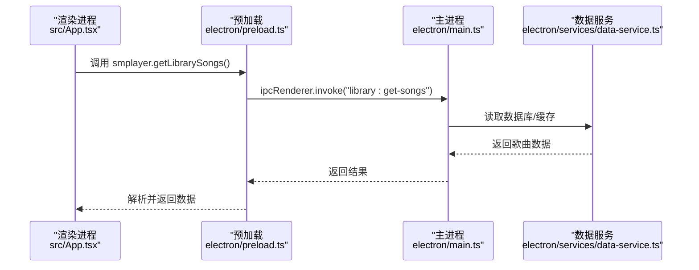
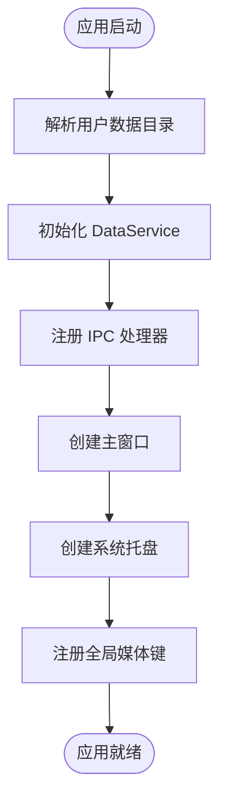
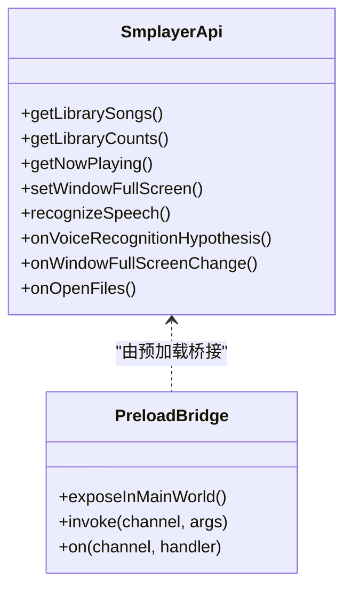
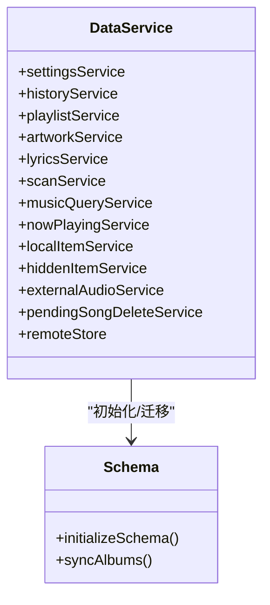
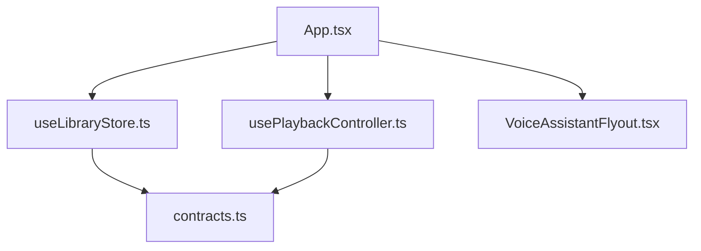
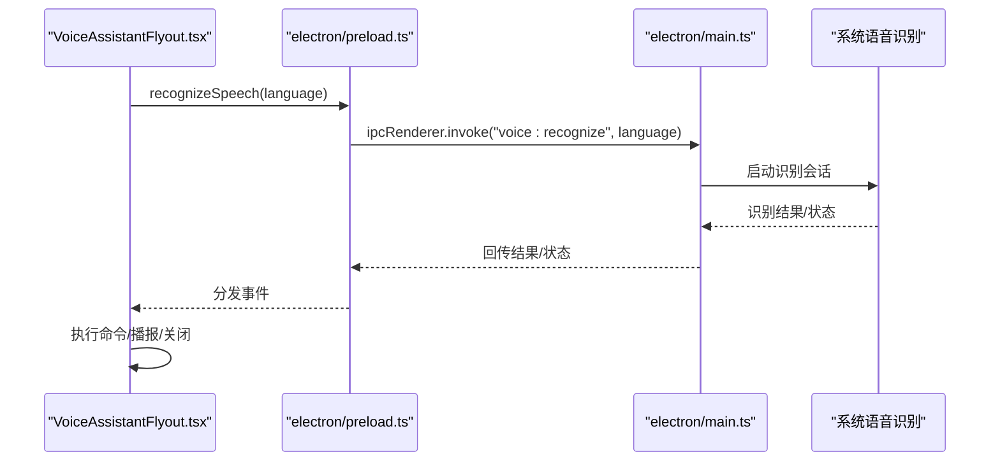
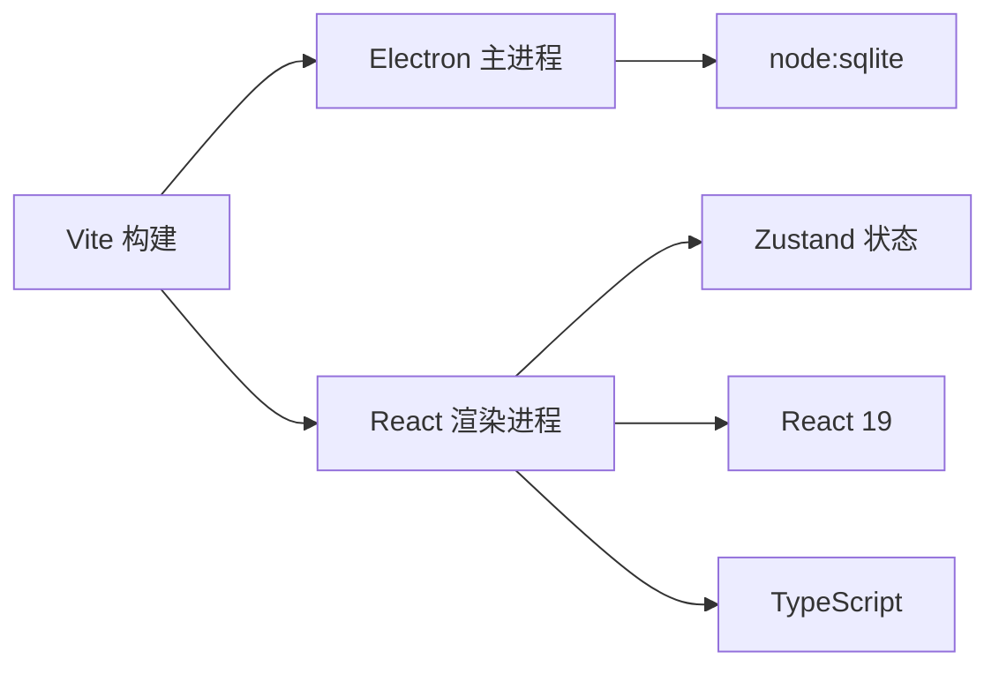

# 项目概述

<cite>
**本文档引用的文件**
- [README.md](file://README.md)
- [package.json](file://package.json)
- [electron/main.ts](file://electron/main.ts)
- [electron/preload.ts](file://electron/preload.ts)
- [vite.config.ts](file://vite.config.ts)
- [src/main.tsx](file://src/main.tsx)
- [src/App.tsx](file://src/App.tsx)
- [src/state/useLibraryStore.ts](file://src/state/useLibraryStore.ts)
- [src/hooks/usePlaybackController.ts](file://src/hooks/usePlaybackController.ts)
- [src/components/VoiceAssistantFlyout.tsx](file://src/components/VoiceAssistantFlyout.tsx)
- [src/shared/contracts.ts](file://src/shared/contracts.ts)
- [electron/ipc/app-ipc.ts](file://electron/ipc/app-ipc.ts)
- [electron/services/data-service.ts](file://electron/services/data-service.ts)
- [electron/services/schema.ts](file://electron/services/schema.ts)
- [docs/MIGRATION_AUDIT.md](file://docs/MIGRATION_AUDIT.md)
</cite>

## 目录
1. [简介](#简介)
2. [项目结构](#项目结构)
3. [核心组件](#核心组件)
4. [架构总览](#架构总览)
5. [详细组件分析](#详细组件分析)
6. [依赖关系分析](#依赖关系分析)
7. [性能考量](#性能考量)
8. [故障排查指南](#故障排查指南)
9. [结论](#结论)
10. [附录](#附录)

## 简介
SMPlayer 是一个基于 Electron 的跨平台桌面音乐播放器，目标是重建原 UWP 版本的功能，并在现代桌面平台上提供一致的本地音乐体验。项目采用 React + TypeScript + Zustand + Vite 技术栈，结合 SQLite 数据库存储本地音乐库，实现从扫描、元数据解析、封面缓存、歌词同步到播放控制的完整链路。

核心能力概览：
- 本地音乐库：递归扫描、元数据提取、多艺术家关系、隐藏项管理、重扫清理副作用
- 播放引擎：播放/暂停、上一首/下一首、进度拖动、音量/静音、单曲/随机/循环切换
- 歌词系统：本地.lrc/.txt 与嵌入式歌词，联网歌词检索与自动回退
- 智能界面：最近播放历史、收藏歌单、搜索历史与过滤、全屏/迷你模式
- 系统集成：系统托盘、全局媒体键、原生通知、窗口控制与深色主题
- 语音助手：基于 Web Speech API 的语音命令识别与反馈
- 打包分发：electron-builder 多平台安装包配置

**章节来源**
- [README.md:1-157](file://README.md#L1-L157)
- [package.json:1-175](file://package.json#L1-L175)

## 项目结构
项目采用典型的 Electron + React 前后端分离架构：
- 主进程：负责应用生命周期、窗口管理、系统集成、数据库与服务编排
- 预加载脚本：通过 contextBridge 暴露受控 API 到渲染进程
- 渲染进程：React 应用，使用 Zustand 管理状态，调用预加载 API 完成业务操作
- 构建工具：Vite 提供开发与生产构建，配合 vite-plugin-electron 实现主进程与预加载打包

```mermaid
graph TB
subgraph "主进程"
MAIN["electron/main.ts"]
DATA["electron/services/data-service.ts"]
SCHEMA["electron/services/schema.ts"]
IPC_APP["electron/ipc/app-ipc.ts"]
end
subgraph "预加载"
PRELOAD["electron/preload.ts"]
end
subgraph "渲染进程"
RENDER_MAIN["src/main.tsx"]
APP["src/App.tsx"]
LIB_STORE["src/state/useLibraryStore.ts"]
PLAYBACK["src/hooks/usePlaybackController.ts"]
VOICE["src/components/VoiceAssistantFlyout.tsx"]
end
MAIN --> DATA
DATA --> SCHEMA
MAIN --> IPC_APP
RENDER_MAIN --> APP
APP --> LIB_STORE
APP --> PLAYBACK
APP --> VOICE
PRELOAD <- --> APP
```

**图表来源**
- [electron/main.ts:1-243](file://electron/main.ts#L1-L243)
- [electron/preload.ts:1-287](file://electron/preload.ts#L1-L287)
- [src/main.tsx:1-15](file://src/main.tsx#L1-L15)
- [src/App.tsx:1-800](file://src/App.tsx#L1-L800)
- [src/state/useLibraryStore.ts:1-800](file://src/state/useLibraryStore.ts#L1-L800)
- [src/hooks/usePlaybackController.ts:1-800](file://src/hooks/usePlaybackController.ts#L1-L800)
- [src/components/VoiceAssistantFlyout.tsx:1-304](file://src/components/VoiceAssistantFlyout.tsx#L1-L304)
- [electron/services/data-service.ts:1-198](file://electron/services/data-service.ts#L1-L198)
- [electron/services/schema.ts:1-364](file://electron/services/schema.ts#L1-L364)
- [electron/ipc/app-ipc.ts:1-26](file://electron/ipc/app-ipc.ts#L1-L26)

**章节来源**
- [vite.config.ts:1-36](file://vite.config.ts#L1-L36)
- [README.md:105-117](file://README.md#L105-L117)

## 核心组件
- 主进程入口与窗口控制：初始化窗口、注册 IPC、系统托盘、媒体协议、语音识别回调
- 预加载 API 桥接：统一暴露 smplayer API，封装所有 IPC 调用与事件监听
- 数据服务层：以 DataService 为中心，聚合设置、历史、播放队列、歌词、扫描、封面等子服务
- React 应用：App 组件作为根容器，协调导航、侧边栏、媒体控制、对话框与状态恢复
- 状态管理：Zustand useLibraryStore 将库数据、扫描进度、播放队列、最近记录等集中管理
- 播放控制：usePlaybackController 提供播放状态机、队列游标、音量/重复/随机、进度同步
- 语音助手：VoiceAssistantFlyout 封装识别、处理与反馈流程，与主进程语音识别 IPC 对接

**章节来源**
- [electron/main.ts:141-243](file://electron/main.ts#L141-L243)
- [electron/preload.ts:45-287](file://electron/preload.ts#L45-L287)
- [electron/services/data-service.ts:39-198](file://electron/services/data-service.ts#L39-L198)
- [src/App.tsx:71-800](file://src/App.tsx#L71-L800)
- [src/state/useLibraryStore.ts:111-800](file://src/state/useLibraryStore.ts#L111-L800)
- [src/hooks/usePlaybackController.ts:68-800](file://src/hooks/usePlaybackController.ts#L68-L800)
- [src/components/VoiceAssistantFlyout.tsx:28-304](file://src/components/VoiceAssistantFlyout.tsx#L28-L304)

## 架构总览
Electron 应用遵循“主进程负责系统级能力，渲染进程负责 UI 与交互”的分层设计。主进程通过 IPC 向渲染进程提供只读/写入接口；预加载脚本通过 contextBridge 将这些接口安全地注入到全局 window.smplayer 中，避免直接访问 Node/Electron API。



**图表来源**
- [src/App.tsx:132-168](file://src/App.tsx#L132-L168)
- [electron/preload.ts:50-52](file://electron/preload.ts#L50-L52)
- [electron/main.ts:199-203](file://electron/main.ts#L199-L203)
- [electron/services/data-service.ts:64-145](file://electron/services/data-service.ts#L64-L145)

## 详细组件分析

### 主进程与窗口控制
- 初始化窗口、托盘菜单、媒体协议、外部音频打开、远程分享服务
- 注册各类 IPC 接口（应用信息、库查询、数据导入导出、窗口控制、语音识别）
- 生命周期处理：单实例锁、退出前清理、任务栏显示/隐藏



**图表来源**
- [electron/main.ts:141-219](file://electron/main.ts#L141-L219)
- [electron/main.ts:221-243](file://electron/main.ts#L221-L243)

**章节来源**
- [electron/main.ts:141-243](file://electron/main.ts#L141-L243)

### 预加载 API 与 IPC 映射
- 通过 contextBridge.exposeInMainWorld 暴露 smplayer API
- 将所有库操作、播放控制、窗口行为、语音识别等映射为 invoke/call
- 提供事件订阅（进度、识别状态、窗口变化）与取消函数



**图表来源**
- [src/shared/contracts.ts:527-664](file://src/shared/contracts.ts#L527-L664)
- [electron/preload.ts:45-287](file://electron/preload.ts#L45-L287)

**章节来源**
- [electron/preload.ts:45-287](file://electron/preload.ts#L45-L287)
- [src/shared/contracts.ts:527-664](file://src/shared/contracts.ts#L527-L664)

### 数据服务与数据库架构
- DataService 聚合多个子服务：设置、历史、播放队列、歌词、扫描、封面、本地项、外部音频、待删歌曲等
- 使用 node:sqlite 与 WAL 模式，保证并发与可靠性
- schema.ts 动态迁移表结构与索引，兼容旧版本字段与类型变更



**图表来源**
- [electron/services/data-service.ts:39-198](file://electron/services/data-service.ts#L39-L198)
- [electron/services/schema.ts:33-364](file://electron/services/schema.ts#L33-L364)

**章节来源**
- [electron/services/data-service.ts:39-198](file://electron/services/data-service.ts#L39-L198)
- [electron/services/schema.ts:33-364](file://electron/services/schema.ts#L33-L364)

### React 应用与状态管理
- App.tsx 作为根组件，整合导航、侧边栏、媒体控制、对话框与滚动位置记忆
- useLibraryStore 以 Zustand 管理音乐库快照、扫描进度、播放队列、最近记录、设置等
- usePlaybackController 提供播放状态机、队列游标、音量/重复/随机、进度同步与恢复



**图表来源**
- [src/App.tsx:132-168](file://src/App.tsx#L132-L168)
- [src/state/useLibraryStore.ts:111-319](file://src/state/useLibraryStore.ts#L111-L319)
- [src/hooks/usePlaybackController.ts:68-178](file://src/hooks/usePlaybackController.ts#L68-L178)
- [src/shared/contracts.ts:359-377](file://src/shared/contracts.ts#L359-L377)

**章节来源**
- [src/App.tsx:132-168](file://src/App.tsx#L132-L168)
- [src/state/useLibraryStore.ts:111-319](file://src/state/useLibraryStore.ts#L111-L319)
- [src/hooks/usePlaybackController.ts:68-178](file://src/hooks/usePlaybackController.ts#L68-L178)

### 语音助手集成
- VoiceAssistantFlyout 封装识别状态、提示文本、帮助对话框与合成语音
- 与主进程 IPC 协作，实时接收识别假设与状态变更，执行命令并播报结果



**图表来源**
- [src/components/VoiceAssistantFlyout.tsx:97-221](file://src/components/VoiceAssistantFlyout.tsx#L97-L221)
- [electron/preload.ts:156-179](file://electron/preload.ts#L156-L179)
- [electron/main.ts:177-188](file://electron/main.ts#L177-L188)

**章节来源**
- [src/components/VoiceAssistantFlyout.tsx:97-221](file://src/components/VoiceAssistantFlyout.tsx#L97-L221)
- [electron/preload.ts:156-179](file://electron/preload.ts#L156-L179)
- [electron/main.ts:177-188](file://electron/main.ts#L177-L188)

## 依赖关系分析
- 技术栈选择
  - Electron：跨平台桌面框架，提供系统集成与窗口管理
  - React 19：声明式 UI，组件化与 Hooks 生态
  - TypeScript：类型安全与工程化保障
  - Vite：快速开发与构建，支持插件生态
  - SQLite(node:sqlite)：轻量可靠的数据存储
  - Zustand：轻量状态管理，避免样板代码
- 外部依赖与打包
  - electron-builder：多平台打包与安装包生成
  - 音频格式支持：通过 music-metadata 解析元数据
  - 语音识别：Web Speech API（浏览器与系统支持）



**图表来源**
- [package.json:23-49](file://package.json#L23-L49)
- [vite.config.ts:8-25](file://vite.config.ts#L8-L25)

**章节来源**
- [package.json:23-49](file://package.json#L23-L49)
- [vite.config.ts:8-25](file://vite.config.ts#L8-L25)

## 性能考量
- 数据库优化
  - WAL 模式与索引策略提升查询与并发性能
  - 扫描过程分阶段（检查/读取/更新），并提供进度回调
- 渲染性能
  - React 19 与严格模式减少不必要重渲染
  - Zustand 仅在相关状态变化时触发更新
- I/O 与网络
  - 封面与歌词缓存降低重复读取
  - 语音识别异步处理，避免阻塞 UI

[本节为通用指导，无需具体文件引用]

## 故障排查指南
- 构建警告
  - node:sqlite 在浏览器环境被外部化，属于预期行为，不影响 Electron 构建
  - vite-plugin-electron 的 inlineDynamicImports 警告可忽略
- 运行问题
  - 确认 userData 目录可写，SQLite 数据库初始化成功
  - 检查扫描进度回调是否正确移除监听
  - 语音识别失败时检查隐私设置与权限
- 常见错误定位
  - IPC 调用异常：查看预加载 API 的 invoke/on 注册与事件名一致性
  - 播放卡顿：关注播放状态机与缓冲超时逻辑

**章节来源**
- [README.md:145-149](file://README.md#L145-L149)
- [src/state/useLibraryStore.ts:377-410](file://src/state/useLibraryStore.ts#L377-L410)
- [src/hooks/usePlaybackController.ts:292-305](file://src/hooks/usePlaybackController.ts#L292-L305)

## 结论
SMPlayer 以 Electron 为基础，结合 React 与现代前端技术栈，构建了功能完备的本地音乐播放器。项目在数据模型、播放控制、系统集成与用户体验方面均达到较高水准。当前仍处于持续演进阶段，后续重点在于完善排序/视图、迷你模式、偏好收集页面与远程播放控制等功能。

[本节为总结性内容，无需具体文件引用]

## 附录

### 发展历程与版本信息
- 当前版本：3.0.0
- 迁移审计：参考 MIGRATION_AUDIT.md，明确已迁移、部分迁移、待实现与废弃的功能点
- 建议下一步：按 README 的推荐步骤推进剩余工作

**章节来源**
- [package.json:4](file://package.json#L4)
- [docs/MIGRATION_AUDIT.md:1-85](file://docs/MIGRATION_AUDIT.md#L1-L85)
- [README.md:151-157](file://README.md#L151-L157)